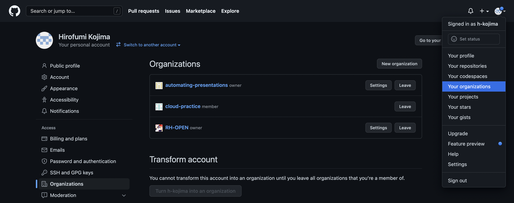
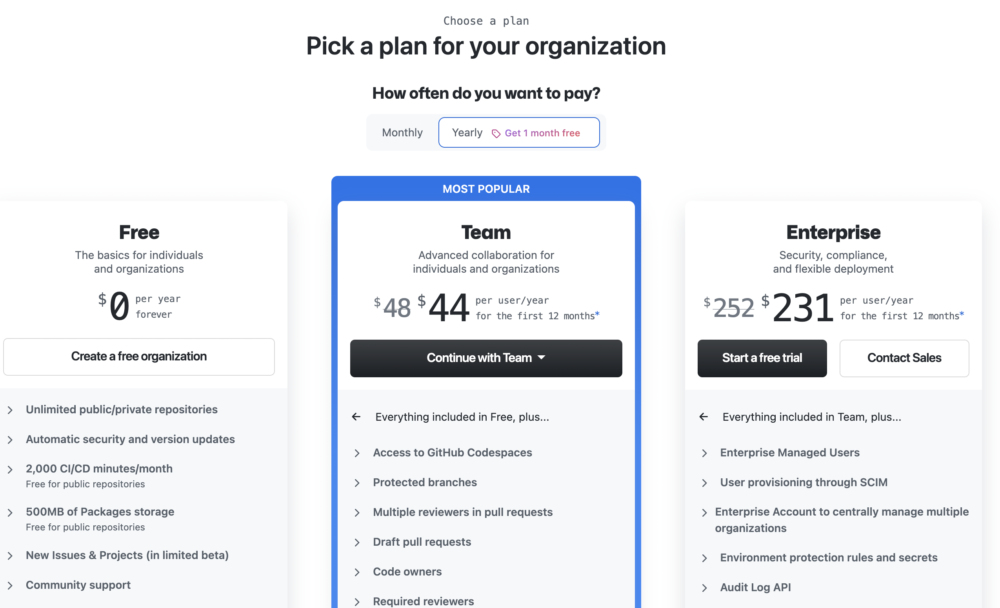
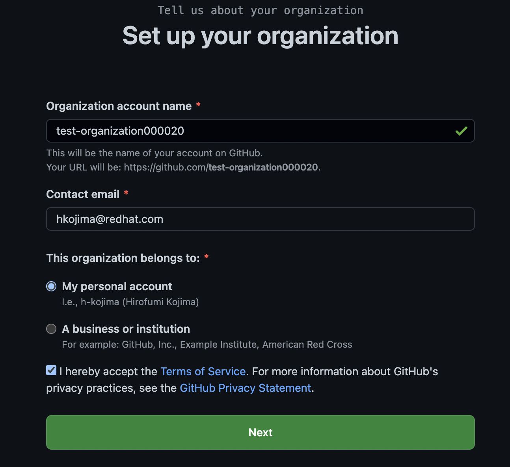
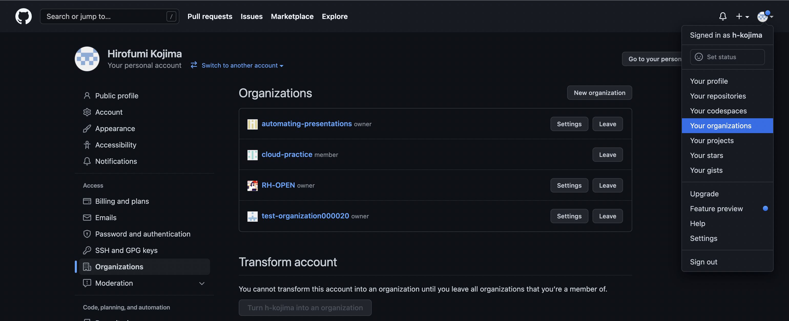
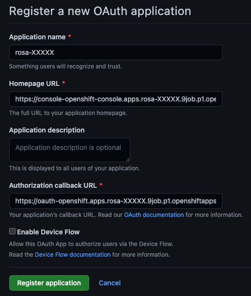
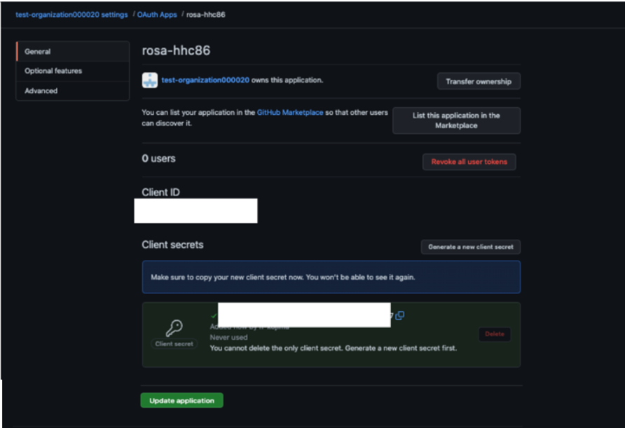
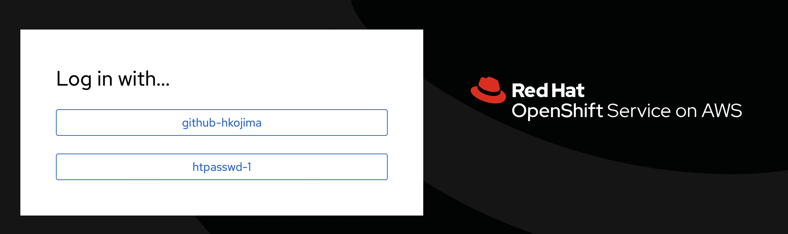
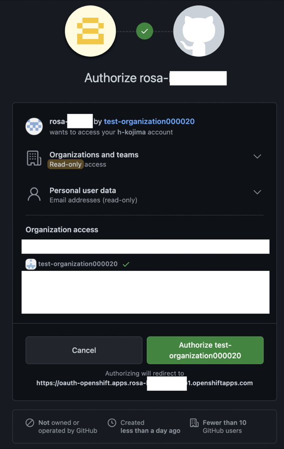
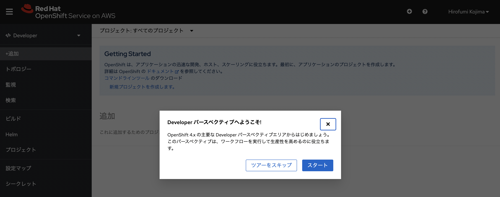

## GitHubを利用したROSAクラスターへのアクセス

### ROSA/OpenShift CLIを実行するRHELインスタンスへのアクセス

予めインストラクターが作成しておいたROSAクラスターにアクセスします。そのために、ROSAクラスターにアクセスするための認証情報を、ROSA CLIを使用して作成します。  
ROSA CLIを実行するためのRHELインスタンスにSSHアクセスして、本演習を実施します。 
インストラクターにより、RHELインスタンスのパブリックIPアドレスとSSHログインの情報が共有されます。

SSHを利用して、RHELインスタンスにアクセスします。
```
$ ssh testuserXX@XXX.XXX.XXX.XXX
```

このRHELインスタンスは、ROSA CLIとOpenShift CLI (oc)が利用できるようになっています。  
次のコマンドを実行して、rosa, ocコマンドが実行可能か確認してみてください。
```
$ rosa list clusters
ID                                NAME        STATE
XXXXXXXXXXXXXXXXXXXXXXXXXXXXXXXX  rosa-XXXXX  ready
$ oc version
Client Version: 4.10.15
```

### GitHub Organizationの作成

ROSA CLIを利用して、GitHub認証情報を追加します。[ROSAのアイデンティティープロバイダー](https://docs.openshift.com/rosa/rosa_install_access_delete_clusters/rosa-sts-config-identity-providers.html#understanding-idp-supported_rosa-sts-config-identity-providers)ではHTPasswdを利用できますが、これはROSAクラスターの、1つの管理者アカウント用に利用することしか現時点ではサポートされていません。そのため、本演習では、GitHubを利用してROSAクラスターへのアクセス設定を実施します。

GitHubのアカウントを持っていない場合、[こちら](https://github.com/)から作成してください。

GitHubアカウントの作成が完了したら、GitHub organizationを作成します。OpenShiftにGitHubとの認証連携を利用する場合、[GitHub Organization](https://docs.github.com/ja/organizations/collaborating-with-groups-in-organizations/about-organizations)か[GitHub teams](https://docs.github.com/ja/organizations/organizing-members-into-teams/about-teams)を認証に利用します。ここでは、GitHub organizationを利用した、認証連携を設定します。

右上のアイコンをクリックして、「Your organizations」を選択して、「New organization」をクリックします。「Your organization」がメニューにない場合は、画面右上の「+」アイコンから、「New Organization」を選択してください。


<div style="text-align: center;">GitHub organizationの新規作成</div>

プランが数種類表示されますので、Freeプランを選択します。


<div style="text-align: center;">Freeプランの選択</div>

Organizationの名前とメールアドレスを入力して、「Next」　-> 「Skip this setup」をクリックします。入力するOrganizationは、GitHubのグローバルネームスペースに存在するので、名前の重複はできません。重複しないような名前を入力してください。


<div style="text-align: center;">GitHub organizationの名前とメールアドレスの入力</div>

Welcome画面が表示されますので、右上のアイコンを再度クリックして、「Your organizations」を選択すると、先ほど作成したGitHub organizationの名前が追加されていることを確認できます。


<div style="text-align: center;">GitHub organizationの作成完了</div>

### ROSA CLIを利用したアイデンティティープロバイダーの追加

先ほどの手順で作成したGitHub organizationを利用して、アイデンティティープロバイダーを追加します。

次のコマンドを実行して、現時点でのROSAクラスターが利用できるアイデンティティープロバイダーを確認します。ROSAクラスターの名前である「rosa-XXXXX」は、「rosa list clusters」コマンドの実行で表示されたクラスター名に適宜置換してください。
```
$ rosa list idp -c rosa-XXXXX
NAME          TYPE
htpasswd-1    HTPasswd
```

現時点では、HTPasswdを利用したクラスター管理者用のアイデンティティープロバイダーしかありません。そのため、ROSAクラスターのアイデンティティープロバイダーを追加していきます。

次のコマンドを実行して、GitHubを利用したアイデンティティープロバイダーを追加します。「Identity provider name」の項目には、この例では「github-hkojima」と入力していますが、ご自身のものであると分かる名前を入力してください。ROSAクラスター内では、アイデンティティープロバイダー名の重複はできません。「GitHub organizations」の項目には、先ほど作成したorganizationの名前を入力してください。
```
$ rosa create idp -c rosa-XXXXX
I: Interactive mode enabled.
Any optional fields can be left empty and a default will be selected.
? Type of identity provider:  [Use arrows to move, type to filter]
> github
  gitlab
  google
  htpasswd
  ldap
  openid
? Identity provider name: github-hkojima
? Restrict to members of:  [Use arrows to move, type to filter, ? for more help]
> organizations
  teams
? Restrict to members of: organizations
? GitHub organizations: test-organization000020
? To use GitHub as an identity provider, you must first register the application:
  - Open the following URL:
    https://github.com/organizations/test-organization000020/settings/applications/new?oauth_application%5Bcallback_url%5D=https%3A%2F%2Foauth-openshift.apps.rosa-XXXXX.9job.p1.openshiftapps.com%2Foauth2callback%2Fgithub-hkojima&oauth_application%5Bname%5D=rosa-XXXXX&oauth_application%5Burl%5D=https%3A%2F%2Fconsole-openshift-console.apps.rosa-XXXXX.9job.p1.openshiftapps.com
  - Click on 'Register application'
? Client ID: [? for help] 
```

ここで「Open the following URL」のURLにアクセスすると、次の画面が表示されますので、「Register Application」をクリックします。


<div style="text-align: center;">GitHub OAuth Appsの作成</div>

「rosa-XXXXX」という名前のGitHub OAuth Appsが作成されましたので、「Generate a new client secret」をクリックしてClient secretsを作成して、下部にある「Update application」をクリックして、作成したシークレットを保存します。


<div style="text-align: center;">シークレットの作成</div>

「rosa create idp」コマンドの実行画面に戻り、上の画像にあるClient IDとClient Secretの値を入力します。GitHub Enterprise Hostname については何も入力せずにEnterキーを押し、Mapping methodは「claim」を選択します。

```
? Client ID: XXXXXXXXXXXX
? Client Secret: [? for help] ****************************************
? GitHub Enterprise Hostname (optional): 
? Mapping method: claim
I: Configuring IDP for cluster 'rosa-XXXXX'
I: Identity Provider 'github-hkojima' has been created.
   It will take up to 1 minute for this configuration to be enabled.
   To add cluster administrators, see 'rosa grant user --help'.
   To login into the console, open https://console-openshift-console.apps.rosa-XXXXX.9job.p1.openshiftapps.com and click on github-hkojima.
$ rosa list idp -c rosa-XXXXX
NAME              TYPE        AUTH URL
htpasswd-1        HTPasswd    
github-hkojima    GitHub      https://oauth-openshift.apps.rosa-XXXXX.9job.p1.openshiftapps.com/oauth2callback/github-hkojima
```

数分待って、「To login into the console」のURL(上記の例だと、`https://console-openshift-console.apps.rosa-XXXXX.9job.p1.openshiftapps.com`)にアクセスすると、次のような画面が表示されますので、「rosa create idp」コマンドで指定した認証プロバイダーの名前(ここでは「github-hkojima」)を選択します。


<div style="text-align: center;">ROSAのログイン画面</div>

GitHubをOAuthの認可サーバーとして利用しているため、ROSAから認可リクエストがGitHubに送信されて、認可の確認画面が表示されます。「Authorize XXXXX」をクリックして認可します。


<div style="text-align: center;">GitHubの認可画面</div>

GitHubから認可レスポンスが返されて、ROSAにリダイレクトされてログインが完了します。初回ログインした時に、「スタート」をクリックすると、開発者用コンソールの使い方ガイドを確認できます。


<div style="text-align: center;">ROSAの初回ログイン</div>

これでROSAクラスター上でアプリケーションを開発・デプロイできるようになります。次の演習の[アプリケーションのデプロイのクイックスタート](../rosa-app-deploy-quickstart)に進んでください。

### ログインができない場合のトラブルシューティング

ROSAクラスターのIDP作成時の、GitHub OAuth AppsのクライアントIDとクライアントシークレットのコピペミスが考えられますので、一旦「rosa delete idp」コマンドで、前述の手順で作成したIDPを削除して、再作成してみてください。
次のコマンドは、「github-XXX」IDPを削除する例となります。
```
＄　rosa delete idp github-XXX --cluster rosa-XXXXX
```

さらに、それでもうまくいかない場合、GitHub Oauth Appsを一旦削除・作成して、再設定してみてください。

[HOME](../../README.md)
