## AWS Controllers for Kubernetes (ACK) による Amazon S3の利用

### \[デモ\] AWS Controllers for Kubernetes (ACK) - Amazon S3 Operatorのインストール

※ここで紹介している内容は、インストラクターによって紹介されるデモ手順であり、受講者はコマンド/GUI操作を実施する必要はありません。次の「[ハンズオン] Amazon S3のバケット作成と削除」まで読み進めて下さい。

ROSAに含まれるRed Hat OpenShiftのOperatorHubでは、Kubernetes/OpenShiftからAWSのリソースを簡単に利用できるようになっている、[AWS Controllers for Kubernetes (ACK)](https://aws-controllers-k8s.github.io/community/docs/user-docs/openshift/)というOperatorを用意しています。ACKを利用して、Amazon S3を利用するための設定を行います。

ACKはAWSが提供しているOperatorです。詳細は下記をご参照ください。

- [AWS Controllers for Kubernetes プレビューの発表](https://aws.amazon.com/jp/about-aws/whats-new/2020/08/announcing-the-aws-controllers-for-kubernetes-preview/)

ROSAクラスターの管理者権限を持つユーザでログインして、OperatorHubを選択すると、利用可能なACKのリストを確認できます。

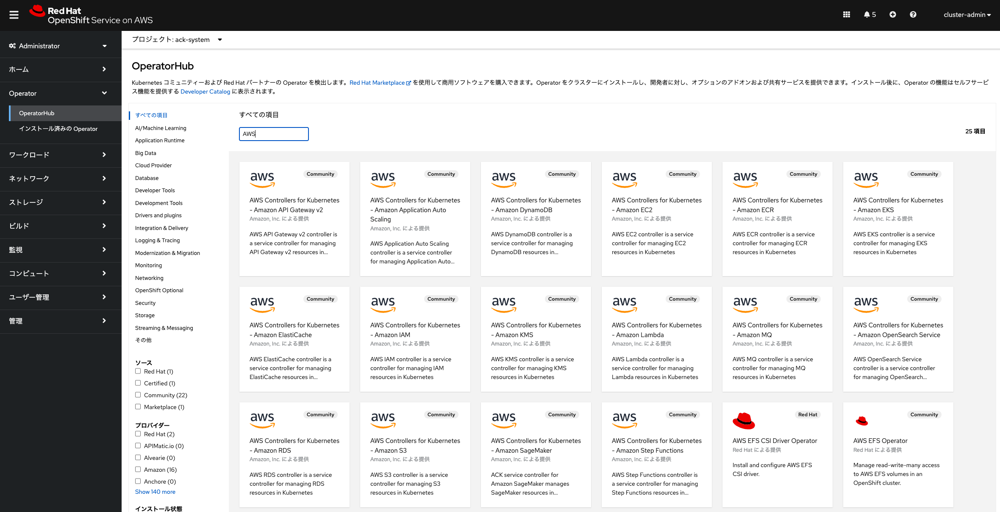
<div style="text-align: center;">OperatorHubにあるACKのリスト</div>　　

ACKを利用するために必要となる、設定情報とAWS認証情報を登録します。これには、管理者権限によるOpenShift CLI (oc) を利用します。  
最初に設定情報とAWS認証情報を保存するプロジェクト、「ack-system」を作成して、作業場所を「ack-system」に移動します。

```
$ oc new-project ack-system; oc project ack-system
```

設定情報をこのプロジェクト内に作成します。OpenShiftでの設定情報は、プロジェクトごとにconfigmapというリソースとして作成されます。ACKが利用するconfimapとして、「ack-s3-user-config」という名前(この「s3」の部分については、ACKが利用するAWSサービスの名前を指定します)が指定されますので、この名前を使ってconfigmapを作成します。

```
$ cat <<EOF > config.txt
ACK_ENABLE_DEVELOPMENT_LOGGING=true
ACK_LOG_LEVEL=debug
ACK_WATCH_NAMESPACE=
AWS_REGION=ap-northeast-1
AWS_ENDPOINT_URL=
ACK_RESOURCE_TAGS=rosa-ack
EOF
$ oc create configmap --from-env-file=config.txt ack-s3-user-config
configmap/ack-s3-user-config created
```

AWS認証情報を作成します。OpenShiftでの認証情報は、プロジェクトごとにsecretというリソースとして作成されます。ACKが利用するsecretとして、「ack-s3-user-secrets」という名前(この「s3」の部分については、ACKが利用するAWSサービスの名前を指定します)が指定されますので、この名前を使ってsecretsを作成します。

```
$ cat <<EOF > secrets.txt 
AWS_ACCESS_KEY_ID=XXXXXXX
AWS_SECRET_ACCESS_KEY=XXXXXXXXXXXXXXXXXXX
EOF
$ oc create secret generic --from-env-file=secrets.txt ack-s3-user-secrets
secret/ack-s3-user-secrets created
```

作成した　configmapとsecretsは、ROSAのWebコンソールで確認できます。

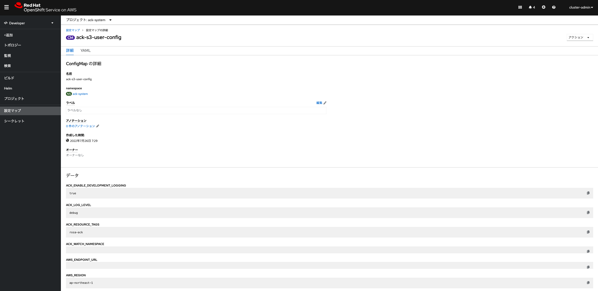
<div style="text-align: center;">ack-systemプロジェクトに作成したack-s3-user-config</div>　　

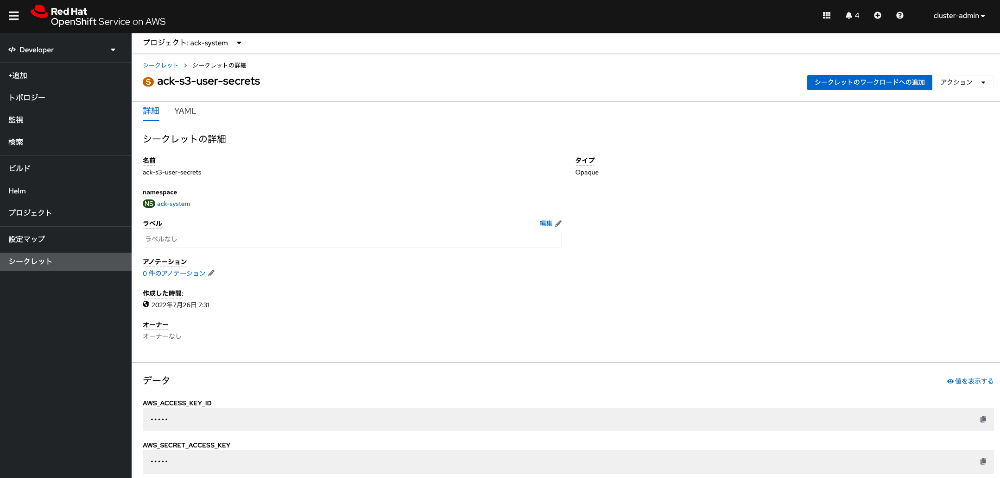
<div style="text-align: center;">ack-systemプロジェクトに作成したack-s3-user-secrets</div>　　

あとは、管理者権限を持つユーザで、OperatorHubから「ACK - Amazon S3」Operatorをインストールします。全てデフォルトの値を利用して、インストールを進めていきます。


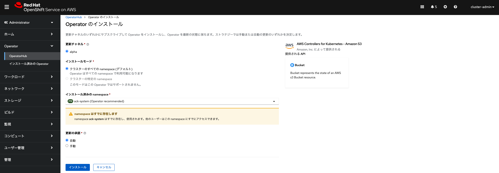
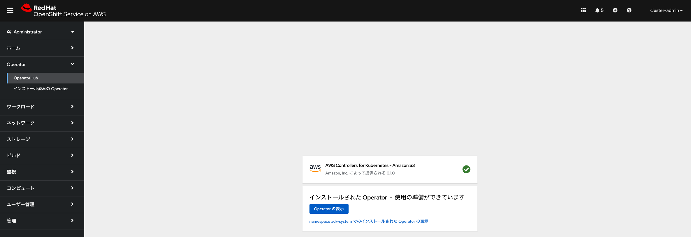
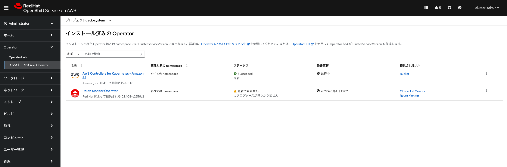
<div style="text-align: center;">ACK Amazon S3のインストール</div>　

この状態が表示されれば、インストールが完了しています。ROSAのローカルユーザがインストールされたOperatorを利用して、S3のバケットをAWS上に作成できるようになります。

#### \[Tips\]: ROSAクラスター管理者権限の付与

現時点で、受講者はGitHub認証を利用してROSAクラスターに一般ユーザ(プロジェクトの作成やプロジェクト上でのアプリデプロイ権限を持つユーザ)として、ROSAクラスターにログインしています。この一般ユーザには、rosaコマンドを利用して、管理者権限を付与できます。下記コマンドで指定している「h-kojima」は、GitHubアカウントのIDです。ご利用のGitHubアカウントIDに応じて、「h-kojima」のIDを適宜修正してください。

```
$ rosa list clusters
ID                                NAME        STATE
XXXXXXXXXXXXXXXXXXXXXXXXXXXXXXXX  rosa-XXXXX  ready
$ rosa list user --cluster rosa-XXXXX
W: There are no users configured for cluster 'rosa-XXXXX'
$ rosa grant user dedicated-admin --user=h-kojima --cluster rosa-XXXXX
I: Granted role 'dedicated-admins' to user 'h-kojima' on cluster 'rosa-XXXXX'
$ rosa list user --cluster rosa-XXXXX
ID          GROUPS
h-kojima    dedicated-admins
```

これで、ROSAクラスターの管理者権限が付与されましたので、受講者も上記で紹介しているOperatorのインストール作業が実施できるようになります。ログアウトして再ログインすると、一般ユーザでは参照できなかったROSAクラスターのリソースを参照できるようになります。

付与した管理者権限を削除したい場合は、「rosa revoke user」コマンドを実行します。

```
$ rosa revoke user dedicated-admin --user=h-kojima --cluster rosa-XXXXX
? Are you sure you want to revoke role dedicated-admins from user h-kojima in cluster rosa-XXXXX? Yes
I: Revoked role 'dedicated-admins' from user 'h-kojima' on cluster 'rosa-XXXXX'
$ rosa list user --cluster rosa-XXXXX
W: There are no users configured for cluster 'rosa-XXXXX'
```

### \[ハンズオン\] Amazon S3のバケット作成と削除

ROSAクラスターにローカルユーザでログインしなおして、「インストールされたOperator」から ACK Amazon S3 Operatorを利用してバケットを作成します。このOperatorを選択して、「インスタンスの作成」をクリックすると、パラメータ入力画面に移動します。「名前」は任意の名前(ここではexample20)を入力し、「Name」には作成するAmazon S3バケット名を入力します。Amazon S3バケットは、グローバル名前空間にあるため、名前の重複が許可されていません。そのため、重複しないような名前を指定する必要があります。最後に一番下にある「作成」ボタンをクリックすれば、S3バケットの作成が完了します。

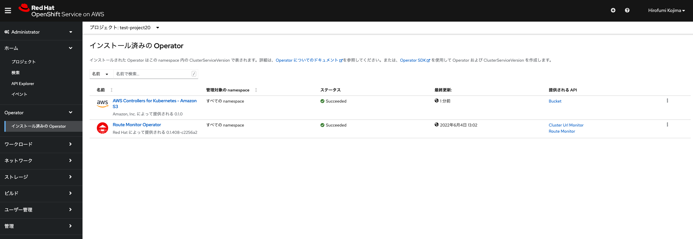
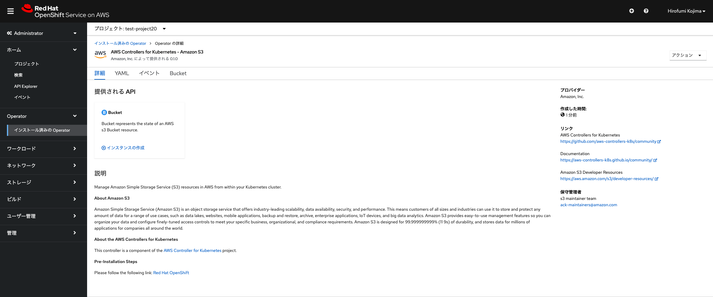
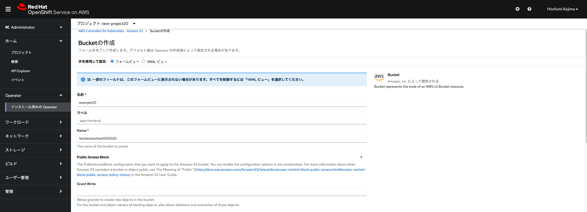
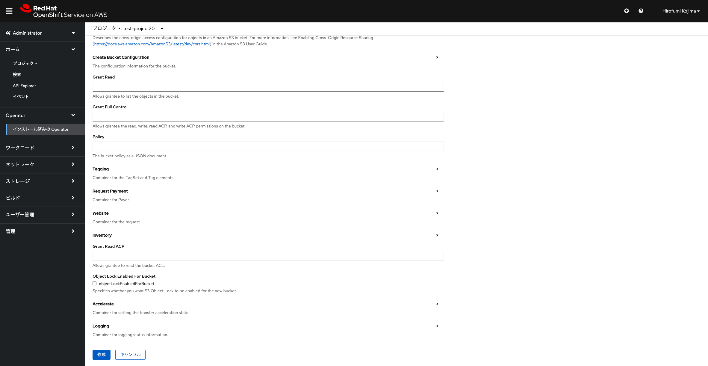
<div style="text-align: center;">Amazon S3バケットの作成</div>　

S3バケットの作成が完了すると、ROSAや[Amazon S3のコンソール](https://s3.console.aws.amazon.com/s3/home)で、バケットが作成されていることを確認できます。ROSAのコンソールで確認できない場合は、ROSA v4.11以降の場合、「Current namespace only」にチェックを入れることで確認できるようになります。AWSのコンソールにアクセスするためのアカウントは、インストラクターにより共有されます。

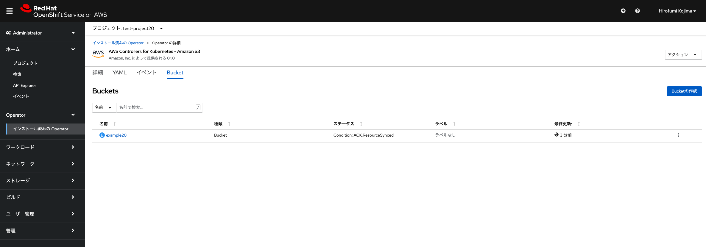
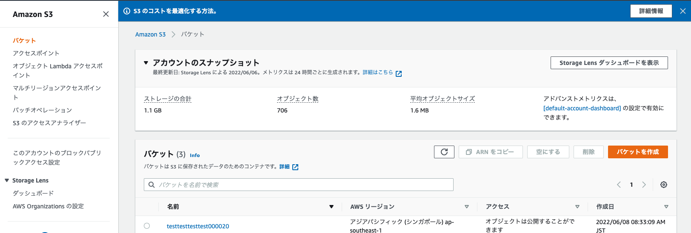
<div style="text-align: center;">Amazon S3バケットの作成</div>　

ACKによって作成したS3バケットを削除したい場合、当該バケットを選択して、「Bucketの削除」を選択すると削除できます。ROSAとAWSの両方から削除されます。

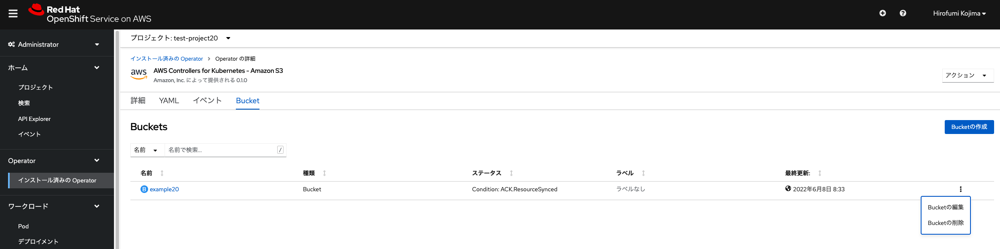
<div style="text-align: center;">Amazon S3バケットの削除</div>　

これでROSAクラスターからの、ACKを利用したAmazon S3バケットの作成と削除が完了しました。次の演習の[ROSAクラスターのロギングとモニタリング](../rosa-logs-and-monitor)に進んでください。

#### \[参考情報\]
- [Configuration for ACK controllers in an OpenShift cluster](https://aws-controllers-k8s.github.io/community/docs/user-docs/openshift/)
- [第1章 管理ロールおよびユーザーの管理](https://access.redhat.com/documentation/ja-jp/openshift_dedicated/4/html/cluster_administration/osd-admin-roles#understanding-admin-roles_osd-admin-roles)

[HOME](../../README.md)
