## アプリケーションのデプロイのクイックスタート

ROSAのWebコンソールを使用して、Node.jsのサンプルアプリケーションをデプロイします。

アプリケーションの作成場所となる「プロジェクト」を、「新規プロジェクトを作成します」をクリックして作成します。この例では、「test-project20」を入力しています。同じ名前を持つプロジェクトを複数作成できませんので、プロジェクト名は適宜変更してください。

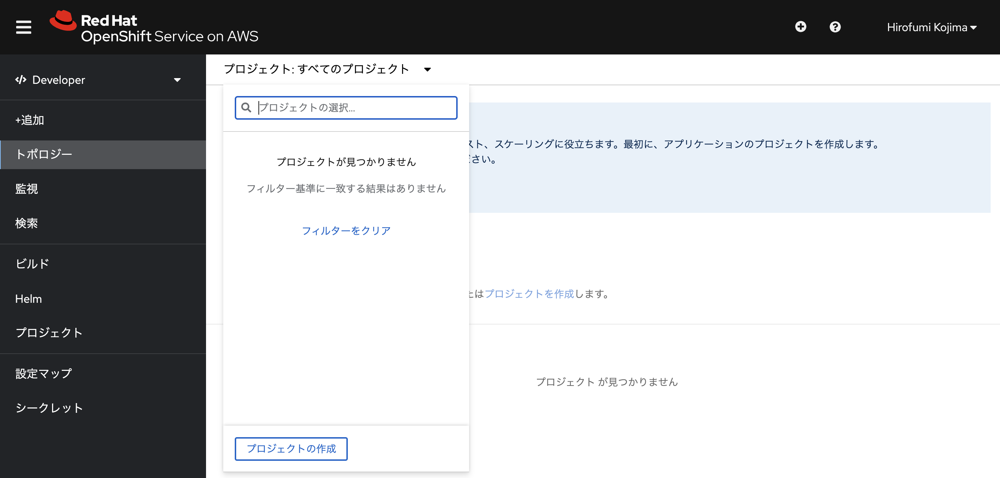
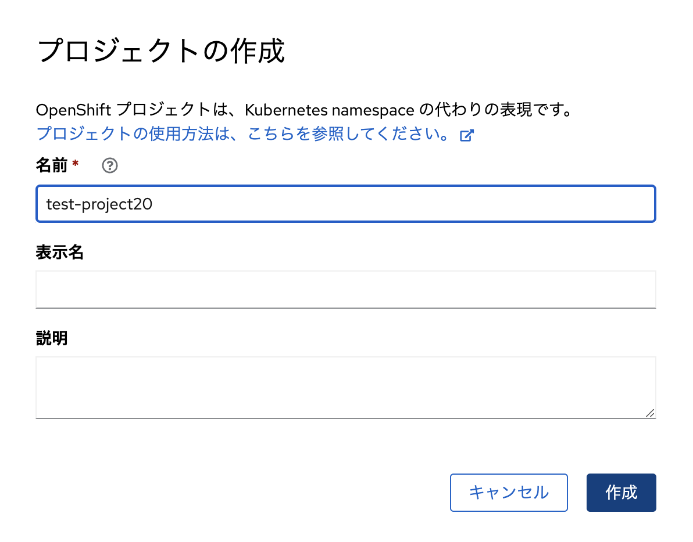

プロジェクトの作成
　　

プロジェクトの作成が完了したら、「+追加」からサンプルアプリケーションを作成します。「すべてのサービス」を選択して、「Node.js + PostgreSQL」を選択します。名前に「(Ephemeral)」が付いていないことを確認してください。「テンプレートのインスタンス化」を選択して、最後に「作成」をクリックします。入力パラメータは全てデフォルトのままにします。

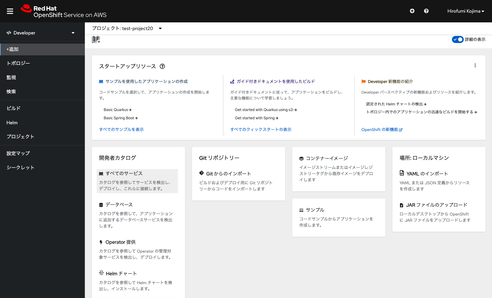
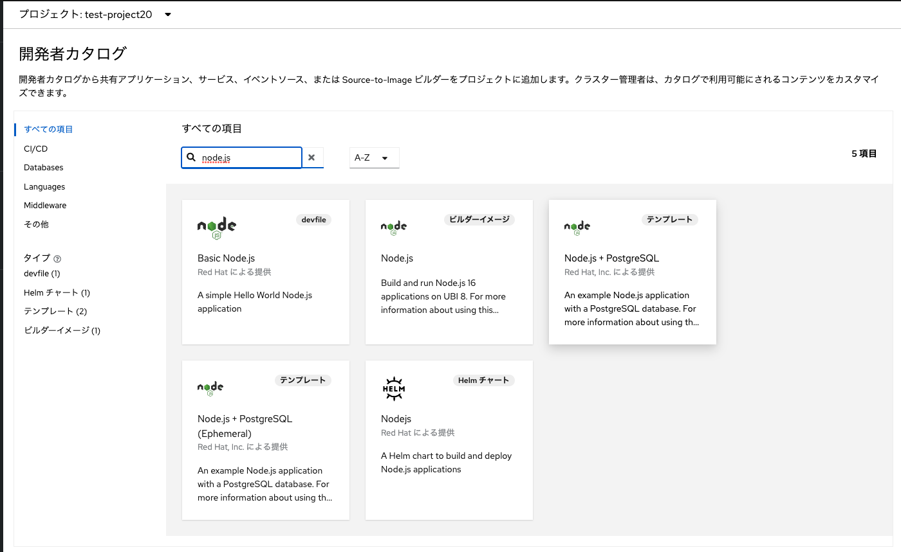
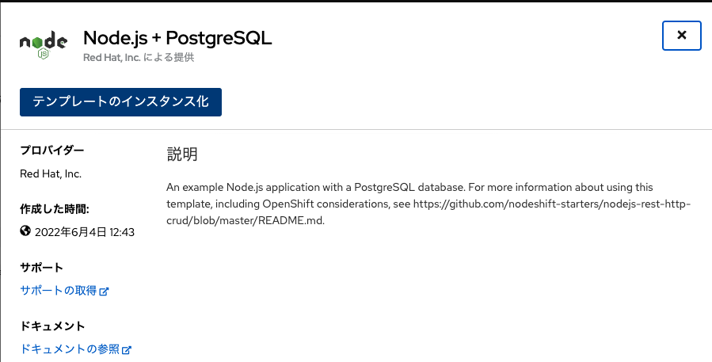
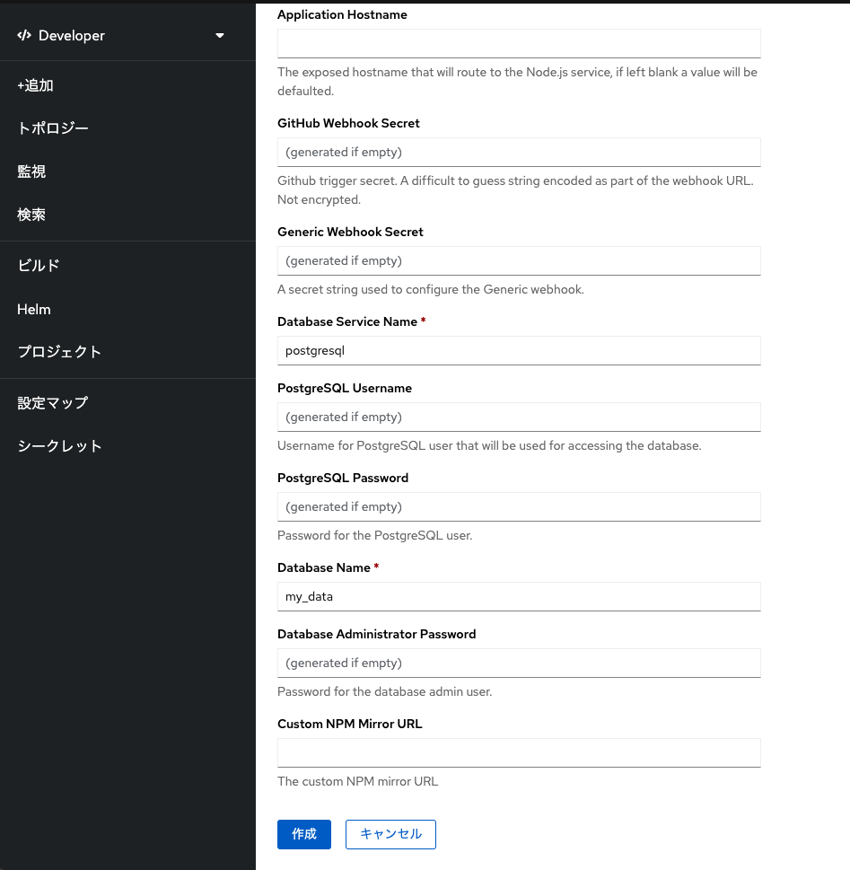

Node.js + PostgreSQLアプリの作成
　　

Node.jsとPostgreSQLアプリの作成が完了すると、「トポロジー」メニューからデプロイしたアプリのトポロジーを確認できます。トポロジーにある、Node.jsアイコンの右上部にある「矢印」アイコンをクリックすると、デプロイしたNode.jsアプリにアクセスできます。

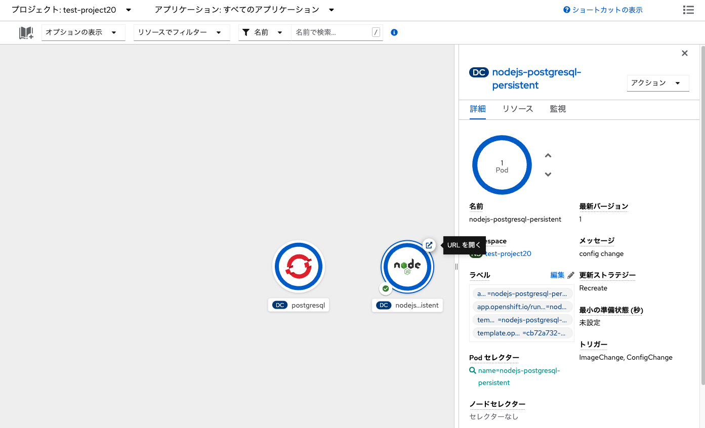
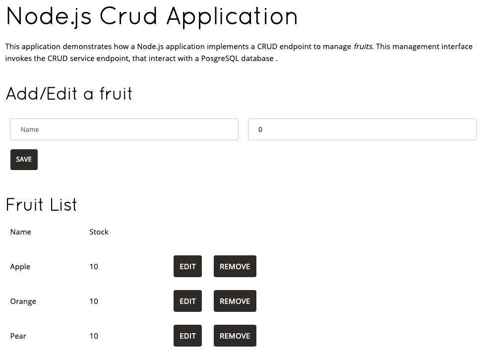

Node.jsアプリへのアクセス
　　

このサンプルアプリは、バックエンドのデータベースとしてPostgreSQLを使用しており、Webブラウザで入力したデータを保存します。例えば、Nameに「banana」、数字に「15」を入力して、「SAVE」をクリックすると、入力値が保存されていることを確認できます。

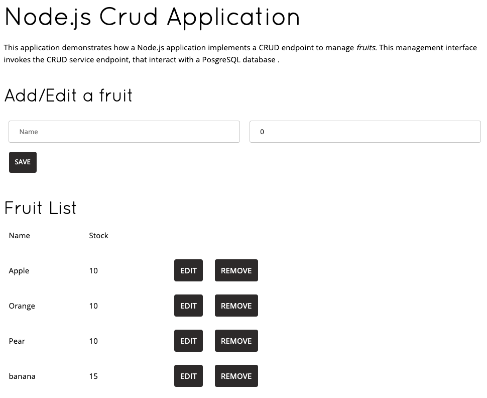

データの保存
　

保存したデータは、コンテナアプリであるPostgreSQL Pod(Kubernetes/OpenShift上でのコンテナアプリの実行単位。詳細は後述)に接続された永続ボリュームに保存されます。これは、サンプルアプリを作成するテンプレートにより、「Administrator」パースペクティブ(コンソール左上の「Developer」パースペクティブをクリックして、「Administrator」パースペクティブに切り替えます)の「永続ボリューム要求(Persistent Volume Claim, PVC)」で、「postgresql」という名前の要求に応じて、外部ストレージにデータを保存する永続ボリューム(Persistent Volume, PV)が作成されていることによります。PVC, PVの利用方法の詳細は、「永続ボリュームとしての Amazon EBS/EFS の利用設定」ハンズオンで扱います。

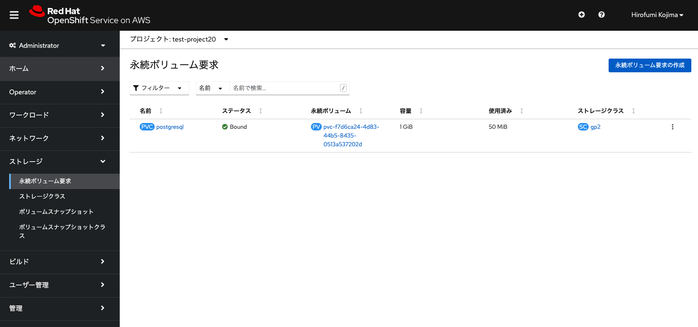

PostgreSQLが利用する永続ボリューム

コンテナアプリであるPostgreSQL Podを再起動してみます。「Developer」パースペクティブの「トポロジー」から、Podの数を設定できます。PostgreSQLアプリケーションを選択して、詳細タブから「↓矢印」をクリックしてPodの数を0にし、「^」をクリックしてPodの数を1にします。永続ボリュームを利用していない場合は、コンテナを再起動すると、コンテナ起動元となるコンテナイメージに保存されていないデータは失われますが、先ほど入力したデータが永続ボリュームとして外部ストレージに保存されているため、Podの再起動でもユーザが入力したデータが失われません。これは、Node.jsアプリに再度アクセスすることで確認できます。

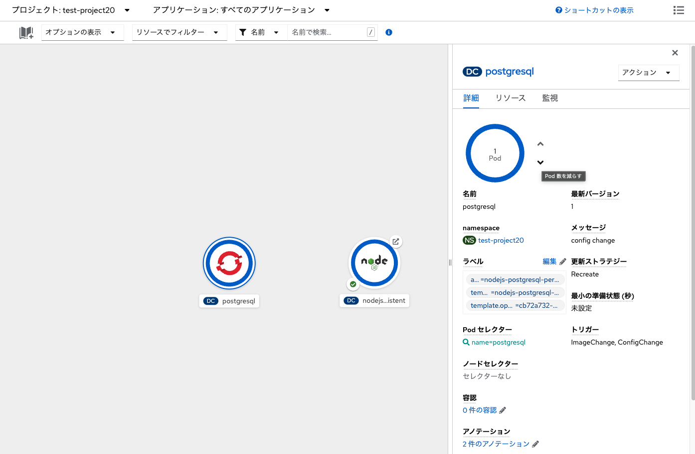

Pod数の設定

これでROSAクラスターでの、サンプルアプリケーションのデプロイが完了しました。次の演習の[永続ボリュームとしての Amazon EBS/EFS の利用設定](../rosa-volume)に進んでください。

[HOME](../../README.md)
