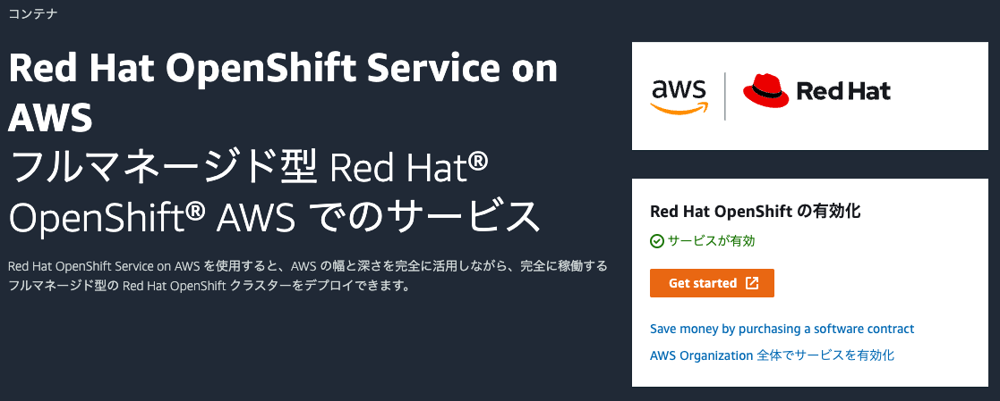
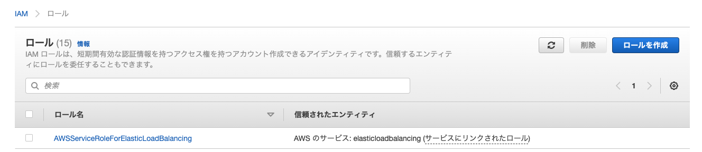
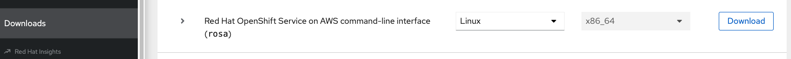
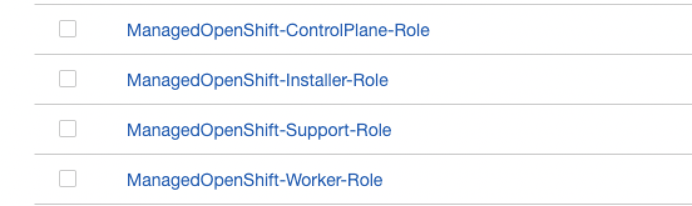
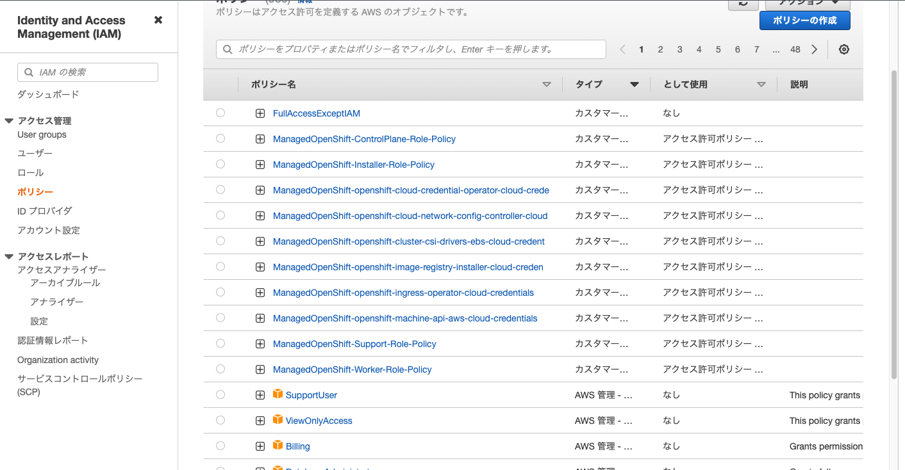

## ROSAクラスターの作成

### 前準備

ROSAは、Red Hatによるお客様の既存AWSアカウントへのデプロイを可能にするモデルを提供します。Red Hatはセキュリティを考慮して、[AWS Secrity Token Service (STS)](https://docs.aws.amazon.com/ja_jp/IAM/latest/UserGuide/id_credentials_temp.html) を利用したROSAのデプロイを推奨しています。STSを使用したROSAデプロイの前提条件は、次のドキュメントをご参照ください。

- [第1章 STS を使用した ROSA の AWS 前提条件](https://access.redhat.com/documentation/ja-jp/red_hat_openshift_service_on_aws/4/html/prepare_your_environment/rosa-sts-aws-prereqs)
- [第4章 必要な AWS サービスクォータ](https://access.redhat.com/documentation/ja-jp/red_hat_openshift_service_on_aws/4/html/prepare_your_environment/rosa-sts-required-aws-service-quotas)

ROSAクラスターをデプロイするには、AWSアカウントと[Red Hatアカウント](https://cloud.redhat.com/)を利用します。アカウントがない場合は、アカウントを作成する必要があります。ROSAをデプロイ・実行するには、専用のAWSアカウントの使用を推奨しています。

[AWSコンソール](https://console.aws.amazon.com/rosa/)でROSAサービスを有効にします。AWSアカウントにログインして、「Enable OpenShift」をクリックします。次のような画面になれば、ROSAサービスが有効になっています。


<div style="text-align: center;">ROSAサービスの有効化</div>　　

AWS CLIを[インストール](https://docs.aws.amazon.com/cli/latest/userguide/cli-chap-install.html)して、[設定](https://docs.aws.amazon.com/ja_jp/cli/latest/userguide/cli-chap-configure.html)します。このとき、「~/.aws/credentials」で、次の情報を設定する必要があります。

- aws_access_key_id
- aws_secret_key

「~/.aws/configure」で、デフォルトのAWSのリージョンを設定します。そして、次のコマンドを実行して、AWS APIをクエリーし、AWS CLIがインストールされて正しく設定されていることを確認します。次のような出力が表示されれば、AWS CLIの設定が完了しています。

```
$ aws sts get-caller-identity
{
    "UserId": "AIDXXXXXXXXXXXXX",
    "Account": "XXXXXXXXX",
    "Arn": "arn:aws:iam::XXXXXXXXX:user/testuser01"
}
```

AWSアカウントを利用してELBをインストールしたことがない場合、次のコマンドを実行してELB用のロールを作成します。
```
$ aws iam create-service-linked-role --aws-service-name "elasticloadbalancing.amazonaws.com"
```

IAMロールが作成されると、次のような画面を確認できます。


<div style="text-align: center;">AWS ELBのロール</div>　　

続いて、[ROSA CLI](https://console.redhat.com/openshift/downloads)をダウンロードして、PATHを設定します。


<div style="text-align: center;">ROSA　CLIのダウンロード画面</div>　　

```
$ chmod +x rosa
$ mv rosa /usr/local/bin/
$ rosa version
1.2.2
```

続いて、ROSA CLIでRed Hatアカウントにログインします。アクセストークンは、下記のコマンド実行により表示されているURLから入手できます。
```
$ rosa login
To login to your Red Hat account, get an offline access token at https://console.redhat.com/openshift/token/rosa
? Copy the token and paste it here: ********************
I: Logged in as 'h.kojima' on 'https://api.openshift.com'
```

AWSアカウントにROSAデプロイに必要なクォータがあることを確認します。次のような出力が表示されたら、クォータのチェックはパスしています。

```
$ rosa verify quota  
I: Validating AWS quota...
I: AWS quota ok. If cluster installation fails, validate actual AWS resource usage against https://docs.openshift.com/rosa/rosa_getting_started/rosa-required-aws-service-quotas.html
```

もし、クォータのチェックに失敗したら、エラーメッセージをもとに、前述のAWSサービスクォータの増加をリクエストします。

次のコマンドを実行して、AWSおよびRed Hatの認証情報が正しく設定されていることを確認します。AWSアカウントID、デフォルトのリージョン、および、ARNが予測した内容と一致していることを確認します。

```
$ rosa whoami
AWS Account ID:               XXXXXXXXXX
AWS Default Region:           ap-northeast-1
AWS ARN:                      arn:aws:iam::XXXXXXXXXX:user/testuser01
OCM API:                      https://api.openshift.com
OCM Account ID:               XXXXXXXXXX
OCM Account Name:             Hiforumi Kojima
OCM Account Username:         h.kojima
OCM Account Email:            hkojima@redhat.com
OCM Organization ID:          XXXXXXXXXX
OCM Organization Name:        Hiforumi Kojima
OCM Organization External ID: XXXXXXXXXX
```

ROSA CLIを利用して、最新のOpenShift CLI (oc) をインストールします。
```
$ rosa download openshift-client
$ rosa verify openshift-client
I: Verifying whether OpenShift command-line tool is available...
I: Current OpenShift Client Version: 4.10.3
```

### STSを使用したROSAクラスターの作成

STSを使用してROSAクラスターを作成するために必要な、AWS IAMロールとポリシーを作成します。
```
$ rosa create account-roles --mode auto -y
I: Logged in as 'h.kojima' on 'https://api.openshift.com'
I: Validating AWS credentials...
I: AWS credentials are valid!
I: Validating AWS quota...
I: AWS quota ok. If cluster installation fails, validate actual AWS resource usage against https://docs.openshift.com/rosa/rosa_getting_started/rosa-required-aws-service-quotas.html
I: Verifying whether OpenShift command-line tool is available...
I: Current OpenShift Client Version: 4.10.3
I: Creating account roles
I: Creating roles using 'arn:aws:iam::XXXXXXXXX:user/testuser01'
I: Created role 'ManagedOpenShift-Installer-Role' with ARN 'arn:aws:iam::XXXXXXXXX:role/ManagedOpenShift-Installer-Role'
I: Created role 'ManagedOpenShift-ControlPlane-Role' with ARN 'arn:aws:iam::XXXXXXXXX:role/ManagedOpenShift-ControlPlane-Role'
I: Created role 'ManagedOpenShift-Worker-Role' with ARN 'arn:aws:iam::XXXXXXXXX:role/ManagedOpenShift-Worker-Role'
I: Created role 'ManagedOpenShift-Support-Role' with ARN 'arn:aws:iam::XXXXXXXXX:role/ManagedOpenShift-Support-Role'
I: Created policy with ARN 'arn:aws:iam::XXXXXXXXX:policy/ManagedOpenShift-openshift-cloud-credential-operator-cloud-crede'
I: Created policy with ARN 'arn:aws:iam::XXXXXXXXX:policy/ManagedOpenShift-openshift-image-registry-installer-cloud-creden'
I: Created policy with ARN 'arn:aws:iam::XXXXXXXXX:policy/ManagedOpenShift-openshift-ingress-operator-cloud-credentials'
I: Created policy with ARN 'arn:aws:iam::XXXXXXXXX:policy/ManagedOpenShift-openshift-cluster-csi-drivers-ebs-cloud-credent'
I: Created policy with ARN 'arn:aws:iam::XXXXXXXXX:policy/ManagedOpenShift-openshift-cloud-network-config-controller-cloud'
I: Created policy with ARN 'arn:aws:iam::XXXXXXXXX:policy/ManagedOpenShift-openshift-machine-api-aws-cloud-credentials'
I: To create a cluster with these roles, run the following command:
rosa create cluster --sts
```

AWSコンソールから、必要なIAMロールとポリシーが作成されていることを確認できます。


<div style="text-align: center;">作成されたIAMロール</div>　　


<div style="text-align: center;">作成されたIAMポリシー</div>　　

どのようなAWSのアクションを許可するポリシーが作成されているかは、[こちらのドキュメント](https://docs.openshift.com/rosa/rosa_architecture/rosa-sts-about-iam-resources.html#rosa-sts-account-wide-roles-and-policies-creation-methods_rosa-sts-about-iam-resources)から確認することもできます。

ROSAクラスターの作成コマンドを実行します。
```
$ rosa create cluster --sts
I: Enabling interactive mode
? Cluster name: test-cluster01
? OpenShift version: 4.10.14
I: Using arn:aws:iam::XXXXXXXXX:role/ManagedOpenShift-Installer-Role for the Installer role
I: Using arn:aws:iam::XXXXXXXXX:role/ManagedOpenShift-ControlPlane-Role for the ControlPlane role
I: Using arn:aws:iam::XXXXXXXXX:role/ManagedOpenShift-Worker-Role for the Worker role
I: Using arn:aws:iam::XXXXXXXXX:role/ManagedOpenShift-Support-Role for the Support role
? External ID (optional): 
? Operator roles prefix: test-cluster01-b0e6
? Multiple availability zones (optional): No
? AWS region: ap-northeast-1
? PrivateLink cluster (optional): No
? Install into an existing VPC (optional): No
? Enable Customer Managed key (optional): No
? Compute nodes instance type (optional): m5.xlarge
? Enable autoscaling (optional): No
? Compute nodes: 2
? Machine CIDR: 10.0.0.0/16
? Service CIDR: 172.30.0.0/16
? Pod CIDR: 10.128.0.0/14
? Host prefix: 23
? Encrypt etcd data (optional): Yes
? Disable Workload monitoring (optional): No
I: Creating cluster 'test-cluster01'
I: To create this cluster again in the future, you can run:
   rosa create cluster --cluster-name test-cluster01 --sts --role-arn arn:aws:iam::XXXXXXXXX:role/ManagedOpenShift-Installer-Role --support-role-arn arn:aws:iam::XXXXXXXXX:role/ManagedOpenShift-Support-Role --controlplane-iam-role arn:aws:iam::XXXXXXXXX:role/ManagedOpenShift-ControlPlane-Role --worker-iam-role arn:aws:iam::XXXXXXXXX:role/ManagedOpenShift-Worker-Role --operator-roles-prefix test-cluster01-b0e6 --region ap-northeast-1 --version 4.10.14 --compute-nodes 2 --compute-machine-type m5.xlarge --machine-cidr 10.0.0.0/16 --service-cidr 172.30.0.0/16 --pod-cidr 10.128.0.0/14 --host-prefix 23 --etcd-encryption
I: To view a list of clusters and their status, run 'rosa list clusters'

I: Cluster 'test-cluster01' has been created.
I: Once the cluster is installed you will need to add an Identity Provider before you can login into the cluster. See 'rosa create idp --help' for more information.
Name:                       test-cluster01
ID:                         XXXXXXXXX
External ID:                
OpenShift Version:          
Channel Group:              stable
DNS:                        test-cluster01.xxx.xx.openshiftapps.com
AWS Account:                XXXXXXXXX
API URL:                    
Console URL:                
Region:                     ap-northeast-1
Multi-AZ:                   false
Nodes:
 - Control plane:           3
 - Infra:                   2
 - Compute:                 2
Network:
 - Service CIDR:            172.30.0.0/16
 - Machine CIDR:            10.0.0.0/16
 - Pod CIDR:                10.128.0.0/14
 - Host Prefix:             /23
STS Role ARN:               arn:aws:iam::XXXXXXXXX:role/ManagedOpenShift-Installer-Role
Support Role ARN:           arn:aws:iam::XXXXXXXXX:role/ManagedOpenShift-Support-Role
Instance IAM Roles:
 - Control plane:           arn:aws:iam::XXXXXXXXX:role/ManagedOpenShift-ControlPlane-Role
 - Worker:                  arn:aws:iam::XXXXXXXXX:role/ManagedOpenShift-Worker-Role
Operator IAM Roles:
 - arn:aws:iam::XXXXXXXXX:role/test-cluster01-b0e6-openshift-cloud-network-config-controller-cl
 - arn:aws:iam::XXXXXXXXX:role/test-cluster01-b0e6-openshift-machine-api-aws-cloud-credentials
 - arn:aws:iam::XXXXXXXXX:role/test-cluster01-b0e6-openshift-cloud-credential-operator-cloud-cr
 - arn:aws:iam::XXXXXXXXX:role/test-cluster01-b0e6-openshift-image-registry-installer-cloud-cre
 - arn:aws:iam::XXXXXXXXX:role/test-cluster01-b0e6-openshift-ingress-operator-cloud-credentials
 - arn:aws:iam::XXXXXXXXX:role/test-cluster01-b0e6-openshift-cluster-csi-drivers-ebs-cloud-cred
State:                      waiting (Waiting for OIDC configuration)
Private:                    No
Created:                    Jun  7 2022 03:09:25 UTC
Details Page:               https://console.redhat.com/openshift/details/s/XXXXXXXXX
OIDC Endpoint URL:          https://rh-oidc.s3.us-east-1.amazonaws.com/XXXXXXXXX

I: Run the following commands to continue the cluster creation:

	rosa create operator-roles --cluster test-cluster01
	rosa create oidc-provider --cluster test-cluster01

I: To determine when your cluster is Ready, run 'rosa describe cluster -c test-cluster01'.
I: To watch your cluster installation logs, run 'rosa logs install -c test-cluster01 --watch'.
```

ここで作成するROSAクラスター専用IAMロールと、OpenID Connect (OIDC) プロバイダーを作成します。これらを作成しないと、ROSAクラスター作成状態が「Waiting」のままで、デプロイが完了しません。
```
$ rosa create operator-roles --cluster test-cluster01 --mode auto -y
$ rosa create oidc-provider --cluster test-cluster01　--mode auto -y
```

クラスターのデプロイ状態を次のコマンドで確認できます。
```
$ rosa list clusters
ID                                NAME            STATE
XXXXXXXXXXXXXXXXXXXXXXXXXXXXXXXX  test-cluster01  installing
$ rosa describe cluster -c test-cluster01
...<省略>...
State:                      installing
...<省略>...
```

デプロイ状態(STATE)は、デプロイの進捗として次のように出力されます。
- waiting (Waiting for OIDC configuration)
- pending (Preparing account)
- installing (DNS setup in progress)
- installing
- ready

また、クラスターのデプロイログは次のコマンドで確認できます。
```
$ rosa logs install -c test-cluster01 --watch
```

40分くらい待つとROSAクラスターのデプロイが完了して、STATEが「ready」状態になり、作成したROSAクラスターにアクセスできるようになります。
