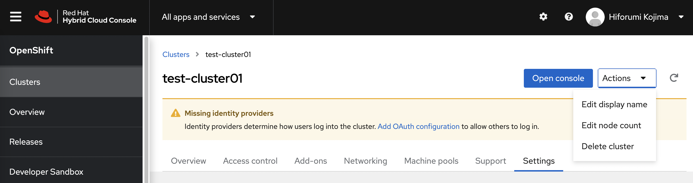
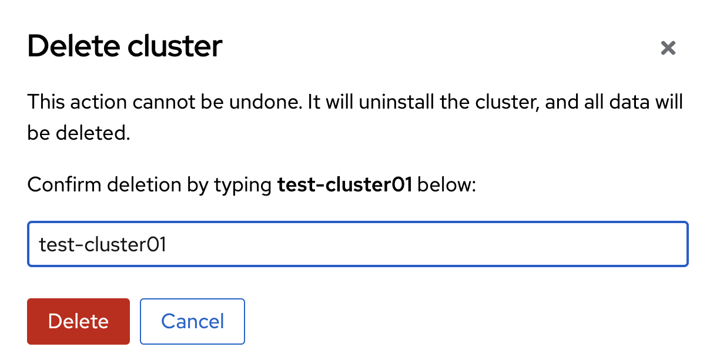

## ROSAクラスターの削除

OpenShift Cluster Manager (OCM) のコンソールか、ROSA CLIを使用してROSAクラスターを削除します。

OCMを利用する場合は、削除対象のROSAクラスターを選択して、Settingsタブの「Actions」から「Delete cluster」をクリックします。そして、削除対象のクラスター名を入力して「Delete」をクリックすると、ROSAクラスターが削除されます。



<div style="text-align: center;">ROSAクラスターの削除</div>　　


または、ROSA CLIを使用して、ROSAクラスターを削除します。
```
$ rosa delete cluster --cluster test-cluster01 --watch   
? Are you sure you want to delete cluster test-cluster01? Yes
I: Cluster 'test-cluster01' will start uninstalling now
I: Your cluster 'test-cluster01' will be deleted but the following objects may remain
I: Operator IAM Roles: - arn:aws:iam::XXXXXXXX:role/test-cluster01-b0e6-openshift-cloud-network-config-controller-cl
 - arn:aws:iam::XXXXXXXX:role/test-cluster01-b0e6-openshift-machine-api-aws-cloud-credentials
 - arn:aws:iam::XXXXXXXX:role/test-cluster01-b0e6-openshift-cloud-credential-operator-cloud-cr
 - arn:aws:iam::XXXXXXXX:role/test-cluster01-b0e6-openshift-image-registry-installer-cloud-cre
 - arn:aws:iam::XXXXXXXX:role/test-cluster01-b0e6-openshift-ingress-operator-cloud-credentials
 - arn:aws:iam::XXXXXXXX:role/test-cluster01-b0e6-openshift-cluster-csi-drivers-ebs-cloud-cred

I: OIDC Provider : https://rh-oidc.s3.us-east-1.amazonaws.com/XXXXXXXX

I: Once the cluster is uninstalled use the following commands to remove the above aws resources.

	rosa delete operator-roles -c XXXXXXXX
	rosa delete oidc-provider -c XXXXXXXX
W: Logs for cluster 'test-cluster01' are not available
/ time="2022-06-07T05:59:28Z" level=debug msg="Couldn't find install logs provider environment variable. Skipping."
time="2022-06-07T05:59:28Z" level=debug msg="search for matching resources by tag in ap-northeast-1 matching aws.Filter{\"kubernetes.io/cluster/test-cluster01-xxxxxxx\":\"owned\"}"
time="2022-06-07T05:59:28Z" level=info msg="running file observer" files="[/etc/aws-creds/..2022_06_07_05_59_25.1832513202/aws_config]"
...<省略>...
\ I: Cluster 'test-cluster01' completed uninstallation
```

ROSAクラスターが削除完了したあとに、各ROSAクラスターがAWSリソースの作成と認証に利用するIAMロールとOIDCプロバイダーを削除します。このとき、「rosa delete cluster」コマンドを実行したときに表示された、「rosa delete operator-roles」, 「rosa delete oidc-provider」コマンドを実行します。ちなみに、OCMのコンソールからROSAクラスターを削除した時にも、IAMロールとOIDCプロバイダーは自動削除されないため、この削除コマンドを実施する必要があります。その場合、ROSAクラスター削除前に「rosa list clusters」コマンドで確認しておいたROSAクラスターのID(NAMEではありません)を、「-c XXXXXXXX」の「XXXXXXXX」として指定します。なお、ROSAクラスターのIDが不明な場合は、AWSのIAMコンソールから当該IAMロールとOIDCプロバイダーを削除することもできます。
```
$ rosa delete operator-roles -c XXXXXXXX --mode auto -y
I: Fetching operator roles for the cluster: XXXXXXXX
I: Successfully deleted the operator roles
$ rosa delete oidc-provider -c XXXXXXXX --mode auto -y
I: Successfully deleted the OIDC provider arn:aws:iam::XXXXXXXX:oidc-provider/rh-oidc.s3.us-east-1.amazonaws.com/XXXXXXXX
```

ROSAクラスター作成の前準備で作成した、AWSアカウントのIAMロール(ManagedOpenShift-XXX-Role)を削除します。
```
$ rosa delete account-roles --mode auto -y
? Role prefix: ManagedOpenShift
? Account role deletion mode: auto
I: Successfully deleted the account roles
```

ManagedOpenShift-XXX-Roleに紐づけられていたManagedOpenShift-XXXXXポリシーは削除されませんので、必要に応じてAWS CLIやIAMコンソールから、手動で削除します。これで、ROSAクラスターの削除とAWSアカウントのクリーンアップが完了します。

これで、ROSAクラスターの基本的な利用方法を学習する演習とデモ紹介は終了しました。時間に余裕がありましたら、オプションの演習である[ROSAクラスターでのJavaアプリケーション開発 スターターラボ](../rosa-sample-app-develop)に進んでください。

[HOME](../../README.md)
