## ROSAクラスターのロギングとモニタリング

### [デモ] ROSAクラスターのロギングの設定

※ここで紹介している内容は、インストラクターによって紹介されるデモ手順であり、受講者はコマンド/GUI操作を実施する必要はありません。次の「[ハンズオン] Amazon CloudWatchによるログ確認」まで読み進めて下さい。


ROSAのロギングについては、Amazon CloudWatchをベースとするログ転送ソリューションの利用を推奨しています。以前のROSAまでは、ROSAのロギングアドオンOperator※によるCloudWatchへのログ転送をサポートしていましたが、ROSAのロギングアドオンOperatorが[非推奨扱いになった](https://access.redhat.com/solutions/6977966)ことに伴って、OpenShift Logging Operatorによる転送設定を推奨するようになりました。

**※** OCMコンソールの「Add-ons」タブにある「Cluster Logging Operator」メニューから、または、「rosa install addon cluster-logging-operator」コマンドで、ROSAクラスターにインストールできるOperatorのことです。

転送設定の概要は次のとおりです。STSの利用有無に関わらず、以下の手順を実施することができます。

1. Amazon CloudWatchのログ参照/書き込み権限を持つAWS IAMユーザーを作成して、このユーザーのアクセスキーとシークレットアクセスキーを取得します。
1. ROSAのOpenShiftコンソールから、OpenShift Logging Operatorをインストールして、ロギングとログ転送用のインスタンスを作成します。このとき、上記手順で作成したAWS IAMユーザーの認証情報(アクセスキー/シークレットアクセスキー)を利用するように設定します。

これらを順番に見ていきましょう。

#### 1. CloudWatch用のAWS IAMユーザーの作成

AWSのコンソールまたはAWS CLIで、CloudWatchのログ参照/書き込み権限を持つAWS IAMユーザーを作成します。IAMユーザー作成手順は、[AWS アカウントでの IAM ユーザーの作成](https://docs.aws.amazon.com/ja_jp/IAM/latest/UserGuide/id_users_create.html)をご参照ください。

例として、下記画像のような権限を持つユーザーを作成します。この画像の例では、ログ参照/書き込み権限として「CloudWatchLogsFullAccess」を「rosauser01」ユーザーに付与しています。

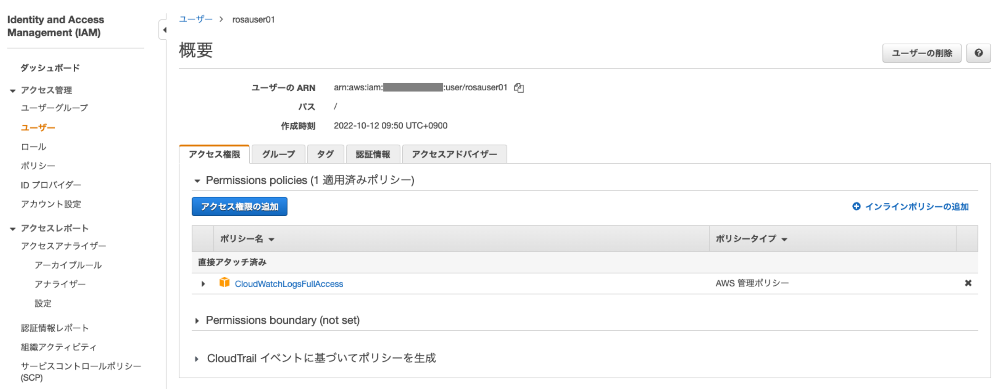
<div style="text-align: center;">CloudWatchのログ参照/書き込み権限を持つ AWS IAMユーザー作成例</div>　　

この時に取得した、AWS IAMユーザーのアクセスキーとシークレットアクセスキーをメモしておきます。

#### 2. OpenShift Logging Operatorのインストールと設定

OpenShiftには「Red Hat OpenShift Logging Operator」というOperatorがあり、OpenShiftのロギングスタックを運用するために利用されます。このOperatorによって、CloudWatchへのログ転送や、[Loki](https://access.redhat.com/documentation/ja-jp/openshift_container_platform/4.11/html/logging/cluster-logging-about-loki)によるロギングスタックの運用が可能になります。

OpenShift Logging Operatorは、OpenShiftのコアコンポーネントがある`openshift-*`プロジェクトの1つ、「openshift-logging」プロジェクトにインストールします。これらのコアコンポーネントにアクセスするための権限である「cluster-admin」権限(dedicated-admin権限の上位権限)が必要となるので、「rosa grant user」コマンドで、この権限を付与します。

```
$ rosa grant user cluster-admin --user XXXXX -c rosa-XXXXX
I: Granted role 'cluster-admins' to user 'XXXXX' on cluster 'rosa-XXXXX'
```

OperatorHubから、「Red Hat OpenShift Logging Operator」をインストールします。「openshift logging」で検索した結果からインストールが可能です。Logging Operatorのインストールには、全てデフォルトのパラメーターを利用します。

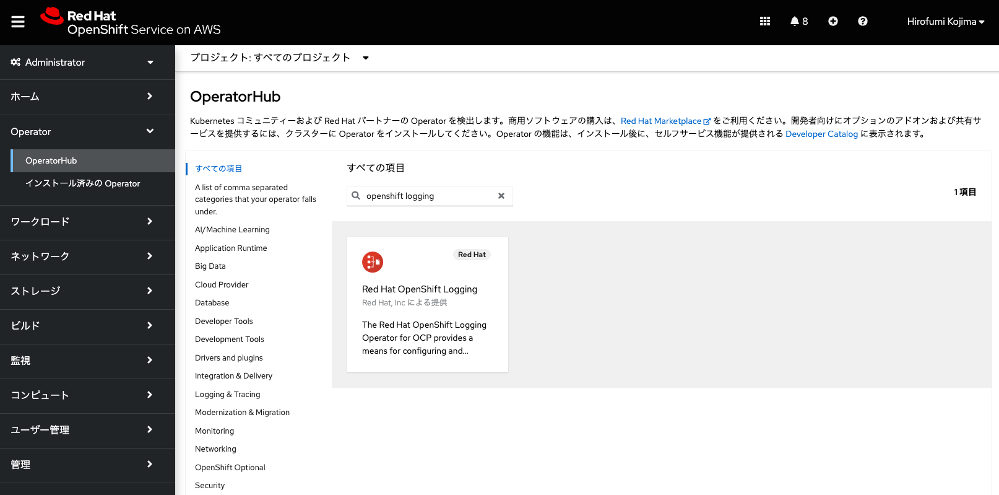
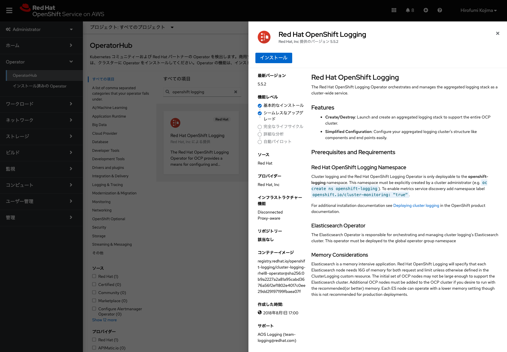
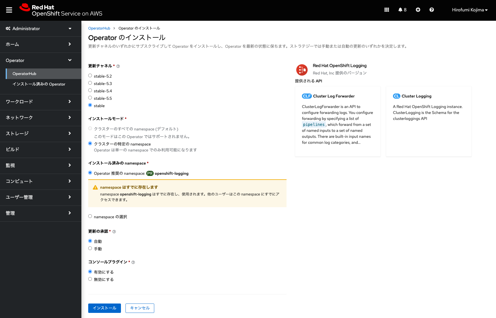
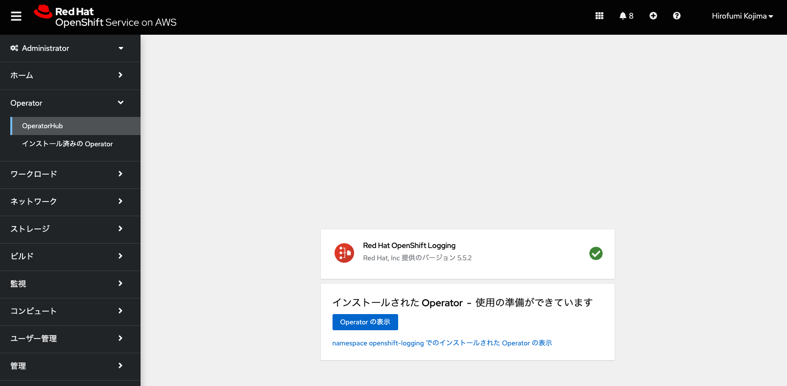
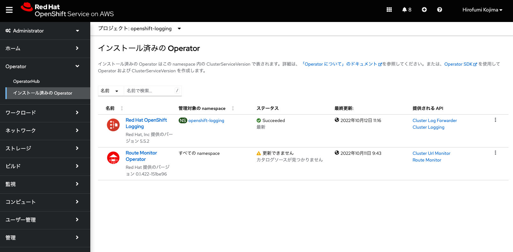
<div style="text-align: center;">Logging Operatorのインストール</div>　


インストールが完了したら、最初に、fluentdによるクラスターロギングを設定します。「インストール済みのOperator」の「Red Hat OpenShift Logging」Operatorを選択して、「Cluster Logging」の下にある「インスタンスの作成」から、次のYAMLを入力して「作成」をクリックします。

```
apiVersion: logging.openshift.io/v1
kind: ClusterLogging
metadata:
  name: instance
  namespace: openshift-logging
spec:
  collection:
    type: fluentd
  managementState: Managed
```

**[Tips]** Amazon CloudWatch Logsには[各種クォータ(制限値)](https://docs.aws.amazon.com/ja_jp/AmazonCloudWatch/latest/logs/cloudwatch_limits_cwl.html)が設定されています。これらの制限値を超えないように、[ログ転送のパフォーマンスを調整](https://access.redhat.com/documentation/ja-jp/openshift_container_platform/4.11/html/logging/cluster-logging-collector-tuning_cluster-logging-collector)できます。

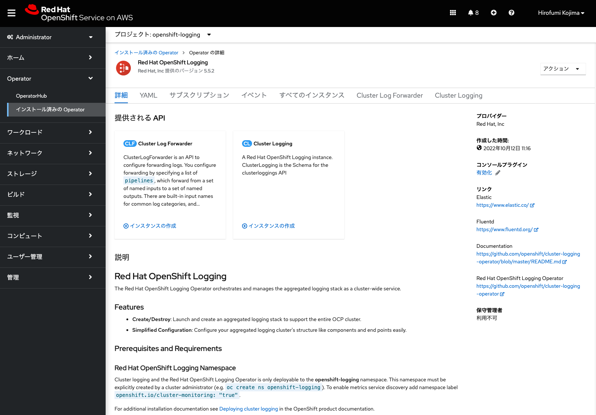
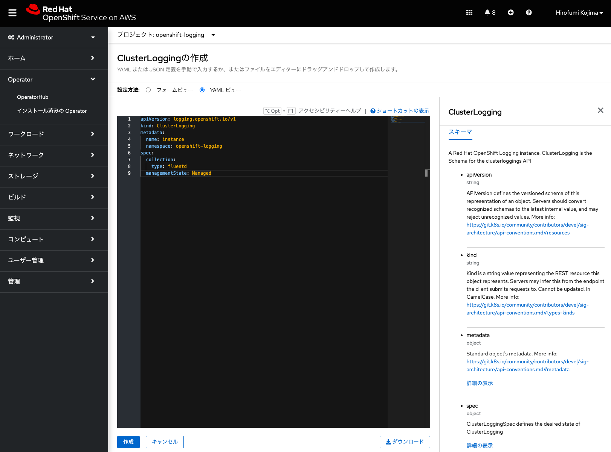
<div style="text-align: center;">ClusterLogging インスタンスの作成</div>　


この段階では、logstore or logforward destination(ログ保存先またはログ転送先)の設定が無いために、ステータスが「Condition: CollectorDeadEnd」となっており、前述のYAMLで設定した、ログ収集/転送に利用するfluentdを実行するPodが起動されません。

次にログ転送設定を行います。「1. CloudWatch用のAWS IAMユーザーの作成」で取得したアクセスキーをシークレットアクセスキーを、AWS認証情報としてOpenShiftのシークレットリソースに保存します。

「OpenShift Logging Operator」をインストールした「openshift-logging」プロジェクトを選択して、左サイドメニューの「ワークロード」→「シークレット」に移動します。

次に、「作成」から「キーと値のシークレット」をクリックして、次の値を入力して「作成」をクリックします。

- シークレット名: AWS認証情報として保存するOpenShiftリソースの任意の名前。この例では「cw-secret」を指定。
- キー/値: AWSアクセスキー(aws_access_key_id)とシークレットアクセスキー(aws_secret_access_key)を入力。

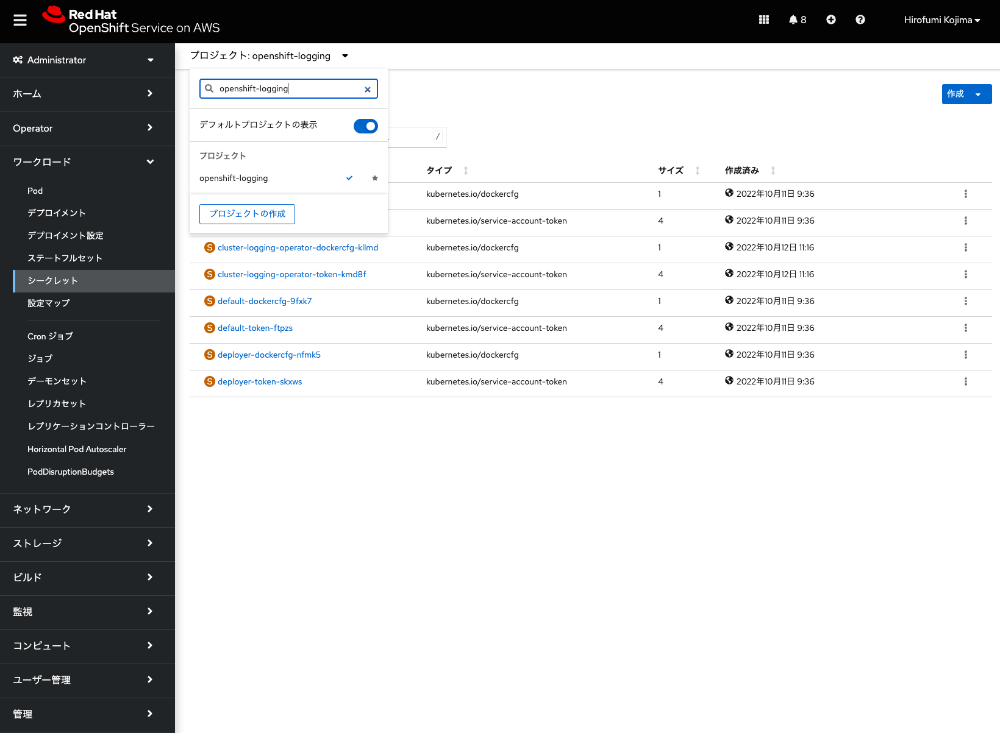
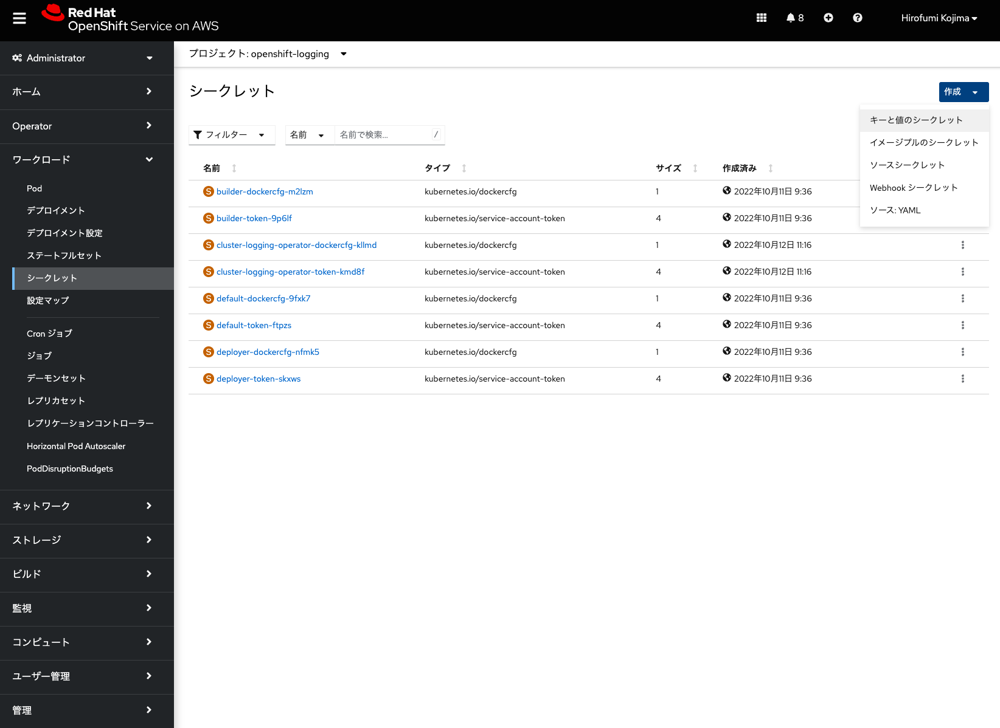
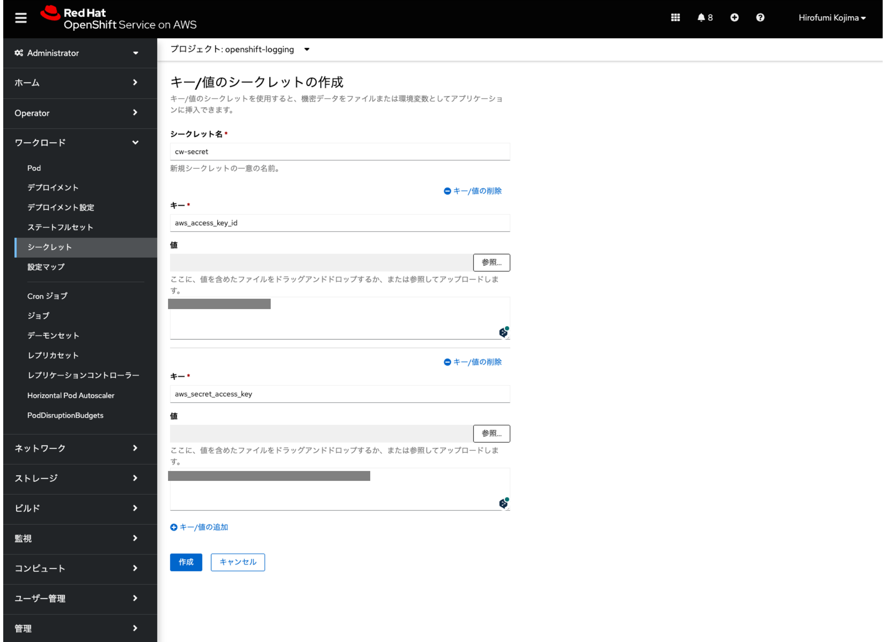
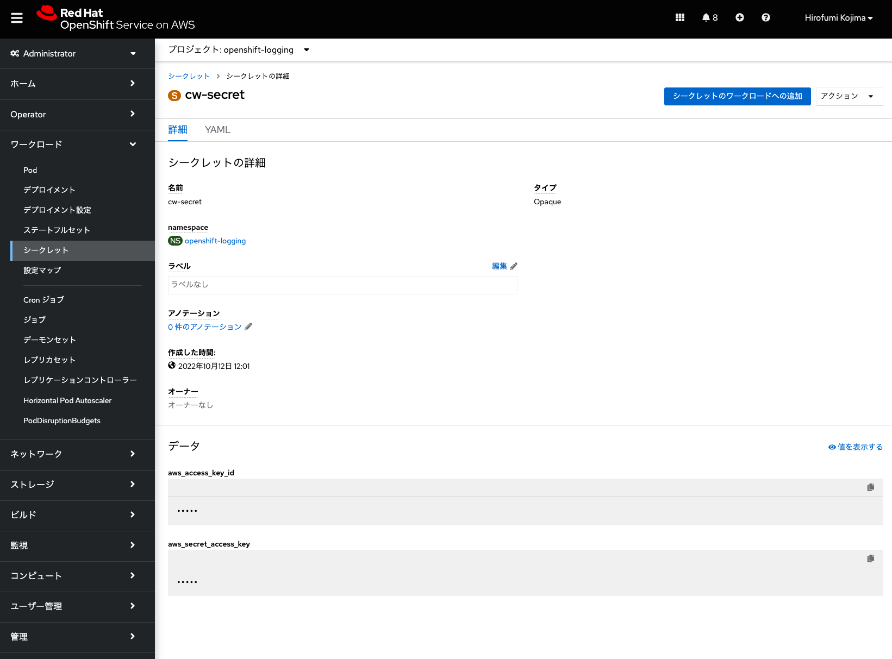
<div style="text-align: center;">AWS認証情報を保存するシークレットの作成</div>　

作成したシークレットリソース「cw-secret」を利用した、ログ転送設定のためのインスタンスを作成します。「OpenShift Logging Operator」を選択して、「Cluster Log Forwarder」の下にある「インスタンスの作成」から、次のYAMLを入力して「作成」をクリックします。

この例では、「region: ap-northeast-1」を指定して、東京リージョンのCloudWatchへのログ転送を指定しています。また、前述の手順で作成した「cw-secret」シークレットも指定します。

```
apiVersion: "logging.openshift.io/v1"
kind: ClusterLogForwarder
metadata:
  name: instance
  namespace: openshift-logging
spec:
  outputs:
   - name: cw
     type: cloudwatch
     cloudwatch:
       region: ap-northeast-1
     secret:
        name: cw-secret
  pipelines:
    - name: all-logs
      inputRefs:
        - application
        - infrastructure
        - audit
      outputRefs:
        - cw
```


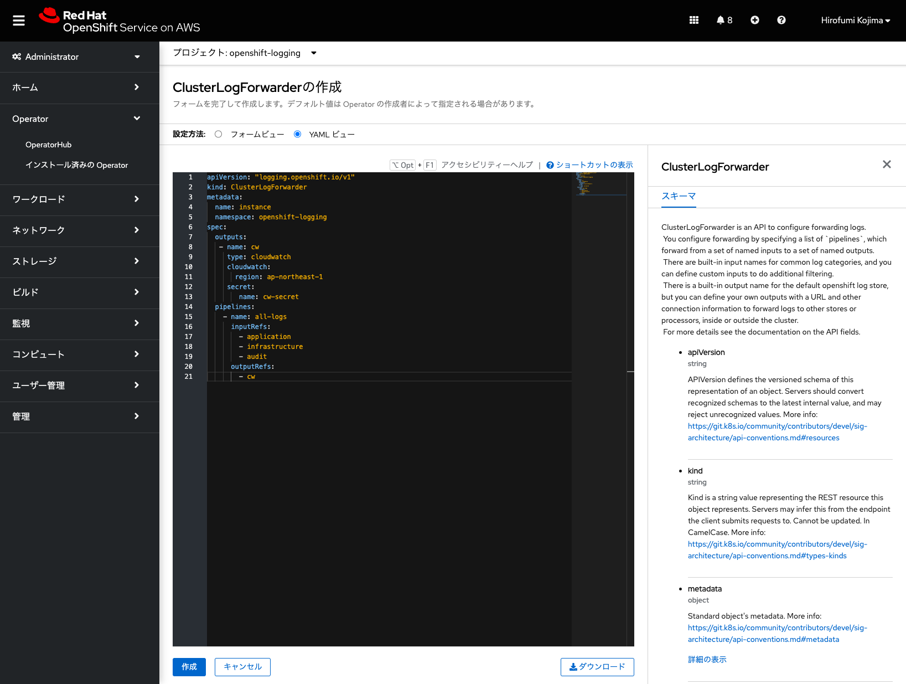
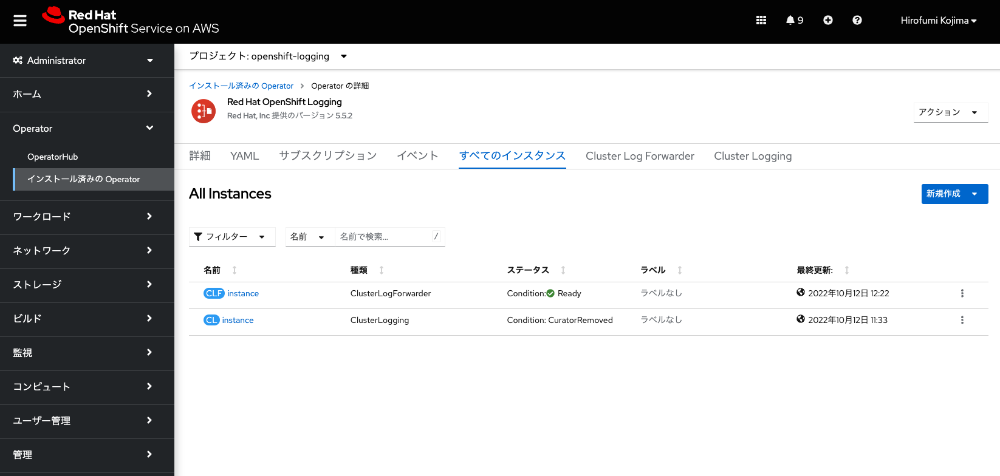
<div style="text-align: center;">ClusterLoggingForwarder インスタンスの作成</div>　


どの種類のログを転送するかについては、前述したYAMLの「inputRefs:」以下の項目で指定できます。

- `application`: アプリケーションログの収集。利用者が作成したプロジェクトにデプロイされるアプリケーションのログ(stdoutとstderrに出力されるログ)を収集します。後述のインフラストラクチャー関連のログは除きます。
- `infrastructure`: インフラストラクチャーログの収集。ROSAクラスター作成時にデフォルトで作成される`openshift-*`,`kube-*`などのプロジェクトにある、インフラストラクチャー関連のログを収集します。
- `audit`: セキュリティ監査に関連するログの収集。ノード監査システム(auditd)で生成されるログ(/var/log/audit/audit.log)、Kubernetes apiserver、OpenShift apiserverの監査ログを収集します。通常、ROSAクラスターの監査ログはRed HatのSREチームにより、OpenShift Logging Operatorとは別の仕組み(現時点ではsplunk)を使ってROSAクラスターの外に保存され、[問題調査の際に、ROSAの利用者のサポートケースを使用したリクエストに伴って提供](https://access.redhat.com/documentation/ja-jp/red_hat_openshift_service_on_aws/4/html/introduction_to_rosa/rosa-policy-change-management_rosa-policy-responsibility-matrix)されます。そのため、ROSAの利用者はこれらのログを保存する必要は必ずしもありませんが、CloudWatchで監査ログを保存/確認したい場合は、「audit」を指定します。


これでログ転送先の設定が完了したため、先ほど作成したLoggingインスタンスによって、自動的に`collector-*`という名前のPod(内部ではfluentdが実行)が、「openshift-logging」プロジェクトに作成されます。


<div style="text-align: center;">openshift-loggingプロジェクトに追加されたPod</div>　　


メモリ使用量が多い、ログ収集とCloudWatchへのログ転送に利用されるcollector Podについては、インフラノードを除く、全てのコントローラ/コンピュートノードで実行されます。後にご紹介する手順で、ROSAの利用者がコンピュートノードを追加/削除した場合、その操作に伴って、上記画像に表示されている「cluster-logging-operator-XXXXX」Pod(Operatorとして実行されるこのPodは、コンピュートノードで実行されます)が、collector podを自動的に追加/削除します。


これでCloudWatchへのログ転送設定は完了です。もし、これ以上`openshift-*`などのプロジェクトにあるROSAのコアコンポーネントにアクセスしない場合は、「cluster-admin」権限を、「rosa revoke user」コマンドで削除しておきます。

```
$ rosa revoke user cluster-admins --user XXXXX --cluster rosa-XXXXX
? Are you sure you want to revoke role cluster-admins from user XXXXX in cluster rosa-XXXXX? Yes
I: Revoked role 'cluster-admins' from user 'XXXXX' on cluster 'rosa-XXXXX'
```


#### [Tips] STSを利用した、Amazon CloudWatchへのログ転送設定

前述したAWSアカウントでのIAMユーザー作成が許可されていない場合、ROSAクラスターインストールの時と同様に、AWS STSを利用したログ転送の設定が可能です。この場合、AWS IAMの一時的な認証情報として利用される、専用のAWS IAMロール(CloudWatchへのログ転送に必要)を作成する必要があります。

本演習では取り扱いませんが、具体的な設定手順については、下記を参考にしてください。

**[参考情報]** [STSを利用した、Amazon CloudWatchへのログ転送設定](../rosa-sts-logs)


### [ハンズオン] Amazon CloudWatchによるログ確認

[Amazon CloudWatchのコンソール](https://console.aws.amazon.com/cloudwatch/home)にアクセスして、ROSAクラスターのリージョン(本演習環境では東京リージョン. ap-northeast-1)を選択します。すると、ROSAクラスターから転送されたログのグループを確認できます。なお、AWSコンソールにアクセスするためのアカウントは、インストラクターにより共有されます。


<div style="text-align: center;">Amazon CloudWatchのロググループ</div>　　

末尾に「application」という名前が付いているロググループを選択して、ログストリームの1つを選択します。ここでは、[アプリケーションのデプロイのクイックスタート](../rosa-app-deploy-quickstart)で作成したNode.jsアプリケーションの、イメージビルドに関するログ(この例だと、「test-project20_XXXXX.sti-build」が名前に含まれているログストリーム)を選択します。受講者は、自身が作成したプロジェクトに関する「<プロジェクト名>_XXXXX.sti-build」を名前に含むログストリームを選択してみてください。ログストリームが表示されない場合、Cloudwatchの画面にある「さらにロードします」をクリックして、タイムスタンプが古いログストリームをロードしていきます。


<div style="text-align: center;">「test-project20」プロジェクトのログストリーム</div>　　

ログストリームにあるログイベントをロードしていき、タイムスタンプが一番古いログイベントの「message」と、Pod(この例では、nodejs-postgresql-persistent-1-build)の先頭のログを照らし合わせると、PodのログがCloudWatchに正しく転送されていることが確認できます。


<div style="text-align: center;">ログの転送確認</div>　　

こうしたログをもとに、ROSAの利用者は[CloudWatchのサブスクリプションを使用したログデータのリアルタイム処理](https://docs.aws.amazon.com/ja_jp/AmazonCloudWatch/latest/logs/Subscriptions.html)などを実行できるようになります。


### [ハンズオン] ROSAクラスターのモニタリング

ROSAクラスターは、デフォルトでPrometheusをベースとしたモニタリング機能が有効になっています。このモニタリング機能のユースケースは、ROSAクラスター全体のリソース利用状況を見るものと、ROSAの利用者が作成したプロジェクト内のリソース利用状況を見るものの2つに別れます。

ROSAクラスター全体のリソース利用状況のモニタリング、いわゆる「プラットフォームモニタリング」とRed Hatの公式ドキュメントで定義しているものについては、Red HatのSREチームによって利用されています。ROSAの責任分担マトリクスによって、プラットフォームモニタリングについては、Red Hatに責任があると定義しているため、ROSAの利用者はこれらの情報を気にする必要はありません。

後述するコンピュートノードのオートスケール設定が有効になっていない場合、プラットフォームモニタリングによって得られた情報をもとに、SREチームがROSAの利用者に、追加のコンピュートノードやストレージなどのクラスターリソースに必要な変更についてアラートを適宜送信します。

**[参考情報]** [3.2.2.2 変更管理 の「容量の管理」 (ROSAのポリシーおよびサービス定義)](https://access.redhat.com/documentation/ja-jp/red_hat_openshift_service_on_aws/4/html/introduction_to_rosa/rosa-policy-change-management_rosa-policy-responsibility-matrix#doc-wrapper)


ROSAクラスターでは、モニタリング機能を提供するPodが、「openshift-monitoring」と「openshift-user-workload-monitoring」という2つのプロジェクトで実行されています。プラットフォームモニタリング機能を提供するPodが「openshift-monitoring」プロジェクトで実行され、利用者のプロジェクトのモニタリングに関するカスタム設定を適用するためのPodが「openshift-user-workload-monitoring」プロジェクトで実行されます。

これらは、ROSAクラスターの管理者権限「dedicated-admin」を持つユーザーでログインすることで確認できます。管理者権限を付与していない場合は、次のコマンドで付与します。

```
$ rosa grant user dedicated-admin --user=<受講者が利用しているROSAのユーザID(GitHubのアカウントID)> --cluster rosa-XXXXX
I: Granted role 'dedicated-admins' to user '<受講者が利用しているROSAのユーザID(GitHubのアカウントID)>' on cluster 'rosa-XXXXX'
```


<div style="text-align: center;">モニタリングプロジェクトの一覧</div>　　


「openshift-monitoring」プロジェクトの中で、比較的大きなサイズのメモリを使用するPodは、「prometheus-k8s」Podです。ただし、このPodは、Red HatのSREチームが管理するインフラストラクチャーノード上で実行/管理されるため(ノードセレクターが、「node-role.kubernetes.io/infra」となります)、ROSAの利用者がアプリケーションの開発やデプロイ用に利用するコンピュートノードのメモリ利用に影響を与えません。


<div style="text-align: center;">「openshift-monitoring」プロジェクトのPod</div>　　

また、「openshift-monitoring」プロジェクトにあるPodは、全てのコントローラ/インフラストラクチャー/コンピュートノードで実行されるnode-exporter(メトリクス収集に利用)などの一部のPodを除き、大半がインフラストラクチャーノード上で実行されるようになっています。

これらについては、各Podを選択して、「詳細タブ」のノードセレクターの表示や、ノード名をクリックして、「ノードの詳細」の「概要」タブの「ロール」が「infra, worker」(インフラストラクチャーノード)、または、「master」(コントローラノード)となっていることを確認してみてください。

**[参考情報]** [1.2.1 デフォルトのモニタリングコンポーネント](https://access.redhat.com/documentation/ja-jp/openshift_container_platform/4.11/html/monitoring/understanding-the-monitoring-stack_monitoring-overview#default-monitoring-components_monitoring-overview)

「openshift-user-workload-monitoring」プロジェクトでは、PrometheusのOperator Pod(コントローラノードで実行)を除いて、全てコンピュートノードで実行されます。なお、コンピュートノードを追加したとしても、これらのPodは追加されません。ちなみに、これらのPodは、[コントローラまたはインフラストラクチャーノードに移動することは許可されていません。](https://access.redhat.com/documentation/ja-jp/red_hat_openshift_service_on_aws/4/html/cluster_administration/moving-monitoring-components-to-different-nodes_rosa-configuring-the-monitoring-stack)


<div style="text-align: center;">「openshift-user-workload-monitoring」プロジェクトのPod</div>　　

ROSAクラスターのPrometheusでは、Red HatのSREチームによって、ROSAクラスターのコアコンポーネントのメトリクスデータが永続ボリュームに一定期間保存されるように設定されています。

一方で、利用者のプロジェクトに関するメトリクスデータは、デフォルトでは永続ボリュームに保存される設定にはなっていません。このため、ROSAクラスターのアップグレードや障害発生に伴う再起動などにより、利用者のメトリクスデータが失われる可能性があります。

そこで、利用者のメトリクスデータを、200GiBの永続ボリュームを利用して30日間保存するような設定例を考えてみましょう。この場合、「openshift-user-workload-monitoring」プロジェクトのPodが利用する設定情報(ConfigMapリソース)を編集します。

「user-workload-monitoring-config」設定マップ(ConfigMap)の「YAML」タブを開いて、下記の「data: ...」以下の行を末尾に追加して「保存」をクリックして保存します。(これは本演習環境では設定済みなので、受講者は設定する必要はありません。)

```
kind: ConfigMap
apiVersion: v1
metadata:
  name: user-workload-monitoring-config
  namespace: openshift-user-workload-monitoring
data:
  config.yaml: |
    prometheus:
      retention: 30d
      volumeClaimTemplate:
        spec:
          resources:
            requests:
              storage: 200Gi
```


<div style="text-align: center;">「user-workload-monitoring-config」の設定変更</div>　　


すると、「prometheus-user-workload」Podが2つとも再起動され、修正した設定内容が反映されます。また、再起動時に、ROSAクラスターのデフォルトのストレージクラス(gp3)を利用したPVCが自動的に作成され、この2つのPodにBoundされます。


<div style="text-align: center;">ユーザー用Prometheus Podが利用するPVC</div>　　


### [ハンズオン] プロジェクトのメトリクスデータの確認

ここで、実際にメトリクスデータを見てみましょう。Node.jsアプリケーションを作成したプロジェクトを選択して、Developerパースペクティブの左サイドメニューの「監視」をクリックします。すると、CPU使用量/メモリ使用量/送受信帯域幅/送受信パケットレート/送受信パケットドロップレート/ストレージIOに関するグラフを確認できます。


<div style="text-align: center;">プロジェクトのメトリクスデータ</div>　　

PodのCPUとメモリ使用については、「リミット(制限)」と「リクエスト(要求)」という値があり、Pod実行時には、予め定義された「リミット」の中で、「リクエスト」された量を確保しようとします。各コンピュートノードに、「リクエスト」に満たないCPU/メモリリソースしかない場合、ROSAに内包されるKubernetesのスケジューラによるPod配置は行われません。

「リミット」がない場合、リクエストされた値以上のリソースが使用される可能性があります。また、「リミット」のみ定義されている場合は、リミットに一致する値がリソースとして、スケジューラによってPodに自動的に割り当てられます。

**[参考情報]** [コンテナのリソース管理の「要求と制限」](https://kubernetes.io/ja/docs/concepts/configuration/manage-resources-containers/)を参照

このダッシュボードにある、CPUやメモリの使用率は、これらの「リミット」と「リクエスト」の値に対してどのくらい使用されているか、という情報となります。上記画像の例では、使用率は7.70%となっているため、まだまだリソースに余裕があるということを示しています。

「メトリクス」タブでは、Prometheusのクエリ(PromQL)によるグラフ表示が可能です。予め用意されたクエリ(メモリー使用量など)を用いて、データを確認してみてください。本演習では扱いませんが、カスタムクエリを実施したい場合、[こちらのドキュメント](https://prometheus.io/docs/prometheus/latest/querying/basics/)を参考にできます。


<div style="text-align: center;">Prometheusのクエリ</div>　　


「イベント」タブでは、プロジェクト上の様々な記録を確認できます。PodやPVCなどを作成した際に実行される様々な操作記録(イベント)がストリーミングされていることを確認してみてください。

これらのイベントは、ROSA/OpenShiftの様々なクラスター情報を保存する「etcd」データベースに保存されますが、保存期間は「3時間」となります。3時間を過ぎたらetcdデータベースから消去されます。この値は[ハードコーディング](https://github.com/openshift/cluster-kube-apiserver-operator/blob/master/bindata/assets/config/defaultconfig.yaml#L110)されており、ROSAの利用者が値を変更することはサポートしていません。

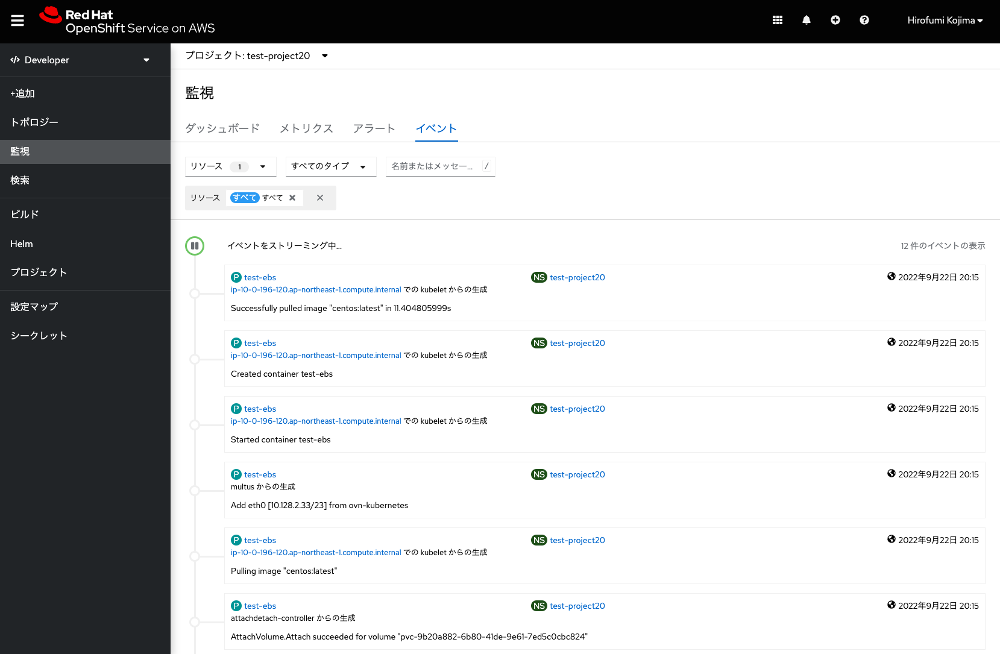
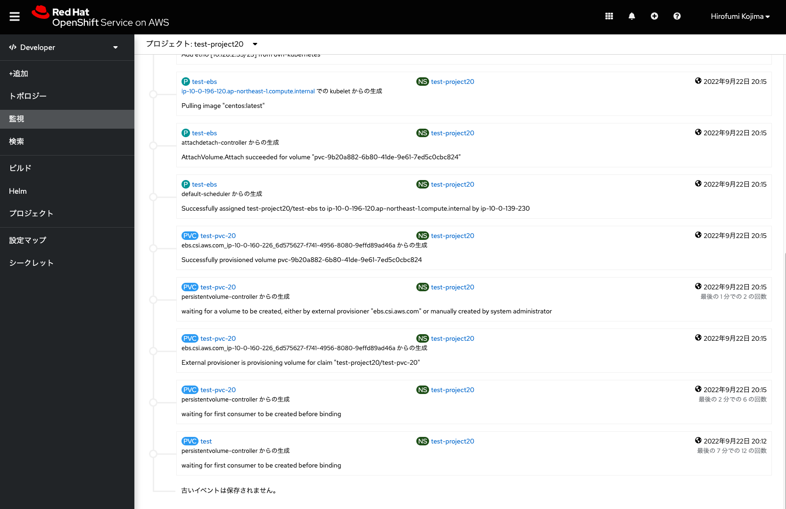
<div style="text-align: center;">ストリーミングされたイベントの例</div>　　


なお、2022年9月時点で、[ROSAクラスターの利用者がモニタリングのアラート機能を利用することはできません。](https://access.redhat.com/documentation/ja-jp/red_hat_openshift_service_on_aws/4/html/cluster_administration/rosa-managing-alerts)利用者は、クラスター全体のリソース利用に関するアラート発行をSREチームに任せたり、CloudWatchによるアプリケーションログ監視をする、といった前提でROSAクラスターをご利用いただくことになります。


これで、ROSAクラスターのロギングとモニタリングに関する演習は終了です。次の演習の[コンピュートノードの追加/削除とオートスケールの設定](../rosa-nodes)に進んでください。

[HOME](../../README.md)
