## ROSAクラスターのロギングとモニタリング

### [デモ] ROSAクラスターのロギングアドオンインストール

※ここで紹介している内容は、インストラクターによって紹介されるデモ手順であり、受講者はコマンド/GUI操作を実施する必要はありません。次の「[ハンズオン] Amazon CloudWatchによるログ確認」まで読み進めて下さい。


ROSAのロギングについては、ROSAのアドオンとして提供しているAmazon CloudWatchをベースとするログ転送ソリューション(Cluster Logging Operator)の利用を推奨しています。このアドオンは、[ROSAクラスター作成後に追加でインストール](https://access.redhat.com/documentation/ja-jp/red_hat_openshift_service_on_aws/4/html-single/cluster_administration/index#rosa-install-logging)することで利用できるようになります。

Cluster Logging Operatorは、Red HatのSaaSの1つである、OpenShiftクラスターのテレメトリ情報などを管理する[OpenShift Cluster Manager (OCM) のコンソール](https://console.redhat.com/openshift)から簡単にインストールできます。(この演習では、受講者はOCMコンソールへのアクセス権限を持たないことを想定します。)最初に、該当のROSAクラスターを選択して、「Add-ons」タブから「Cluster Logging Operator」を選択して、「Install」をクリックします。

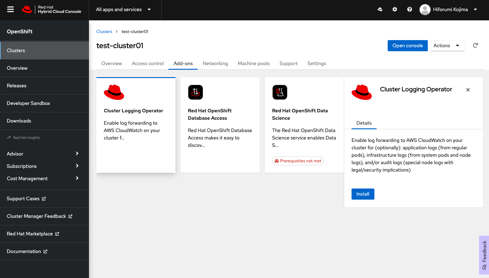
<div style="text-align: center;">Cluster Logging Operatorのインストール</div>　　

次に、Cluster Logging Operatorの設定画面が表示されます。各設定項目の意味は次のとおりです。

- `Use AWS CloudWatch`: CloudWatchの利用有無。CloudWatchでログ確認する際は必須の項目。チェックを入れなくても、Cluster Logging Operatorインストール後でも設定変更はできますが、その場合は、fluentdによるログ収集だけが行われます。
- `Collect Applications logs`: アプリケーションログの収集。`openshift-*`,`kube-*`,`default`以外のプロジェクトにデプロイされるアプリケーションのログ(STDOUT(標準出力)に送信されるログ)を収集します。
- `Collect Infrastructure logs`: インフラストラクチャーログの収集。ROSAクラスター作成時にデフォルトで作成される`openshift-*`,`kube-*`プロジェクトにある、インフラストラクチャー関連のログを収集します。
- `Collect Audit logs`: セキュリティ監査に関連するノードのログ収集。通常、ROSクラスターの監査ログはRed HatのSREチームにより、Cluster Logging Operatorとは別の仕組みを使ってROSAクラスターの外に保存され、[問題調査の際に、ROSAの利用者のサポートケースを使用したリクエストに伴って提供](https://access.redhat.com/documentation/ja-jp/red_hat_openshift_service_on_aws/4/html/introduction_to_rosa/rosa-policy-change-management_rosa-policy-responsibility-matrix)されます。そのため、ROSAの利用者はこれらのデータを保存する必要は必ずしもありませんが、CloudWatchで監査ログを保存/確認したい場合はチェックを入れます。
- `CloudWatch region`: CloudWatchを利用するリージョン。何も指定しなければ、ROSAクラスターがあるリージョンが利用されます。


ここでは全てにチェックを入れて、「Install」をクリックします。およそ、10分ほど待つと、「installed」という表示に変わり、インストールが完了します。

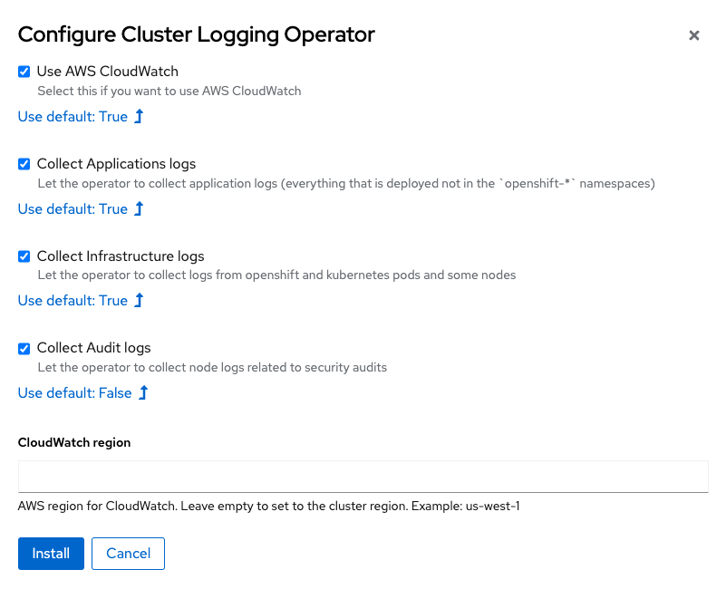
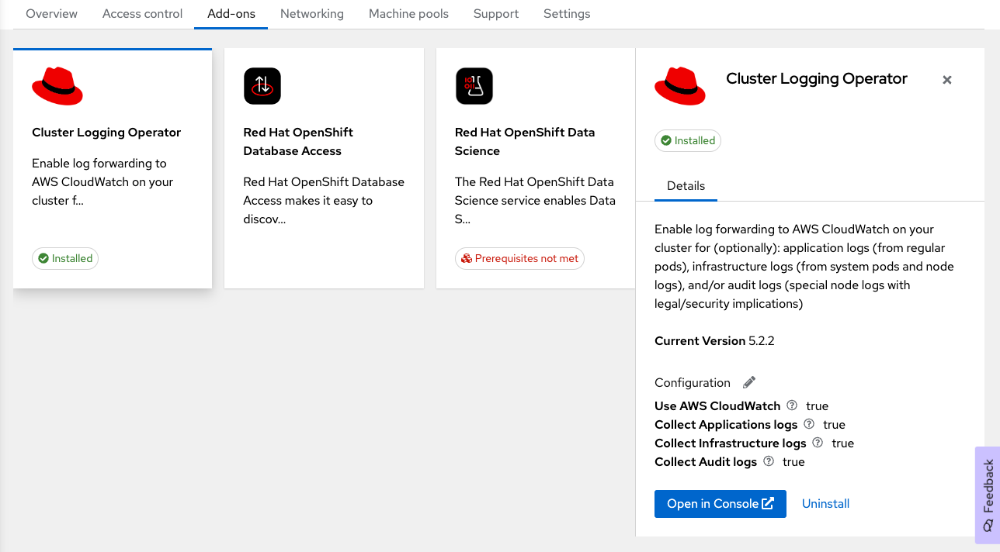
<div style="text-align: center;">Cluster Logging Operatorの設定とインストール完了画面</div>　　

Cluster Logging Operatorのインストール完了後に、ROSAクラスターの「openshift-logging」プロジェクトを見てみます。もし、ROSAクラスターの管理者権限が割り当てられていない場合、事前に「rosa grant user」コマンドを実行して、自身のアカウントに割り当てておきます。

```
$ rosa grant user dedicated-admin --user=<受講者が利用しているROSAのユーザID(GitHubのアカウントID)> --cluster rosa-XXXXX
I: Granted role 'dedicated-admins' to user '<受講者が利用しているROSAのユーザID(GitHubのアカウントID)>' on cluster 'rosa-XXXXX'
```

このプロジェクトは、Cluster Logging Operatorのインストール前は何もない状態ですが、インストール後は、「cluster-logging-operator」と「fluetnd」Podが実行されていることが確認できます。メモリ使用量が多い、ログ収集とCloudWatchへのログ転送に利用されるfluentd Podについては、全てのコントローラ/コンピュートノードで実行されます。後にご紹介する手順で、ROSAの利用者がコンピュートノードを追加/削除した場合、その操作に伴って、「cluster-logging-operator」Operatorがfluentd podを自動的に追加/削除します。

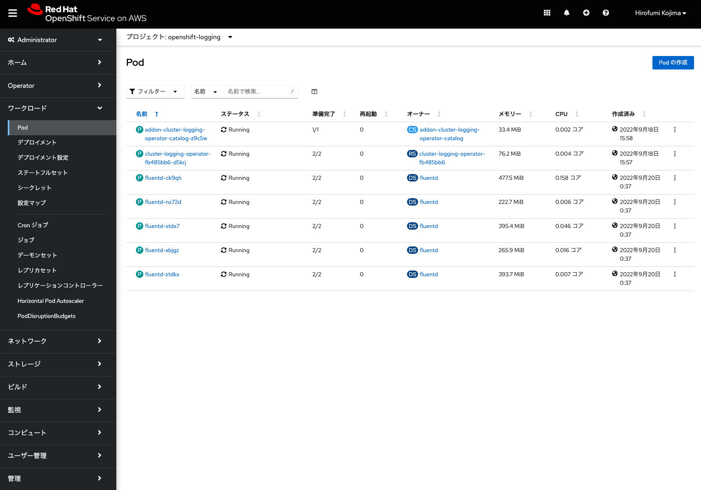
<div style="text-align: center;">openshift-loggingプロジェクトに追加されたPod</div>　　


#### [Tips]: STSを利用してROSAクラスターを作成している時の、ロギングアドオンインストール

STSを利用してROSAクラスターを作成している場合、CloudWatchを利用する権限(AWS IAMポリシー/ロール)を持ったAWS IAMユーザを作成し、そのユーザの認証情報をROSAクラスターの「openshift-logging」プロジェクトのシークレットリソースとして保存しておく必要があります。これにより、ロギングアドオンインストール後に、そのユーザ権限を持ってCloudWatchへのログ転送が可能になります。具体的な手順は、下記を参考にしてください。

[参考情報] [STSを利用したROSAクラスターへのロギングアドオンインストール](https://www.rosaworkshop.io/ostoy/9-logging/#installing-the-cluster-logging-add-on-service)


### [ハンズオン] Amazon CloudWatchによるログ確認

[Amazon CloudWatchのコンソール](https://console.aws.amazon.com/cloudwatch/home)にアクセスして、ROSAクラスターのリージョン(本演習環境ではシンガポールリージョン. ap-southeast-1)を選択します。すると、ROSAクラスターから転送されたログのグループを確認できます。なお、AWSコンソールにアクセスするためのアカウントは、インストラクターにより共有されます。

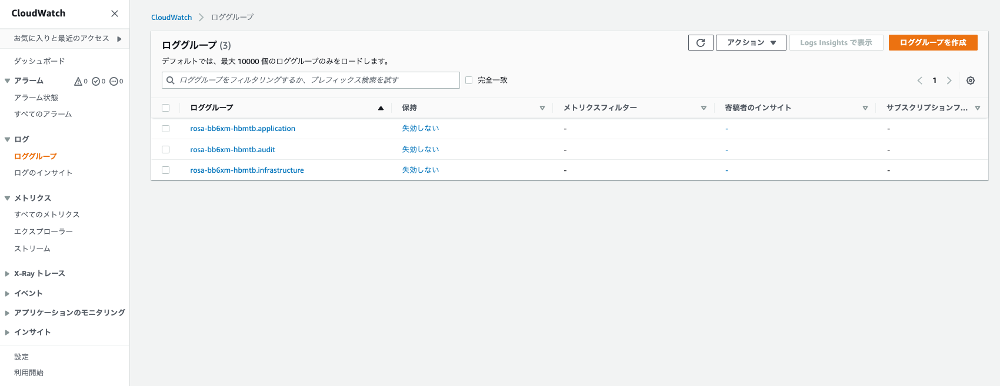
<div style="text-align: center;">Amazon CloudWatchのロググループ</div>　　

末尾に「application」という名前が付いているロググループを選択して、ログストリームの1つを選択します。ここでは、[アプリケーションのデプロイのクイックスタート](../rosa-app-deploy-quickstart)で作成したNode.jsアプリケーションの、イメージビルドに関するログ(この例だと、「test-project20_sti-build」が名前に含まれているログストリーム)を選択します。受講者は、自身が作成したプロジェクトに関する「<プロジェクト名>_sti-build」を名前に含むログストリームを選択してみてください。


<div style="text-align: center;">「test-project20」プロジェクトのログストリーム</div>　　

ログストリームにある「message」と、Pod(この例では、nodejs-postgresql-persistent-1-build)の先頭のログを照らし合わせると、PodのログがCloudWatchに正しく転送されていることが確認できます。

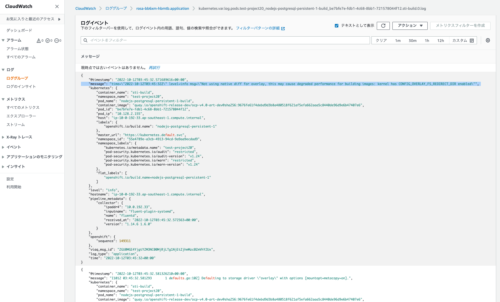
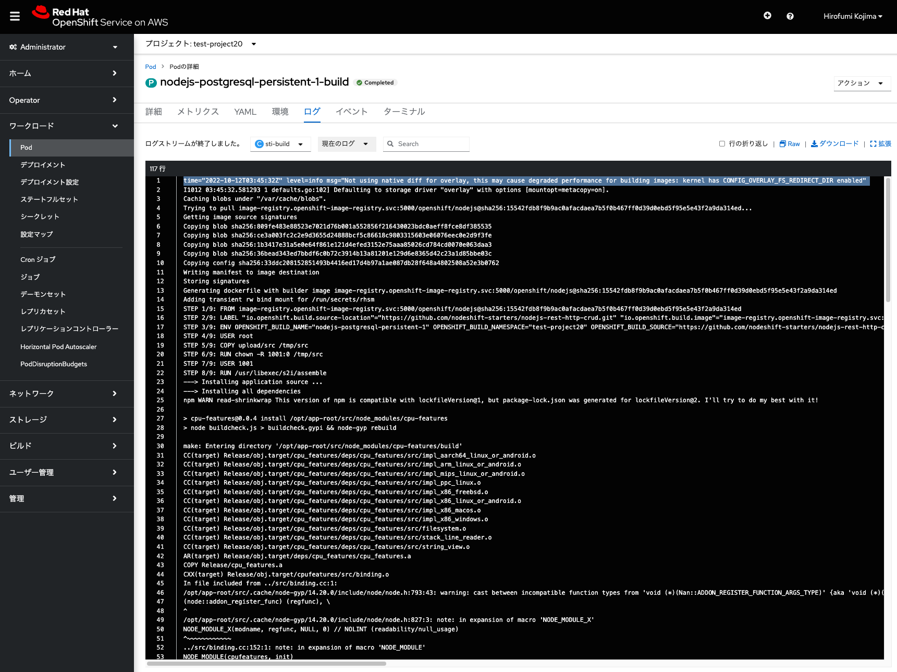
<div style="text-align: center;">ログの転送確認</div>　　

また、こうしたログをもとに、ROSAの利用者は[CloudWatchのサブスクリプションを使用したログデータのリアルタイム処理](https://docs.aws.amazon.com/ja_jp/AmazonCloudWatch/latest/logs/Subscriptions.html)などを実行できるようになります。


### [ハンズオン] ROSAクラスターのモニタリング

ROSAクラスターは、デフォルトでPrometheusをベースとしたモニタリング機能が有効になっています。このモニタリング機能のユースケースは、ROSAクラスター全体のリソース利用状況を見るものと、ROSAの利用者が作成したプロジェクト内のリソース利用状況を見るものの2つに別れます。

ROSAクラスター全体のリソース利用状況のモニタリング、いわゆるプラットフォームモニタリングとRed Hatの公式ドキュメントで定義しているものについては、Red HatのSREチームによって利用されています。ROSAの責任分担マトリクスによって、プラットフォームモニタリングについては、Red Hatに責任があると定義しているため、ROSAの利用者はこれらの情報を気にする必要はありません。後述するコンピュートノードのオートスケール設定が有効になっていない場合、プラットフォームモニタリングによって得られた情報をもとに、SREチームがROSAの利用者に、追加のコンピュートノードやストレージなどのクラスターリソースに必要な変更についてアラートを適宜送信します。

[参考情報] [3.2.2.2 変更管理 の「容量の管理」 (ROSAのポリシーおよびサービス定義)](https://access.redhat.com/documentation/ja-jp/red_hat_openshift_service_on_aws/4/html/introduction_to_rosa/rosa-policy-change-management_rosa-policy-responsibility-matrix#doc-wrapper)


ROSAクラスターでは、モニタリング機能を提供するPodが、「openshift-monitoring」と「openshift-user-workload-monitoring」という2つのプロジェクトで実行されています。プラットフォームモニタリング機能を提供するPodが「openshift-monitoring」プロジェクトで実行され、利用者のプロジェクトのモニタリングに関するカスタム設定を適用するためのPodが「openshift-user-workload-monitoring」プロジェクトで実行されます。これらは、ROSAクラスターの管理者権限「dedicated-admin」を持つユーザーでログインすることで確認できます。管理者権限を付与していない場合は、次のコマンドで付与します。

```
$ rosa grant user dedicated-admin --user=<受講者が利用しているROSAのユーザID(GitHubのアカウントID)> --cluster rosa-XXXXX
I: Granted role 'dedicated-admins' to user '<受講者が利用しているROSAのユーザID(GitHubのアカウントID)>' on cluster 'rosa-XXXXX'
```

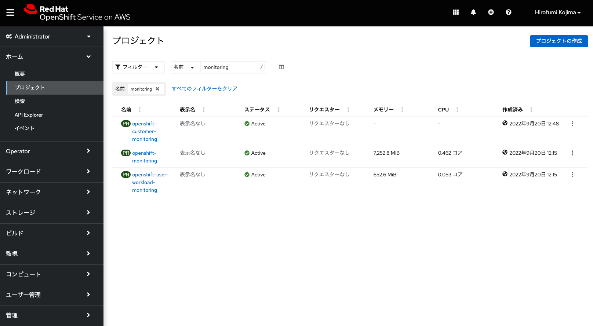
<div style="text-align: center;">モニタリングプロジェクトの一覧</div>　　


「openshift-monitoring」プロジェクトの中で、比較的大きなサイズのメモリを使用するPodは、「prometheus-k8s」Podです。ただし、このPodは、Red HatのSREチームが管理するインフラストラクチャーノード上で実行/管理されるため(ノードセレクターが、「node-role.kubernetes.io/infra」となります)、ROSAの利用者がアプリケーションの開発やデプロイ用に利用するコンピュートノードのメモリ利用に影響を与えません。

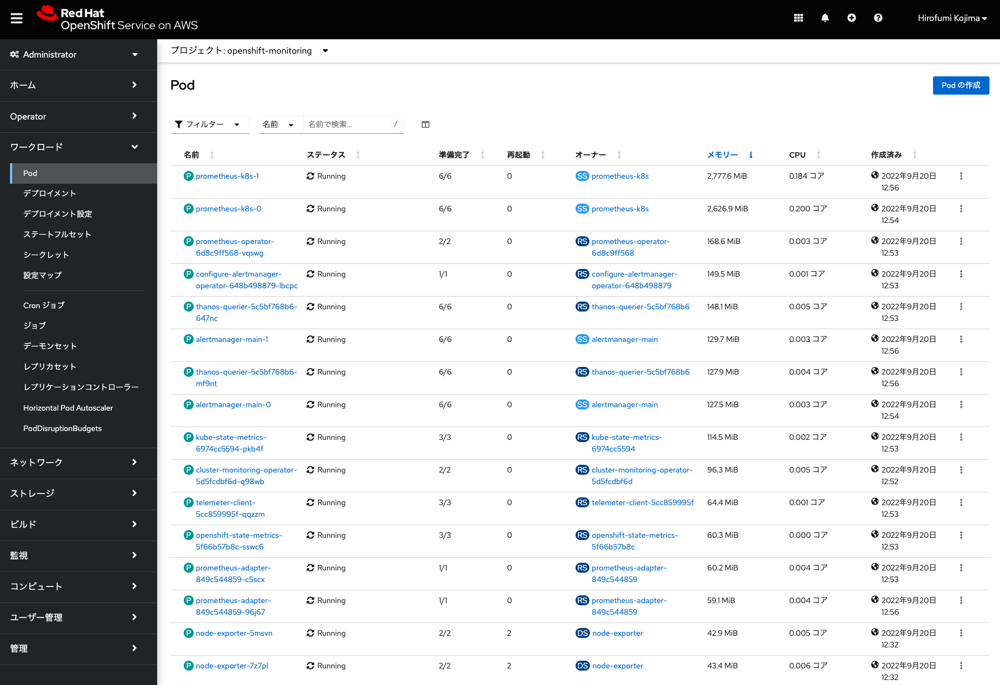
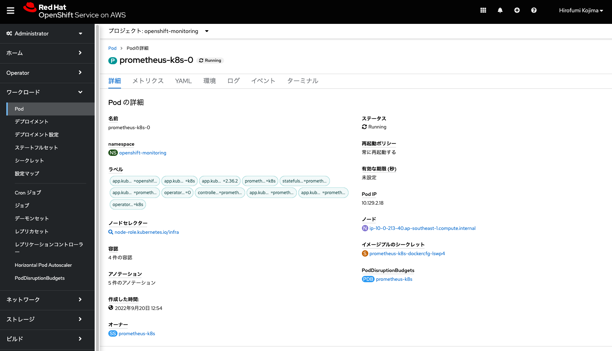
<div style="text-align: center;">「openshift-monitoring」プロジェクトのPod</div>　　

また、「openshift-monitoring」プロジェクトにあるPodは、全てのコントローラ/インフラストラクチャー/コンピュートノードで実行されるnode-exporter(メトリクス収集に利用)などの一部のPodを除き、大半がインフラストラクチャーノード上で実行されるようになっています。これらについては、各Podを選択して、「詳細タブ」のノードセレクターの表示や、ノード名をクリックして、「ノードの詳細」の「概要」タブの「ロール」が「infra, worker」(インフラストラクチャーノード)、または、「master」(コントローラノード)となっていることを確認してみてください。

[参考情報] [1.2.1 デフォルトのモニタリングコンポーネント](https://access.redhat.com/documentation/ja-jp/openshift_container_platform/4.11/html/monitoring/understanding-the-monitoring-stack_monitoring-overview#default-monitoring-components_monitoring-overview)

「openshift-user-workload-monitoring」プロジェクトでは、PrometheusのOperator Pod(コントローラノードで実行)を除いて、全てコンピュートノードで実行されます。なお、コンピュートノードを追加したとしても、これらのPodは追加されません。


<div style="text-align: center;">「openshift-user-workload-monitoring」プロジェクトのPod</div>　　

ROSAクラスターのPrometheusでは、利用者のプロジェクトに関するメトリクスデータの保持期間は15日間です。ただし、デフォルトの設定だと、これらのデータは永続ボリュームによって永続化されていないため、コンピュートノードの障害発生によって失われてしまう可能性があります。これを防ぐために、200GiBの永続ボリュームを利用してメトリクスデータを保存するように設定変更します。また、保持期間をデフォルトの15日間から30日間に変更します。

この場合、「openshift-user-workload-monitoring」プロジェクトのPodが利用する設定情報(ConfigMapリソース)を編集します。「user-workload-monitoring-config」設定マップ(ConfigMap)の「YAML」タブを開いて、下記の「data: ...」以下の行を末尾に追加して「保存」をクリックして保存します。(これは本演習環境では設定済みなので、受講者は設定する必要はありません。)

```
kind: ConfigMap
apiVersion: v1
metadata:
  name: user-workload-monitoring-config
  namespace: openshift-user-workload-monitoring
data:
  config.yaml: |
    prometheus:
      retention: 30d
      volumeClaimTemplate:
        spec:
          resources:
            requests:
              storage: 200Gi
```

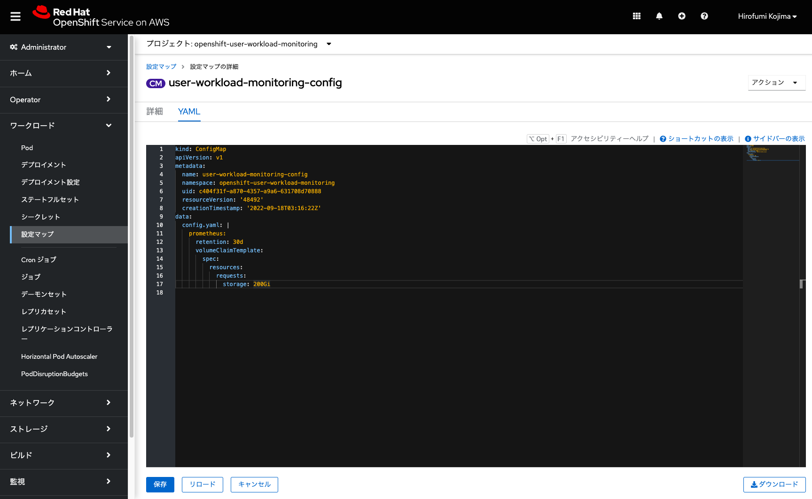
<div style="text-align: center;">「user-workload-monitoring-config」の設定変更</div>　　


すると、「prometheus-user-workload」Podが2つとも再起動され、修正した設定内容が反映されます。また、再起動時に、ROSAクラスターのデフォルトのストレージクラス(gp3)を利用したPVCが自動的に作成され、この2つのPodにBoundされます。

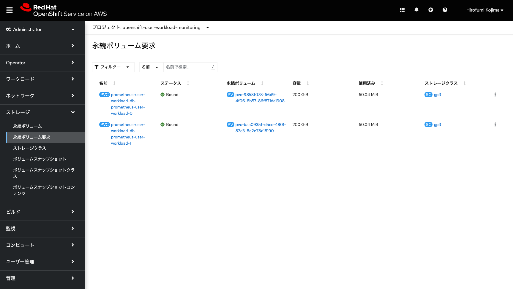
<div style="text-align: center;">ユーザー用Prometheus Podが利用するPVC</div>　　


### [ハンズオン] ROSAクラスターのメトリクスデータの確認

ここで、実際にメトリクスデータを見てみましょう。Node.jsアプリケーションを作成したプロジェクトを選択して、Developerパースペクティブの左サイドメニューの「監視」をクリックします。すると、CPU使用量/メモリ使用量/送受信帯域幅/送受信パケットレート/送受信パケットドロップレート/ストレージIOに関するグラフデータを確認できます。

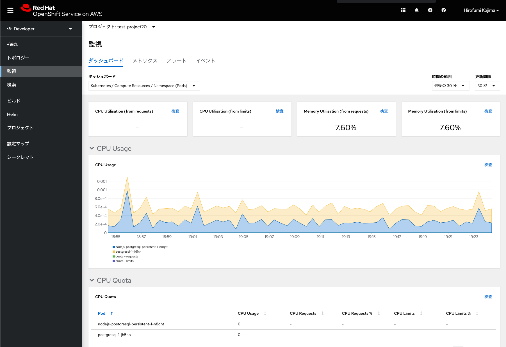
<div style="text-align: center;">プロジェクトのメトリクスデータ</div>　　

PodのCPUとメモリ使用については、「リミット(制限)」と「リクエスト(要求)」という値があり、Pod実行時には、予め定義された「リミット」の中で、「リクエスト」された量を確保しようとします。各コンピュートノードに、「リクエスト」に満たないCPU/メモリリソースしかない場合、ROSAに内包されるKubernetesのスケジューラによるPod配置は行われません。

「リミット」がない場合、リクエストされた値以上のリソースが使用される可能性があります。また、「リミット」のみ定義されている場合は、リミットに一致する値がリソースとして、スケジューラによってPodに自動的に割り当てられます。

[参考情報] [コンテナのリソース管理の「要求と制限」](https://kubernetes.io/ja/docs/concepts/configuration/manage-resources-containers/)を参照

このダッシュボードにある、CPUやメモリの使用率は、これらの「リミット」と「リクエスト」の値に対してどのくらい使用されているか、という情報となります。上記画像の例では、使用率は7.70%となっているため、まだまだリソースに余裕があるということを示しています。

「メトリクス」タブでは、Prometheusのクエリ(PromQL)によるグラフ表示が可能です。予め用意されたクエリ(メモリー使用量など)を用いて、データを確認してみてください。本演習では扱いませんが、カスタムクエリを実施したい場合、[こちらのドキュメント](https://prometheus.io/docs/prometheus/latest/querying/basics/)を参考にできます。


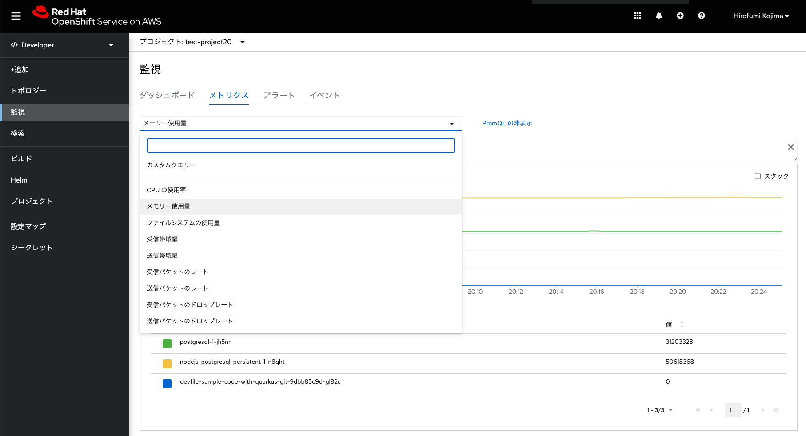
<div style="text-align: center;">Prometheusのクエリ</div>　　


なお、2022年9月時点で、[ROSAクラスターの利用者がモニタリングのアラート機能を利用することはできません。](https://access.redhat.com/documentation/ja-jp/red_hat_openshift_service_on_aws/4/html/cluster_administration/rosa-managing-alerts)利用者は、クラスター全体のリソース利用に関するアラート発行をSREチームに任せたり、CloudWatchによるアプリケーションログ監視をする、といった前提でROSAクラスターをご利用いただくことになります。


これで、ROSAクラスターのロギングとモニタリングに関する演習は終了です。次の演習の[コンピュートノードの追加/削除とオートスケールの設定](../rosa-nodes)に進んでください。

[HOME](../../README.md)
