## コンピュートノードの追加/削除とオートスケールの設定

**※ 本演習環境で用意したリソースの上限値(コンピュートノードの追加が20台まで)を定義しているため、この演習内容を同時に実施できるのは受講者10人までという制約があります。同時実施人数が10人を超える場合、コンピュートノードの追加/削除/編集コマンドの実施のみ(コンピュートノードの追加コマンドを実行して、実際に追加される前に削除コマンドを実施するなどの作業をする)、または、インストラクターによるデモ/説明のみとなりますので、予めご了承ください。**


実行するアプリケーションの数が多くなり、コンピュートノードのリソース(CPUやメモリ)使用率が逼迫した場合、ROSA CLIを使用して、コンピュートノードを簡単に追加・削除できます。
ROSAに含まれるOpenShiftのコンピュートノードは、machinepoolというリソース単位で管理されており、新規にコンピュートノードを追加・削除する場合、このmachinepoolを作成・編集・削除します。利用できるコンピュートノードのインスタンスタイプは、[こちら](https://docs.openshift.com/rosa/rosa_architecture/rosa_policy_service_definition/rosa-service-definition.html#rosa-sdpolicy-aws-compute-types_rosa-service-definition)から確認できます。最小のインスタンスタイプであるc5.xlargeをはじめとした、様々なインスタンスタイプを利用できます。

デフォルトで利用されているmachinepoolは、次のコマンドで確認します。

```
$ rosa list machinepool -c rosa-XXXXX
ID       AUTOSCALING  REPLICAS  INSTANCE TYPE  LABELS    TAINTS    AVAILABILITY ZONES    SPOT INSTANCES
Default  No           2         m5.xlarge                          ap-southeast-1a       N/A
```

コンピュートノードを、AWS EC2インスタンス(m5.xlarge)2台起動しているという、ROSAデフォルトの設定を確認できます。この2台というのは、ROSAのコンピュートノードの最小台数であり、これ以下には減らせません。そもそも、減らす選択肢を実行できないようになっています。ここにmachinepoolを新しく作成して、コンピュートノードを1台追加します。「rosa create machinepool」コマンドを実行します。

```
$ rosa create machinepool -c rosa-XXXXX -i
? Machine pool name: mp20
? Enable autoscaling (optional): No
? Replicas: 1
? Instance type:  [Use arrows to move, type to filter, ? for more help]
  i3en.xlarge
  r5.xlarge
  c5.xlarge
> m5.xlarge
  r6i.xlarge
  z1d.xlarge
  i3.xlarge
? Instance type: m5.xlarge
? Labels (optional): 
? Taints (optional): 
? Use spot instances (optional): Yes
? Spot instance max price: on-demand
I: Machine pool 'mp20' created successfully on cluster 'rosa-XXXXX'
I: To view all machine pools, run 'rosa list machinepools -c rosa-XXXXX'
```

Replicasで、作成するコンピュートノードの台数(ここでは1台)を指定します。オプションで[Amazon EC2スポットインスタンス](https://aws.amazon.com/jp/ec2/spot/)の利用を指定できます。

再度「rosa list machinepool」コマンドを実行して、machinepoolが正常に作成されたかを確認します。
```
$ rosa list machinepool -c rosa-XXXXX
ID       AUTOSCALING  REPLICAS  INSTANCE TYPE  LABELS    TAINTS    AVAILABILITY ZONES    SPOT INSTANCES
Default  No           2         m5.xlarge                          ap-southeast-1a       N/A
mp20     No           1         m5.xlarge 
```

mp20に紐づけられているコンピュートノードの台数を修正したい場合、「rosa edit machinepool」コマンドを実行します。下記では、「--replicas 0」を指定して、コンピュートノードの台数を0台にしています。
```
$ rosa edit machinepool mp20 -c rosa-XXXXX --replicas 0
I: Updated machine pool 'mp20' on cluster 'rosa-XXXXX'
$ rosa list machinepool -c rosa-XXXXX
ID       AUTOSCALING  REPLICAS  INSTANCE TYPE  LABELS    TAINTS    AVAILABILITY ZONES    SPOT INSTANCES
Default  No           2         m5.xlarge                          ap-southeast-1a       N/A
mp20     No           0         m5.xlarge 
```

machinepoolは作成時、または作成後にオートスケールの設定をすることができます。利用者がPodをデプロイしようとした時に、リソース(CPUやメモリ)の使用量が逼迫していて、いずれのコンピュートノードにもデプロイできないPodがある場合、自動的にコンピュートノードを追加します。また、その逆に、一部のノードが長期間にわたって、リソースがあまり使われていない状態が続く場合、コンピュートノードを削除してROSAクラスターのサイズを縮小します。

上記で作成したmp20のオートスケールの設定は、「rosa edit machinepool」コマンドで実行します。
```
$ :↓ オートスケールの有効化
$ rosa edit machinepool mp20 -c rosa-XXXXX --enable-autoscaling
? Min replicas: 1
? Max replicas: 2
I: Updated machine pool 'mp20' on cluster 'rosa-XXXXX'
$ rosa list machinepool -c rosa-XXXXX
ID       AUTOSCALING  REPLICAS  INSTANCE TYPE  LABELS    TAINTS    AVAILABILITY ZONES    SPOT INSTANCES
Default  No           2         m5.xlarge                          ap-southeast-1a       N/A
mp20     Yes          1-2       m5.xlarge                          ap-southeast-1a       Yes (on-demand)


$ :↓ オートスケールの無効化
$ rosa edit machinepool mp20 -c rosa-zkt8b --enable-autoscaling=false 
? Replicas: 1
I: Updated machine pool 'mp20' on cluster 'rosa-zkt8b'
$ rosa list machinepool -c rosa-zkt8b 
ID       AUTOSCALING  REPLICAS  INSTANCE TYPE  LABELS    TAINTS    AVAILABILITY ZONES    SUBNETS    SPOT INSTANCES
Default  No           2         m5.xlarge                          ap-southeast-1a                  N/A
mp20     No           1         m5.xlarge                          ap-southeast-1a                  Yes (on-demand)
```

**[Tips]** オートスケールの設定は、Red HatのSaaSの1つである、OpenShiftクラスターのテレメトリ情報などを管理する[OpenShift Cluster Manager (OCM) のコンソール](https://cloud.redhat.com/openshift)からも実施できます。「Enable autoscaling」のチェックボックスのチェックを付けたり外したりすることで、machinepoolのオートスケールの有効化/無効化ができます。(この演習では、受講者はOCMコンソールへのアクセス権限を持たないことを想定します。)


<div style="text-align: center;">OCMコンソールでのオートスケール設定画面</div>　

追加されたマシンセットに対応するコンピュートノードは、OpenShiftのコンソールで確認できます。ローカルユーザだと、参照権限がありませんので、「AWS Controllers for Kubernetes (ACK) による Amazon S3の利用」ハンズオンコンテンツの中の、「[Tips]: ROSAクラスター管理者権限の付与」で紹介したように、受講者が利用しているユーザに「rosa grant user」コマンドで管理者権限を付与してOpenShiftコンソールに再ログインすることで、確認できるようになります。確認する際は、Administratorパースペクティブのメニューの「コンピュート」→「ノード」「マシン」「マシンセット」のリソースを見ることで、コンピュートノードの追加/削除の状況を確認できます。machinepoolの作成/削除コマンド(削除コマンドは後述)を実施してから、およそ15分~20ほどで、コンピュートノードの追加/削除が完了します。

```
$ rosa grant user dedicated-admin --user=<受講者が利用しているROSAのユーザID(GitHubのアカウントID)> --cluster rosa-XXXXX
I: Granted role 'dedicated-admins' to user '<受講者が利用しているROSAのユーザID(GitHubのアカウントID)>' on cluster 'rosa-XXXXX'
```


<div style="text-align: center;">machinepool「mp20」に対応したコンピュートノードの作成を確認</div>　


作成したmachinepoolを削除する場合、「rosa delete machinepool」コマンドを実行します。これにより、コンピュートノードが削除され、その上で実行されているPodも削除されます。

```
$ rosa delete machinepool mp20 -c rosa-XXXXX
? Are you sure you want to delete machine pool 'mp20' on cluster 'rosa-XXXXX'? Yes
I: Successfully deleted machine pool 'mp20' from cluster 'rosa-XXXXX'
```

**[Tips]** マルチAZ構成のROSAクラスターの場合、3の倍数単位でmachinepoolのレプリカ数を指定します。rosaコマンドでmachinepoolのレプリカ数を設定する場合、３の倍数を指定しないとエラーになります。オートスケールの場合も同様で、アプリケーションデプロイのリソースが足りない場合、3の倍数単位でmachinepoolに対応したコンピュートノードの台数が自動的に増減されます。(この演習では、シングルAZ構成のROSAクラスターの利用を想定するため、受講者は実際にマルチAZ構成を確認することはできません。)

```
$ rosa list machinepools -c maz01
ID       AUTOSCALING  REPLICAS  INSTANCE TYPE  LABELS    TAINTS    AVAILABILITY ZONES                                   SUBNETS    SPOT INSTANCES
Default  No           3         m5.xlarge                          ap-northeast-1a, ap-northeast-1c, ap-northeast-1d               N/A
$ rosa edit machinepools Default -c maz01
? Replicas: 4
E: Multi AZ clusters require that the number of compute nodes be a multiple of 3
$ rosa edit machinepools Default -c maz01 --enable-autoscaling
? Min replicas: 3
? Max replicas: 5
E: Multi AZ clusters require that the number of compute nodes be a multiple of 3
```

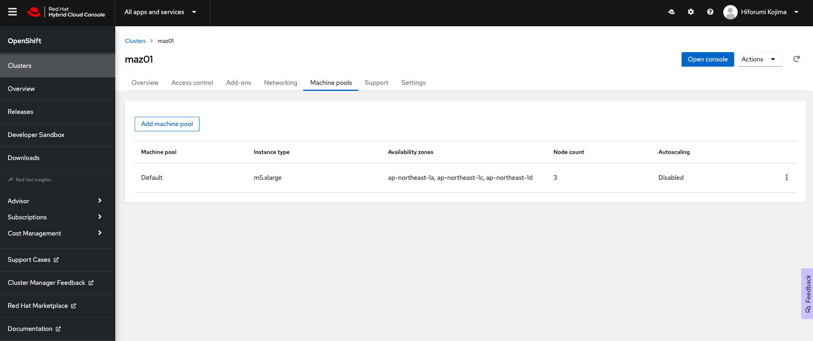
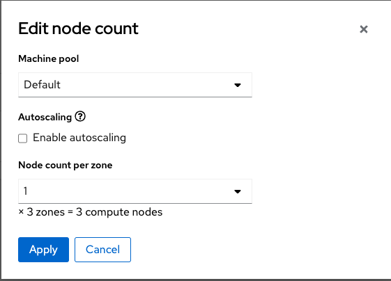
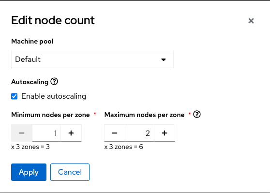
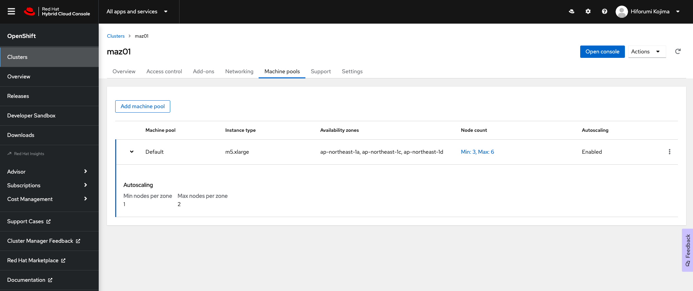
<div style="text-align: center;">マルチAZ構成でのmachinepoolの設定</div>　


### [オプションハンズオン] オートスケールの確認

※以降で紹介する手順は、時間に余裕がありましたらトライしてみて下さい。

オートスケールが正常に動作するかを実際に確認してみます。ここでは受講者が指定した任意のラベルを付けたコンピュートノード上で並列なジョブを実行することで、コンピュートノードの台数の増減を確認します。

ここまでの手順でmachinepoolを削除していた場合は、オートスケールが有効化されたmachinepoolを作成します。下記のようなパラメータを指定することで、「mp20」という名前が付いたmachinepoolを非対話モードで作成しています。この例では、作成するmachinepool「mp20」に対して、最小1台/最大2台でのオートスケールの有効化と、ラベルとして「type=hkojima-mp-nodes」を指定します。
```
$ rosa create machinepool --name=mp20 --cluster rosa-XXXXX --instance-type=m5.xlarge --labels=type=hkojima-mp-nodes --enable-autoscaling --min-replicas=1 --max-replicas=2 --use-spot-instances=true
I: Machine pool 'mp20' created successfully on cluster 'rosa-XXXXX'
I: To view all machine pools, run 'rosa list machinepools -c rosa-XXXXX'


$ : ↓作成したmachinepool「mp20」の確認
$ rosa list machinepools -c rosa-XXXXX
ID       AUTOSCALING  REPLICAS  INSTANCE TYPE  LABELS                   TAINTS    AVAILABILITY ZONES    SUBNETS    SPOT INSTANCES
Default  No           2         m5.xlarge                                         ap-southeast-1a                  N/A
mp20     Yes          1-2       m5.xlarge      type=hkojima-mp-nodes              ap-southeast-1a                  Yes (on-demand)
```

machinepoolに紐づくコンピュートノードに付与するラベルについては、「--labels=key1=value1,key2=value2,...」の形式で指定します。「key」と「value」については、任意の文字列を指定できます。この演習では、他の受講者と重複しないようなラベルを付けて下さい。


既存のmachinepoolがある場合は、machinepoolを「rosa edit machinepool」コマンドで編集して、オートスケールの有効化とラベルの付与を行います。なお、machinepoolのラベルを編集する場合、machinepoolに紐づくコンピュートノードが自動的に削除/作成されますので、ROSAクラスターにコマンド実行結果が反映されるまで、10分ほど時間がかかります。
```
$ rosa edit machinepool mp20 -c rosa-XXXXX --enable-autoscaling --min-replicas=1 --max-replicas=2 --labels=type=hkojima-mp-nodes
I: Updated machine pool 'mp20' on cluster 'rosa-XXXXX' 
```

実行結果が反映されると、rosaコマンドによる確認の他に、次のようにOCMコンソール(この演習では、受講者はOCMコンソールへのアクセス権限を持たないことを想定します)のmachinepoolや、マシン/ノードの各画面で確認できます。マシンセットに紐づくノードのラベル一覧の右下に、上記コマンドで指定した「type=hkojima-...」というラベルが付与されていることが分かります。


<div style="text-align: center;">OCMコンソールでの確認画面</div>　


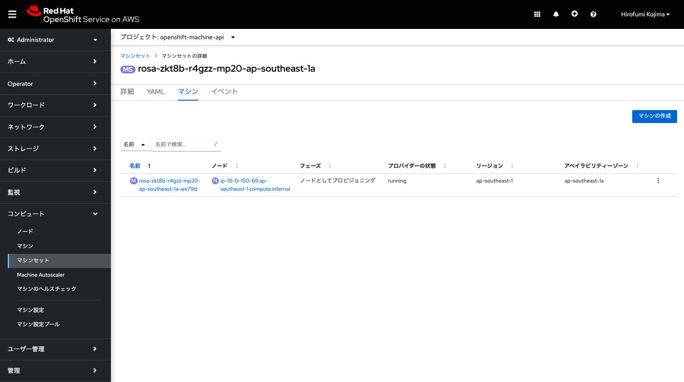
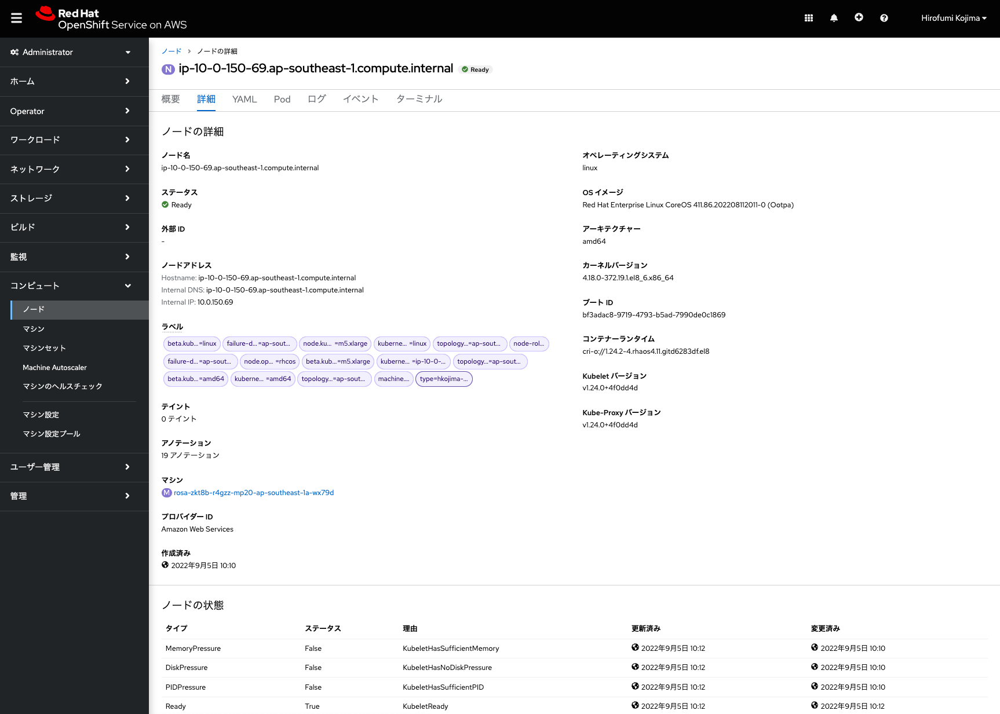
<div style="text-align: center;">マシン/ノードの確認画面</div>　


これでラベルが付いたコンピュートノードでのオートスケール実行準備が完了しました。実際にサンプルジョブを投入して確認してみましょう。適当なプロジェクト(この例では、autoscale-ex20)を作成し、次のYAMLファイルでbusybox Podを15個並列に実行するジョブを投入します。

このとき、先ほどmachinepoolを作成する時に指定したラベルを利用して、このジョブによって作成されるPodが、受講者が作成したmachinepool内だけで実行されるように、「nodeSelector」を指定します。ラベルの「key: value」の「value」に相当する文字列(この例では、hkojima-mp-nodes)は、ダブルクォーテーションで囲む必要があります。これを忘れると、「value」の値が文字列として認識されないため、ラベルの指定ができず、CPU/メモリのリソースが空いている任意のコンピュートノードでPodが実行されるようになるため、注意してください。

```
apiVersion: batch/v1
kind: Job
metadata:
  generateName: work-queue-
spec:
  template:
    spec:
      nodeSelector:
        type: "hkojima-mp-nodes"
      containers:
      - name: work
        image: busybox
        command: ["sleep", "360"]
        resources:
          requests:
            memory: 500Mi
            cpu: 500m
      restartPolicy: Never
  backoffLimit: 4
  completions: 15
  parallelism: 15
```

OpenShiftでのジョブは、「ワークロード」メニューの「ジョブ」から「Jobの作成」をクリックして、上記YAMLファイルをコピペして「作成」をクリックすることで作成できます。

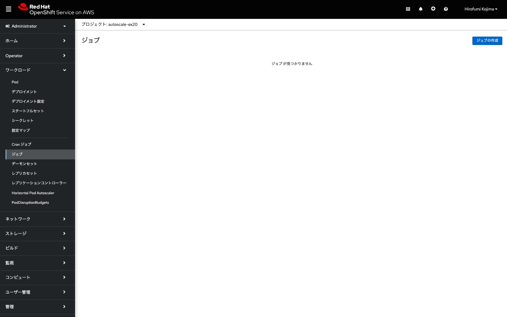
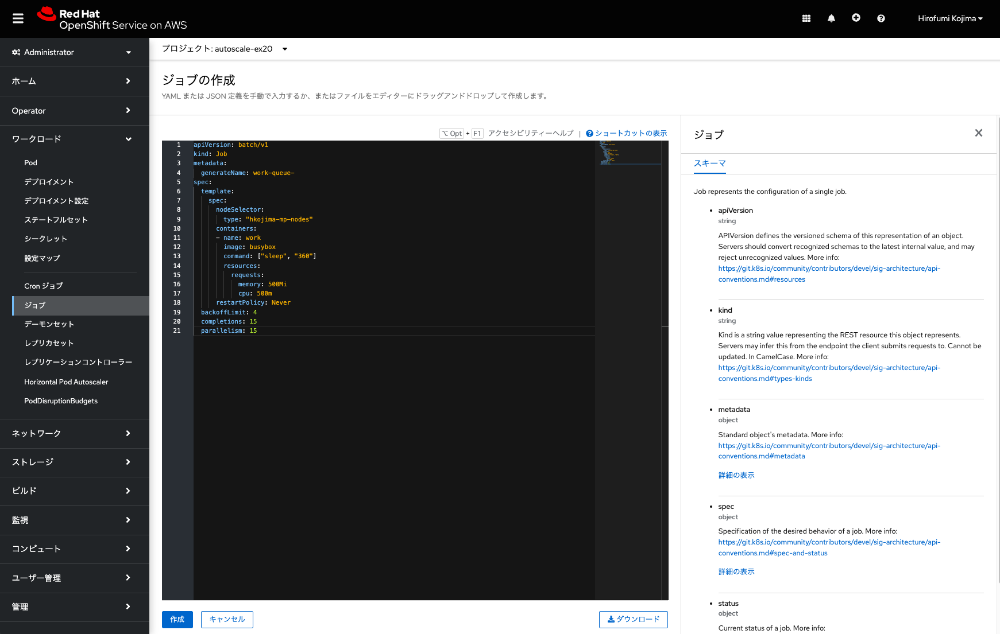
<div style="text-align: center;">ジョブの作成</div>　

ジョブを実行して数分待つと、ジョブの「Pod」から次のような実行状況の画面を確認できます。この画像の例では、最初にコンピュートノード「ip-10-0-150-69.ap-southeast-1.compute.internal」で一部のPodがジョブによって実行され、machinepoolのオートスケールの設定により、コンピュートノード「ip-10-0-202-78.ap-southeast-1.compute.internal」が自動的に追加され、そこでもPodが自動的に実行されている状況を示しています。

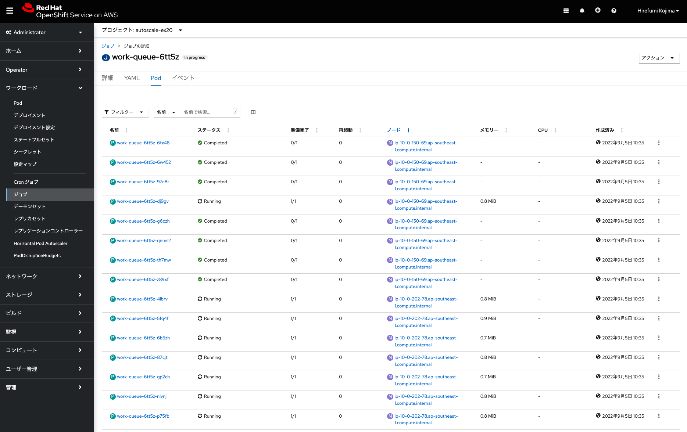
<div style="text-align: center;">ジョブの実行状況</div>　

この他にも、OpenShiftコンソールのAdministratorパースペクティブにある、「コンピュート」メニューの中の「ノード」「マシン」「マシンセット」といったメニューを見ることで、自動的にコンピュートノードが追加されている状況を確認できます。


前述のコマンドで作成したm5.xlargeインスタンスのmachinepoolを利用して、このオートスケールのテストを実行した場合、ジョブ実行が完了し、不要になったコンピュートノード1台がオートスケールダウンによって自動的に削除されるまで、25分ほどかかります。

途中でジョブの実行を中止して次の演習に移りたい場合、当該ジョブを選択して、右上の「アクション」メニューから、「Jobの削除」を選択して「削除」を実行することで、ジョブを削除できます。これによりジョブによって起動されたPodが全て削除され、10分ほど経つと、自動的にコンピュートノードが1台削除されます。

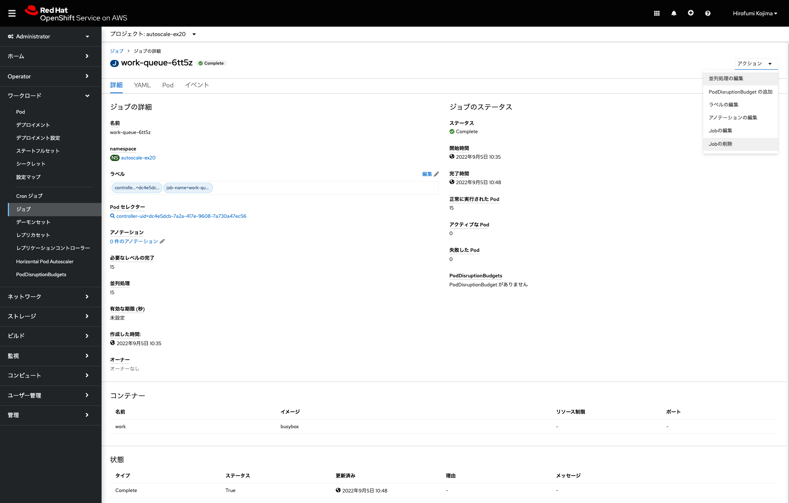
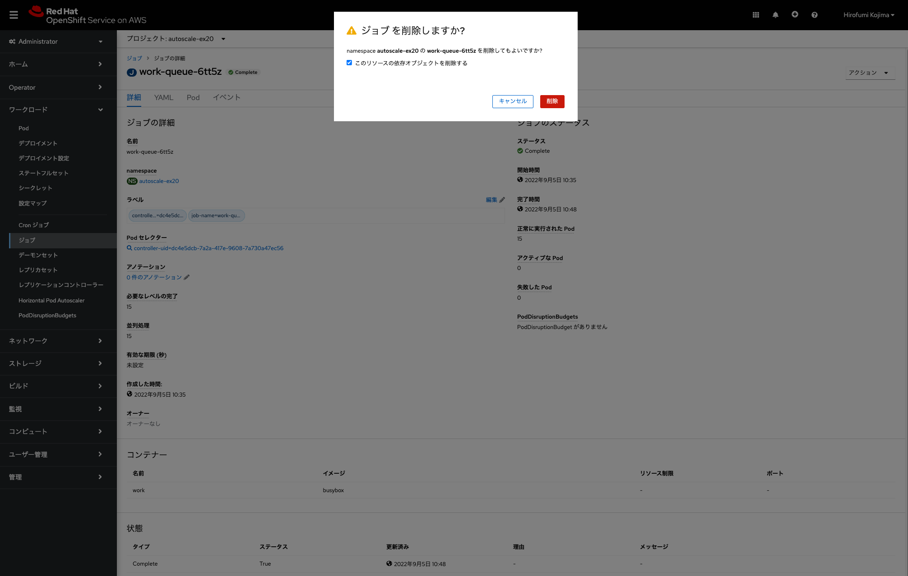
<div style="text-align: center;">ジョブの削除</div>　

最後に、受講者が作成したmachinepoolを削除します。前述したように、「rosa delete machinepool」コマンドを実行します。
```
$ rosa delete machinepool mp20 -c rosa-XXXXX
```

**[Tips]** ROSAクラスターでコンピュートノードを追加していくと、追加した台数に応じて、コントロールプレーンとインフラストラクチャーノードが、SREチームにより、手動で「スケールアップ」されます。どのサイズのEC2インスタンスがコントロールプレーンとインフラストラクチャーノードで使われるかについては、[こちらの表](https://docs.openshift.com/rosa/rosa_planning/rosa-limits-scalability.html#node-sizing-during-installation_rosa-limits-scalability)から確認できます。

これでROSAの基本的な演習は終了です。この後は、インストラクターによる、[ROSAクラスターのアップグレード](../rosa-upgrade)と[ROSAクラスターの削除](../rosa-delete)のデモ紹介があります。

デモ紹介を待っている間、時間に余裕があれば、オプション演習の[ROSAクラスターでのJavaアプリケーション開発 スターターラボ](../rosa-sample-app-develop)に進んでください。

[HOME](../../README.md)
