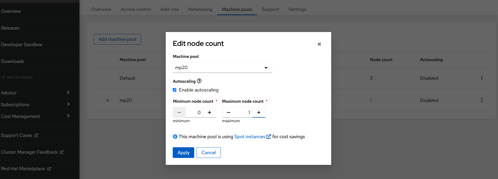
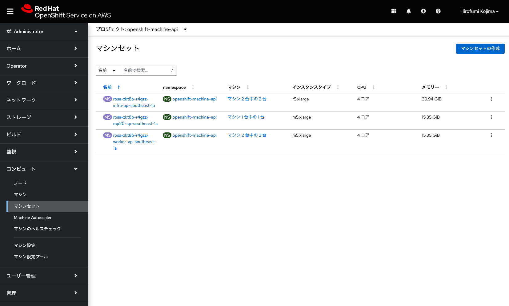
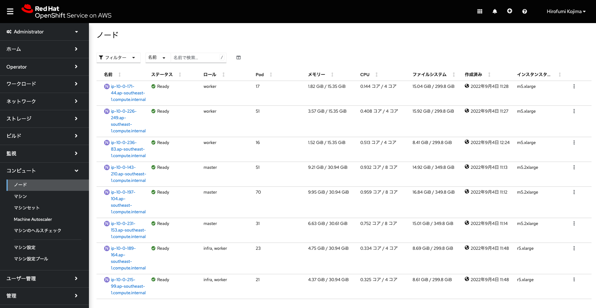

## コンピュートノードの追加/削除とオートスケールの設定

実行するアプリケーションの数が多くなり、コンピュートノードのリソース(CPUやメモリ)使用率が逼迫した場合、ROSA CLIを使用して、コンピュートノードを簡単に追加・削除できます。
ROSAに含まれるOpenShiftのコンピュートノードは、machinepoolというリソース単位で管理されており、新規にコンピュートノードを追加・削除する場合、このmachinepoolを作成・編集・削除します。利用できるコンピュートノードのインスタンスタイプは、[こちら](https://docs.openshift.com/rosa/rosa_architecture/rosa_policy_service_definition/rosa-service-definition.html#rosa-sdpolicy-aws-compute-types_rosa-service-definition)から確認できます。最小のインスタンスタイプであるc5.xlargeをはじめとした、様々なインスタンスタイプを利用できます。

デフォルトで利用されているmachinepoolは、次のコマンドで確認します。

```
$ rosa list machinepool -c rosa-XXXXX
ID       AUTOSCALING  REPLICAS  INSTANCE TYPE  LABELS    TAINTS    AVAILABILITY ZONES    SPOT INSTANCES
Default  No           2         m5.xlarge                          ap-southeast-1a       N/A
```

コンピュートノードを、AWS EC2インスタンス(m5.xlarge)2台起動しているという、ROSAデフォルトの設定を確認できます。ここにmachinepoolを新しく作成して、コンピュートノードを1台追加します。「rosa create machinepool」コマンドを実行します。

```
$ rosa create machinepool -c rosa-XXXXX -i
? Machine pool name: mp20
? Enable autoscaling (optional): No
? Replicas: 1
? Instance type:  [Use arrows to move, type to filter, ? for more help]
  i3en.xlarge
  r5.xlarge
  c5.xlarge
> m5.xlarge
  r6i.xlarge
  z1d.xlarge
  i3.xlarge
? Instance type: m5.xlarge
? Labels (optional): 
? Taints (optional): 
? Use spot instances (optional): Yes
? Spot instance max price: on-demand
I: Machine pool 'mp20' created successfully on cluster 'rosa-XXXXX'
I: To view all machine pools, run 'rosa list machinepools -c rosa-XXXXX'
```

Replicasで、作成するコンピュートノードの台数(ここでは1台)を指定します。オプションで[Amazon EC2スポットインスタンス](https://aws.amazon.com/jp/ec2/spot/)の利用を指定できます。

再度「rosa list machinepool」コマンドを実行して、machinepoolが正常に作成されたかを確認します。
```
$ rosa list machinepool -c rosa-XXXXX
ID       AUTOSCALING  REPLICAS  INSTANCE TYPE  LABELS    TAINTS    AVAILABILITY ZONES    SPOT INSTANCES
Default  No           2         m5.xlarge                          ap-southeast-1a       N/A
mp20     No           1         m5.xlarge 
```

mp20に紐づけられているコンピュートノードの台数を修正したい場合、「rosa edit machinepool」コマンドを実行します。下記では、「--replicas 0」を指定して、コンピュートノードの台数を0台にしています。
```
$ rosa edit machinepool mp20 -c rosa-XXXXX --replicas 0
I: Updated machine pool 'mp20' on cluster 'rosa-XXXXX'
$ rosa list machinepool -c rosa-XXXXX
ID       AUTOSCALING  REPLICAS  INSTANCE TYPE  LABELS    TAINTS    AVAILABILITY ZONES    SPOT INSTANCES
Default  No           2         m5.xlarge                          ap-southeast-1a       N/A
mp20     No           0         m5.xlarge 
```

machinepoolは作成時、または作成後にオートスケールの設定をすることができます。利用者がPodをデプロイしようとした時に、リソース(CPUやメモリ)の使用量が逼迫していて、いずれのコンピュートノードにもデプロイできないPodがある場合、自動的にコンピュートノードを追加します。また、その逆に、一部のノードが長期間にわたって、リソースがあまり使われていない状態が続く場合、コンピュートノードを削除してROSAクラスターのサイズを縮小します。

上記で作成したmp20のオートスケールの設定は、「rosa edit machinepool」コマンドで実行します。
```
$ :↓ オートスケールの有効化
$ rosa edit machinepool mp20 -c rosa-XXXXX --enable-autoscaling
? Min replicas: 1
? Max replicas: 2
I: Updated machine pool 'mp20' on cluster 'rosa-XXXXX'
$ rosa list machinepool -c rosa-XXXXX
ID       AUTOSCALING  REPLICAS  INSTANCE TYPE  LABELS    TAINTS    AVAILABILITY ZONES    SPOT INSTANCES
Default  No           2         m5.xlarge                          ap-southeast-1a       N/A
mp20     Yes          1-2       m5.xlarge                          ap-southeast-1a       Yes (on-demand)


$ :↓ オートスケールの無効化
$ rosa edit machinepool mp20 -c rosa-zkt8b --enable-autoscaling=false 
? Replicas: 1
I: Updated machine pool 'mp20' on cluster 'rosa-zkt8b'
$ rosa list machinepool -c rosa-zkt8b 
ID       AUTOSCALING  REPLICAS  INSTANCE TYPE  LABELS    TAINTS    AVAILABILITY ZONES    SUBNETS    SPOT INSTANCES
Default  No           2         m5.xlarge                          ap-southeast-1a                  N/A
mp20     No           1         m5.xlarge                          ap-southeast-1a                  Yes (on-demand)
```

\[Tips\]: オートスケールの設定は、[OCMコンソール](https://cloud.redhat.com/openshift)からも実施できます。「Enable autoscaling」のチェックボックスのチェックを付けたり外したりすることで、machinepoolのオートスケールの有効化/無効化ができます。(この演習では、受講者はOCMコンソールへのアクセス権限を持たないことを想定します。)


<div style="text-align: center;">OCMコンソールでのオートスケール設定画面</div>　

追加されたマシンセットに対応するコンピュートノードは、OpenShiftのコンソールで確認できます。ローカルユーザだと、参照権限がありませんので、「AWS Controllers for Kubernetes (ACK) による Amazon S3の利用」ハンズオンコンテンツの中の、「[Tips]: ROSAクラスター管理者権限の付与」で紹介したように、受講者が利用しているユーザに「rosa grant user」コマンドで管理者権限を付与してOpenShiftコンソールに再ログインすることで、確認できるようになります。確認する際は、Administratorパースペクティブのメニューの「コンピュート」→「ノード」「マシン」「マシンセット」のリソースを見ることで、コンピュートノードの追加・削除の状況を確認できます。machinepoolの作成/削除コマンドを実施してから、およそ15分~20ほどで、コンピュートノードの追加・削除が完了します。

```
$ rosa grant user dedicated-admin --user=<受講者が利用しているROSAのユーザID(GitHubのアカウントID)> --cluster rosa-XXXXX
I: Granted role 'dedicated-admins' to user '<受講者が利用しているROSAのユーザID(GitHubのアカウントID)>' on cluster 'rosa-XXXXX'
```




<div style="text-align: center;">machinepool(mp20)に対応したコンピュートノードの作成を確認</div>　


作成したmachinepoolを削除する場合、「rosa delete machinepool」コマンドを実行します。これにより、コンピュートノードが削除され、その上で実行されているPodも削除されます。

```
$ rosa delete machinepool mp20 -c rosa-XXXXX
? Are you sure you want to delete machine pool 'mp20' on cluster 'rosa-XXXXX'? Yes
I: Successfully deleted machine pool 'mp20' from cluster 'rosa-XXXXX'
```

これでROSAの基本的な演習は終了です。この後は、インストラクターによる、[ROSAクラスターのアップグレード](../rosa-upgrade)と[ROSAクラスターの削除](../rosa-delete)のデモ紹介があります。

デモ紹介を待っている間、時間に余裕があれば、アドバンスドな演習の[ROSAクラスターでのJavaアプリケーション開発 スターターラボ](../rosa-sample-app-develop)に進んでください。

[HOME](../../README.md)
