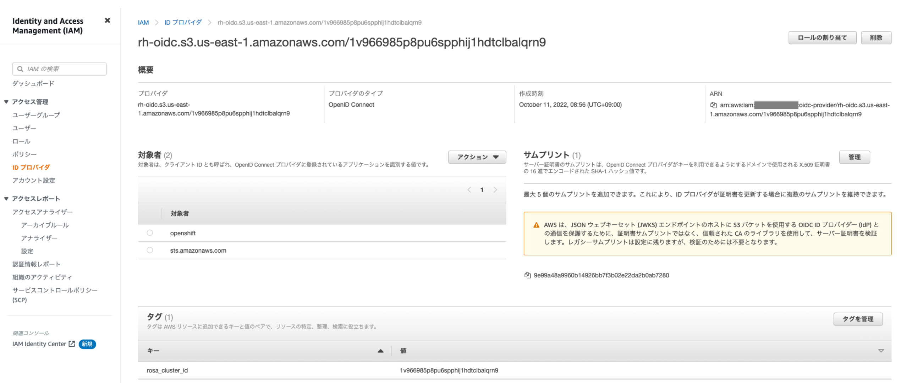
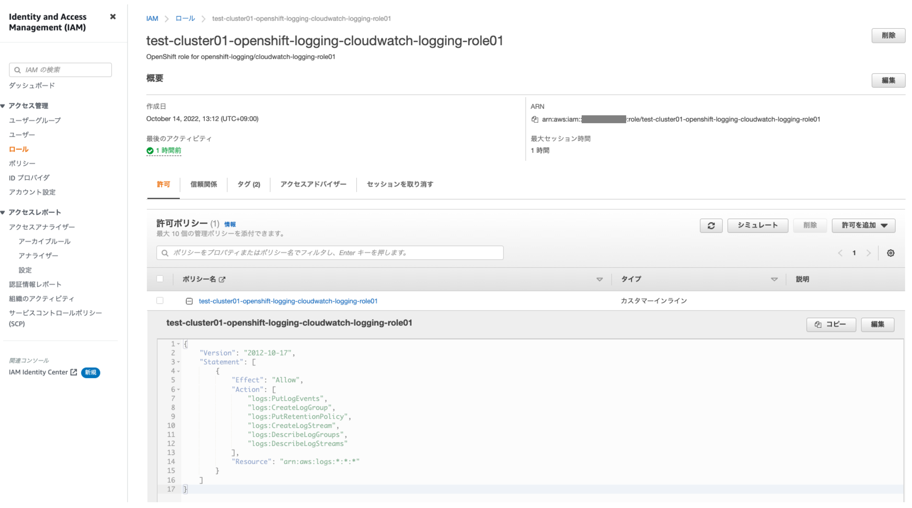
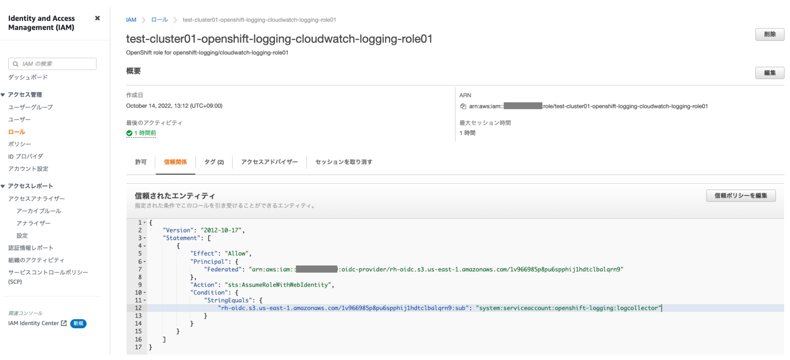
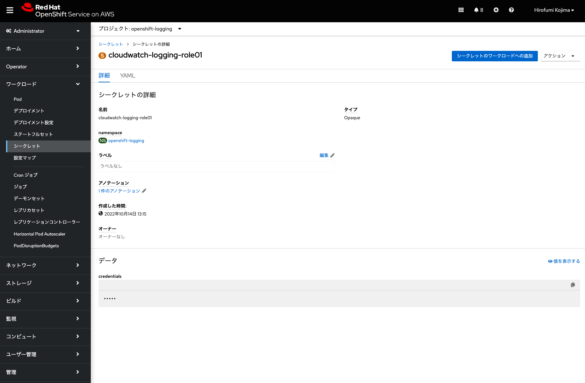
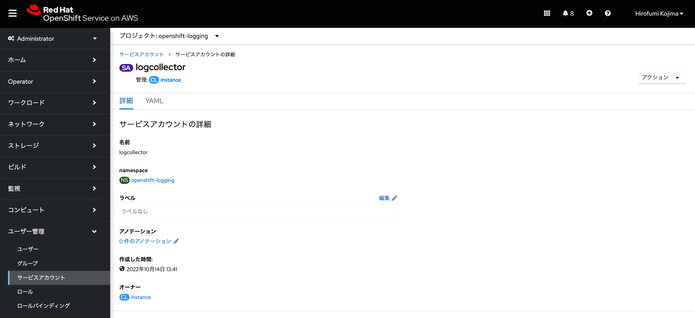
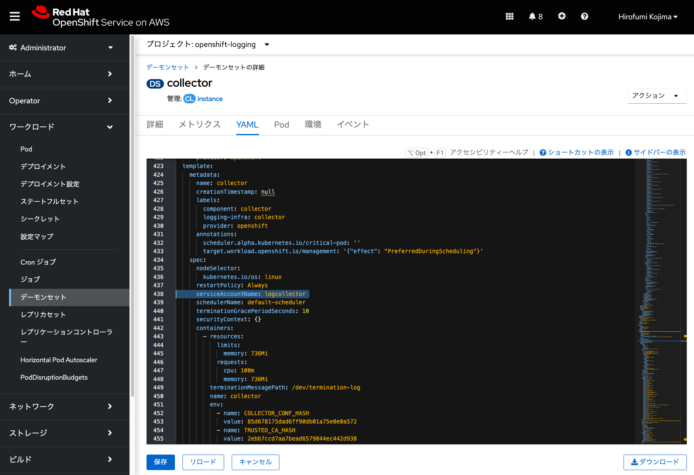
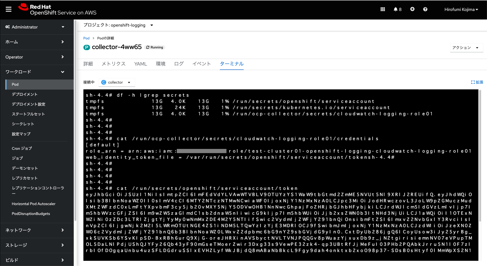

## [参考情報] STSを利用した、Amazon CloudWatchへのログ転送設定

※ここで紹介している内容は参考情報であり、受講者はコマンド/GUI操作を実施する必要はありません。

OpenShiftでは、AWSなどのクラウドプロバイダーの認証情報を管理するためのOperatorとして、[Cloud Credential Operator (CCO)](https://access.redhat.com/documentation/ja-jp/openshift_container_platform/4.11/html/operators/cloud-credential-operator_cluster-operators-ref) というOperatorがデフォルトで実行されています。これらの認証情報は、CredentialsRequestという[Kubernetesのカスタムリソース](https://kubernetes.io/ja/docs/concepts/extend-kubernetes/api-extension/custom-resources/)(Podなどの標準リソースとは異なる、独自定義のリソース。Kubernetes APIを拡張するためのもの)の1つとして管理されています。

このCredentialsRequestをもとに、AWS STSを利用するための、AWS IAMロールとOpenShiftシークレットリソースを作成することで、CloudWatchへのログ転送が可能になります。

最初に、CloudWatchへのログ転送を許可するポリシーを含んだ、CredentialsRequestのYAMLファイルを作成します。例えば、次のようなYAMLファイルになります。

```
$ cat << EOF  > logging-cr.yaml
apiVersion: cloudcredential.openshift.io/v1
kind: CredentialsRequest
metadata:
  name: cloudwatch-logging-role01-credrequest
  namespace: openshift-cloud-credential-operator
spec:
  providerSpec:
    apiVersion: cloudcredential.openshift.io/v1
    kind: AWSProviderSpec
    statementEntries:
      - action:
          - logs:PutLogEvents
          - logs:CreateLogGroup
          - logs:PutRetentionPolicy
          - logs:CreateLogStream
          - logs:DescribeLogGroups
          - logs:DescribeLogStreams
        effect: Allow
        resource: arn:aws:logs:*:*:*
  secretRef:
    name: cloudwatch-logging-role01
    namespace: openshift-logging
  serviceAccountNames:
    - logcollector
EOF
$ ls
logging-cr.yaml
```

このYAMLファイルにある「cloudwatch-logging-role01」は、AWS IAMロールとOpenShiftシークレットリソースの名前として利用されるものであり、任意に名前を付けることができます。「secretRef」の「namespace」で「openshift-logging」を指定することで、「openshift-logging」プロジェクトのシークレットリソースとして、「cloudwatch-logging-role01」が作成されます。

また、「openshift-logging」プロジェクトにあるログ収集/転送Pod(collector Pod)に対して、[サービスアカウント](https://access.redhat.com/documentation/ja-jp/openshift_container_platform/4.11/html/authentication_and_authorization/understanding-and-creating-service-accounts)「logcollector」を付与します。サービスアカウントは、OpenShiftの各プロジェクトに存在するオブジェクトであり、ユーザーの認証情報を共有せずに各コンポーネントがAPIアクセスを制御するための方法を提供します。このサービスアカウントを介して、AWS IAMの一時的な認証情報を利用することになります。


このYAMLファイルをもとに、AWS IAMロールを作成します。作成するためのツールとして、OpenShiftのCCOが提供する「ccoctl」というバイナリファイルを利用できます。「ccoctl」を入手するために、予め、cluster-admin権限を付与しておいたユーザーを利用して、OpenShift CLIであるocコマンドでログインしておきます。ocによるログインコマンドは、ROSAクラスターのWebコンソール右上にあるユーザー名をクリックして、「ログインコマンドのコピー」から確認できます。

```
$ rosa grant user cluster-admin --user XXXXX -c rosa-XXXXX
$ oc login --token=XXXXX --server=https://api.test-cluster01.XXXXX.openshiftapps.com:6443
```

ccoctlを入手するには、次のコマンドを実施します。ここで指定している「pull-secret.txt」は、[こちら](https://console.redhat.com/openshift/downloads#tool-pull-secret)から入手したPull Secretをテキストファイルで保存したものです。

```
$ CCO_IMAGE=$(oc adm release info --image-for='cloud-credential-operator')
$ echo $CCO_IMAGE
quay.io/openshift-release-dev/ocp-v4.0-art-dev@sha256:XXXXX
$ oc image extract $CCO_IMAGE -a ./pull-secret.txt --file="/usr/bin/ccoctl"
$ ls 
ccoctl logging-cr.yaml pull-secret.txt
$ chmod +x ccoctl
```

入手したccoctlを利用して、AWS IAMロールと、OpenShiftシークレットリソースを作成するためのマニフェストファイルを作成します。ccoctlコマンド実行(2022年10月時点では、x86_64版のRHEL8での実行を想定したバイナリファイル)には、rosaコマンドでROSAクラスターを作成した時に利用した、AWS認証情報(「~/.aws/credentials」など)が必要になります。ここで指定しているオプションは次のとおりです。

- `name`: 作成するAWS IAMロールの接頭辞
- `credentials-requests-dir`: 先ほど作成した「logging-cr.yaml」ファイルがあるディレクトリパス
- `identity-provider-arn`: ROSAクラスター作成時に作成された[OIDCプロバイダー](https://docs.aws.amazon.com/ja_jp/IAM/latest/UserGuide/id_roles_providers_create_oidc.html)のARN。AWSコンソールの「ID プロバイダ」から確認できます。


<div style="text-align: center;">ROSAクラスター用のOIDCプロバイダー</div>　　


```
$ ls 
ccoctl logging-cr.yaml pull-secret.txt

$ ./ccoctl aws create-iam-roles --name=test-cluster01 --credentials-requests-dir ./ \
   --identity-provider-arn=arn:aws:iam::XXXXX:oidc-provider/rh-oidc.s3.us-east-1.amazonaws.com/1v966985p8pu6spphij1hdtclbalqrn9

2022/10/14 04:12:12 Role arn:aws:iam::XXXXX:role/test-cluster01-openshift-logging-cloudwatch-logging-role01 created
2022/10/14 04:12:12 Saved credentials configuration to: ./manifests/openshift-logging-cloudwatch-logging-role01-credentials.yaml
2022/10/14 04:12:13 Updated Role policy for Role test-cluster01-openshift-logging-cloudwatch-logging-role01

$ ls
ccoctl logging-cr.yaml manifests pull-secret.txt
```

ccoctlコマンドで作成されたAWS IAMロール「test-cluster01-openshift-logging-cloudwatch-logging-role01」を、AWSコンソールで確認してみます。CloudWatchへログ転送をするためのインラインポリシーが設定されていることが分かります。


<div style="text-align: center;">ccoctlで作成されたAWS IAMロール</div>　　

AWS IAMロールの「信頼関係」タブを見てみると、OpenShiftの「openshift-logging」プロジェクトにある「logcollector」サービスアカウントに対して、AWS STSを利用するための一時的な認証情報を付与する設定が記載されていることが分かります。


<div style="text-align: center;">ccoctlで作成されたAWS IAMロールの信頼関係</div>　　

**[参考情報]** [AWS Security Token Service のアクション、リソース、および条件キー](https://docs.aws.amazon.com/ja_jp/service-authorization/latest/reference/list_awssecuritytokenservice.html)


続いて、この「AWS STSを利用するための一時的な認証情報」を利用するための、OpenShiftシークレットリソースを作成します。先ほどのccoctlコマンドで、「manifests」ディレクトリにYAMLファイルが自動作成されたので、これを利用します。

```
$ tree manifests/
manifests/
`-- openshift-logging-cloudwatch-logging-role01-credentials.yaml

0 directories, 1 file

$ cat manifests/openshift-logging-cloudwatch-logging-role01-credentials.yaml 
apiVersion: v1
stringData:
  credentials: |-
    [default]
    role_arn = arn:aws:iam::XXXXX:role/test-cluster01-openshift-logging-cloudwatch-logging-role01
    web_identity_token_file = /var/run/secrets/openshift/serviceaccount/token
kind: Secret
metadata:
  name: cloudwatch-logging-role01
  namespace: openshift-logging
type: Opaque

$ oc apply -f manifests/openshift-logging-cloudwatch-logging-role01-credentials.yaml 
secret/cloudwatch-logging-role01 created
```

これで、「cloudwatch-logging-role01」という名前のシークレットリソースが、ROSAクラスター上に作成されました。

あとは、[ROSAクラスターのロギングとモニタリング](../rosa-logs-and-monitor)の「[デモ] ROSAクラスターのロギングの設定」で記載している手順と同じく、OpenShift Logging Operatorをインストールして、ClusterLoggingインスタンスとClusterLogForwarderインスタンスを作成すれば、設定完了です。

ClusterLogForwarderインスタンス作成時に指定するシークレット名については、「[デモ] ROSAクラスターのロギングの設定」手順では「name: cw-secret」を指定していますが、ここでは先ほど作成したシークレットを利用するので、「name: cloudwatch-logging-role01」を指定します。「cw-secret」シークレットを、追加で作成する必要はありません。


ここまでの手順によって、ロギングの設定が完了すると、openshift-loggingプロジェクトに、次のリソースがあることを確認できます。

- 「cloudwatch-logging-role01」シークレット
- 「logcollector」サービスアカウント
- 「logcollector」サービスアカウントが付与された、「collector」デーモンセット


<div style="text-align: center;">「cloudwatch-logging-role01」シークレット</div>　　


<div style="text-align: center;">「logcollector」サービスアカウント</div>　　


<div style="text-align: center;">「logcollector」サービスアカウントが付与された、「collector」デーモンセット</div>　　


[デーモンセット](https://access.redhat.com/documentation/ja-jp/openshift_container_platform/4.11/html/nodes/_using-jobs-and-daemonsets)は、一部または全てのノードでPodのコピーが実行されることを保証するためのものです。ログ収集とCloudWatchへのログ転送に利用されるcollector Podの実行に、デーモンセットが利用されています。

このデーモンセットに「logcollector」サービスアカウントが付与されることで、collector Podが、AWS STSによる一時的な認証情報を利用できるようになります。なお、作成したOpenShiftシークレットとトークン情報は、各collector Podの「/run/ocp-collector/secrets/cloudwatch-logging-role01/credentials」と「/run/secrets/openshift/serviceaccount/token」に保存・利用されます。


<div style="text-align: center;">各collector Podにあるシークレットとトークン</div>　　


これで、STSを利用した、Amazon CloudWatchへのログ転送設定手順の紹介は終了です。もし、これ以上`openshift-*`などのプロジェクトにあるROSAのコアコンポーネントにアクセスしない場合は、「cluster-admin」権限を、「rosa revoke user」コマンドで削除しておきます。

```
$ rosa revoke user cluster-admins --user XXXXX --cluster rosa-XXXXX
? Are you sure you want to revoke role cluster-admins from user XXXXX in cluster rosa-XXXXX? Yes
I: Revoked role 'cluster-admins' from user 'XXXXX' on cluster 'rosa-XXXXX'
```

以降は、[ROSAクラスターのロギングとモニタリング](../rosa-logs-and-monitor)ページに戻って、「[ハンズオン] Amazon CloudWatchによるログ確認」に進んでください。


#### [参考情報]
- [Short lived Credentials with AWS Security Token Service](https://github.com/openshift/cloud-credential-operator/blob/master/docs/sts.md)

[HOME](../../README.md)
