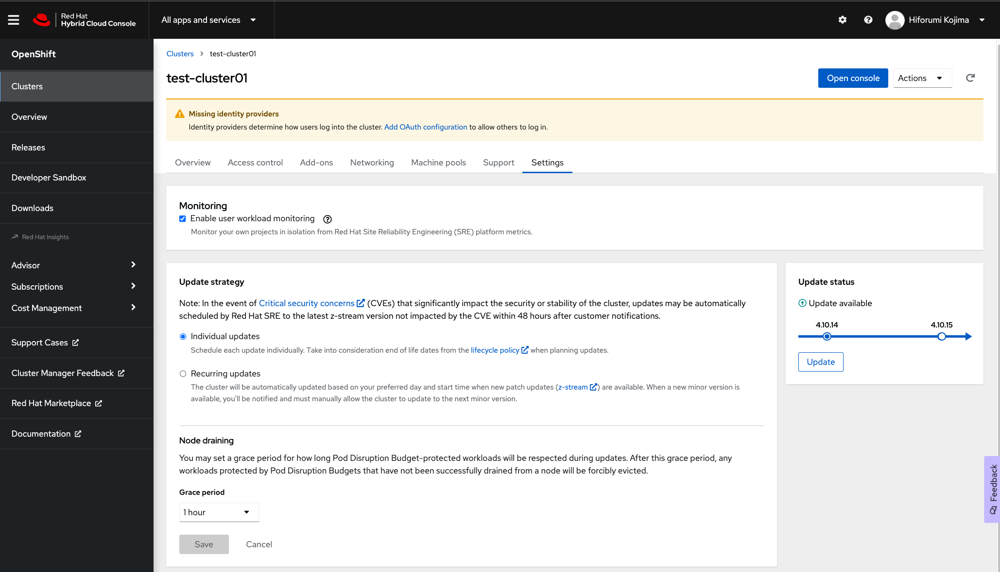
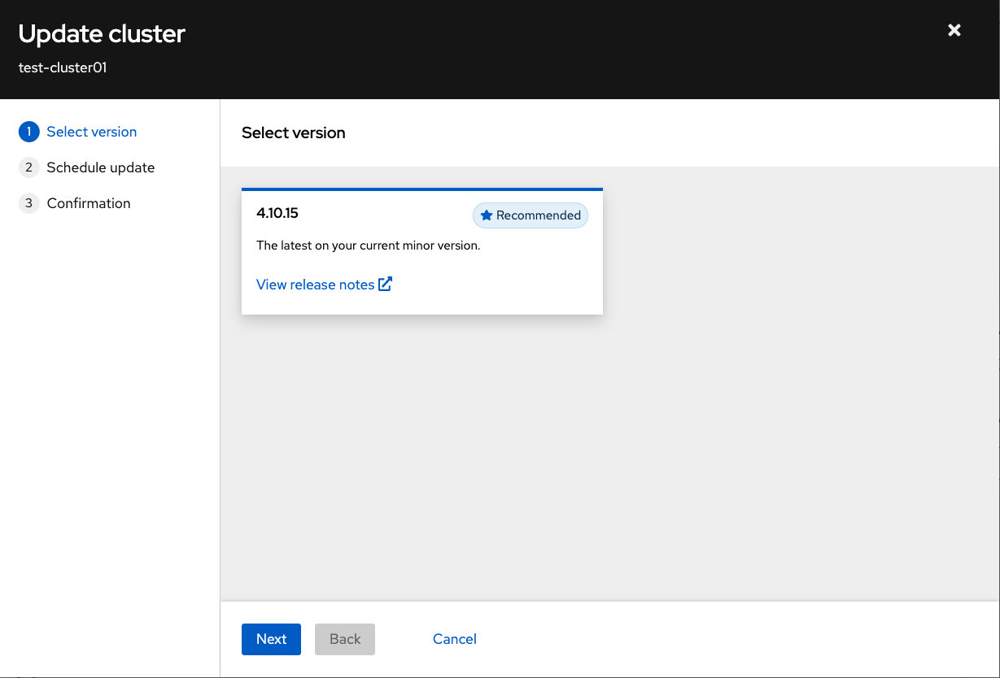
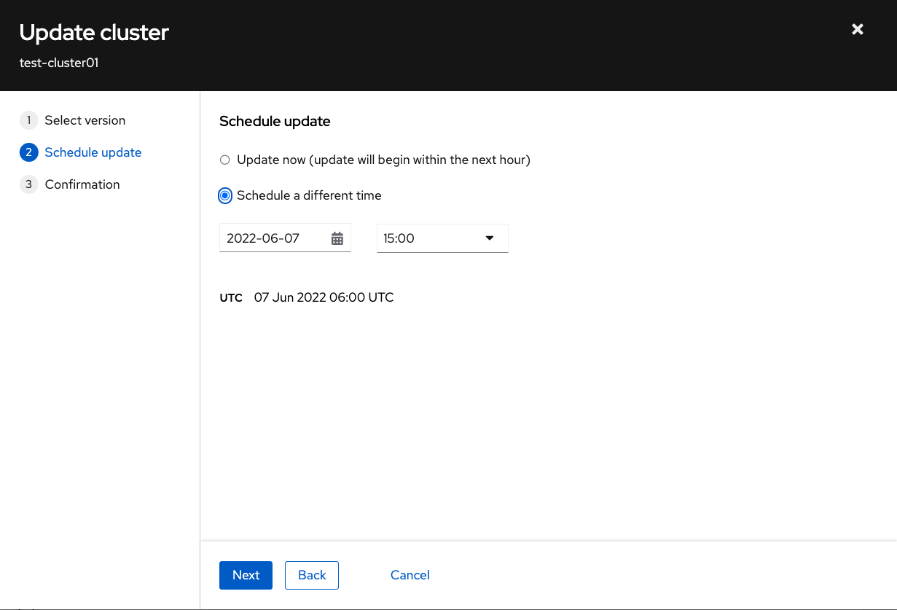
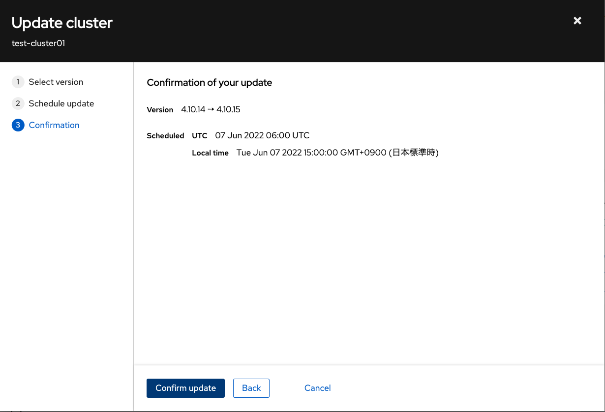
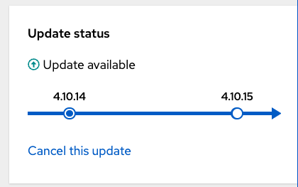
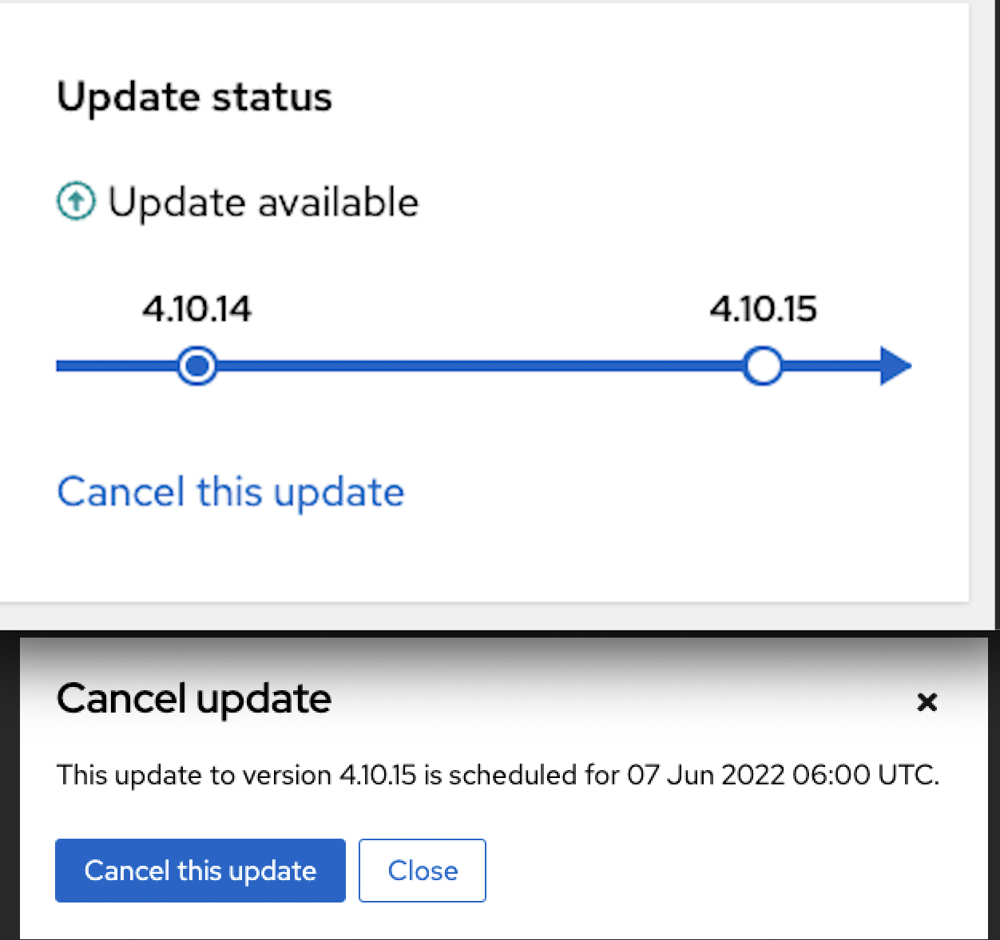

## ROSAクラスターのアップグレード

### コンソールを使用したアップグレード

OpenShift Cluster Manager (OCM)を使用して、AWS STSを使用するROSAクラスターを手動でアップグレードできます。なお、ROSAの場合、通常のOpenShiftとは異なり、OpenShiftのWebコンソールとCLI(ocコマンド)によるアップグレードができないように制限がかけられています。そのため、OCMや後述するROSA CLIによるアップグレードを実施する必要があります。

[OCMにログイン](https://console.redhat.com/openshift/)して、アップグレードするROSAクラスターを選択し、Settingsタブをクリックして、「Update」ボタンをクリックします。


<div style="text-align: center;">ROSAクラスターの設定画面</div>　　

アップグレードするバージョンを選択して、「Next」をクリックします。


<div style="text-align: center;">バージョンの選択</div>　　

クラスターのアップグレードをスケジュールします。 1時間以内にアップグレードするには、「Update now」を選択し、「Next」をクリックします。
指定した時間にアップグレードするには、「Schedule a different time」を選択し、アップグレードの日時を設定します。「Next」をクリックして確認ダイアログに進みます。


<div style="text-align: center;">アップグレードのスケジュール</div>　　

アップグレードするバージョンとスケジュールを確認したら、「Confirm Update」をクリックして、アップグレードをスケジュールします。


<div style="text-align: center;">アップグレードの確認</div>　

アップグレードのステータスが「Update status」ペインに表示されます。


<div style="text-align: center;">アップグレードのステータス</div>　　

アップグレードをキャンセルしたい場合、「Cancel this update」を選択します。


<div style="text-align: center;">アップグレードのキャンセル</div>　　

### ROSA CLIを使用したアップグレード

OCMのコンソールの他に、ROSA CLIを使用してROSAクラスターをアップグレードできます。次のコマンドを実行して、利用可能なアップグレードを確認します。
```
$ rosa list upgrade --cluster test-cluster01
VERSION  NOTES
4.10.15  recommended
```

ここで確認したアップグレードを適用します。「Node draining」では、アップグレードのために、コンピュートノードからPodを停止させる猶予時間を指定できます。デフォルトは1時間です。
```
$ rosa upgrade cluster --cluster test-cluster01
? Version:  [Use arrows to move, type to filter, ? for more help]
> 4.10.15
I: Ensuring account and operator role policies for cluster 'XXXXXXX' are compatible with upgrade.
I: Account and operator roles for cluster 'test-cluster01' are compatible with upgrade
? Please input desired date in format yyyy-mm-dd: 2022-06-07
? Please input desired UTC time in format HH:mm: 08:00
? Node draining:  [Use arrows to move, type to filter, ? for more help]
  15 minutes
  30 minutes
  45 minutes
> 1 hour
  2 hours
  4 hours
  8 hours
I: Upgrade successfully scheduled for cluster 'test-cluster01'
```

指定したアップグレードのスケジュールを確認できます。
```
$ rosa list upgrade cluster --cluster test-cluster01
VERSION  NOTES
4.10.15  scheduled for 2022-06-07 08:00 UTC
```

現時点で、ROSA CLIによるアップグレードのキャンセルはできませんので、アップグレードのキャンセルをしたい場合、OCMのコンソールから実施してください。アップグレードを指定またはキャンセルすると、Red Hat SREチームからメールの通知がきます。

- アップグレードの指定をした場合の通知メールの例

```
Hello Hiforumi,

This notification is for your test-cluster01 cluster.
Your Cluster is scheduled for upgrade maintenance to version '4.10.15' on 2022-06-07 at 08:00 UTC.

Please contact Red Hat support if you have any questions.
Thank you for choosing Red Hat OpenShift Service on AWS,
OpenShift SRE
```

- アップグレードのキャンセルをした場合の通知メールの例

```
Hello Hiforumi,

This notification is for your test-cluster01 cluster.
Your Cluster upgrade maintenance to version '4.10.15' on 2022-06-07 at 06:00 UTC has been cancelled.

If you have any questions, please contact us. Review the support process for guidance on working with Red Hat support.
Thank you for choosing Red Hat OpenShift Service on AWS,
OpenShift SRE
```

これで、ROSAクラスターアップグレードスケジューリングのデモ紹介は終了です。次は、インストラクターによる、[ROSAクラスター削除](../rosa-delete)のデモ紹介です。

[HOME](../../README.md)
