## 永続ボリュームとしてのAmazon EBS/EFS の利用設定

### [ハンズオン]Amazon EBSの利用

ROSAには、Amazon Elastic Block Store (EBS) ボリュームを使用するストレージクラスが事前に設定されています。これにより、[Amazon EBSのgp2, gp3ボリュームタイプ](https://aws.amazon.com/jp/ebs/general-purpose/)がすぐに使えるようになっています。


<div style="text-align: center;">ROSAですぐに利用可能なストレージクラス</div>　　

このうち、デフォルトのストレージクラスがgp3として設定(ROSA 4.11+)されており、外部ストレージを永続ボリュームとして利用する際のデフォルトとして利用されます。

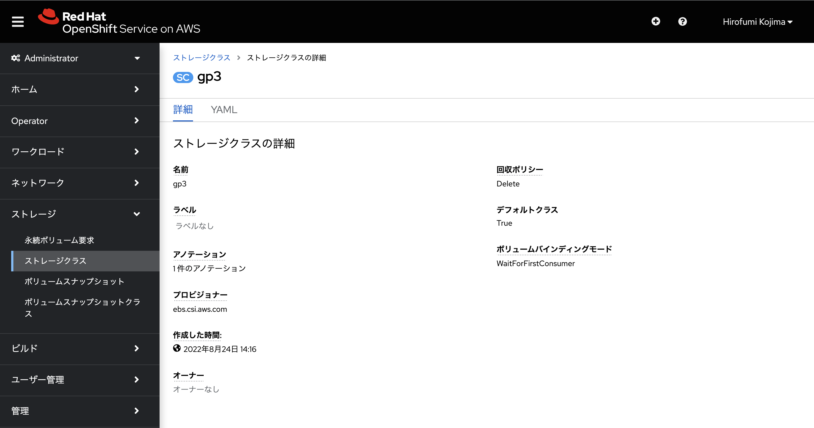
<div style="text-align: center;">gp3ストレージクラス</div>　　

また、前の演習で作成しました、PostgreSQLサンプルアプリでも、gp3ストレージクラスを利用して、gp3ボリュームタイプのAmazon EBSにデータを保存するように設定されています。


<div style="text-align: center;">PostgreSQLが利用する永続ボリューム (Persistent Volume, PV)</div>　

ここでgp3ストレージクラスを利用するために、新しく永続ボリューム要求(Persistent Volume Claim, PVC)を作成します。永続ボリューム要求の名前は、任意の名前(ここではtest-pvc-20)を入力し、要求するサイズは1GiBと指定します。なお、PVCはプロジェクトという名前空間の中にあるリソースです。そのため、プロジェクトごとに同じ名前のPVCが存在できます。例えば、プロジェクト1の中にPVC1、プロジェクト2の中にPVC1を作ることができます。ただし、1つのプロジェクトの中のリソース名の重複は許可されていないため、この例の場合だと、プロジェクト1の中にPVC1を2つ作ることはできません。


<div style="text-align: center;">PVC　(test-pvc-20) の作成</div>　　

このgp3ストレージクラスは、ボリュームバインディングモードが「WaitForFirstConsumer」と指定されており、最初にPodから永続ボリューム要求が利用されるまで、永続ボリュームの割り当てが行われない(ステータスがPendingのまま)ようになっています。ボリュームバインディングモードが「Immediate」となっている場合、PVC作成後すぐに永続ボリュームの割り当てが行われます。

そして、Podを作成します。「Podの作成」から、次のYAMLファイルを入力してPodを作成します。下記の「claimName: test-pvc-20」となっているところは、作成したPVCの名前に応じて、適宜変更してください。

\[Tips\]: PodはKubernetes/OpenShift上でのコンテナアプリの実行単位です。下記のYAMLファイルにあるとおり、コンテナ(この例ではCentOSコンテナの最新版を利用)やコンテナが利用する永続ボリュームの設定などをまとめたものになります。Podにはコンテナを複数まとめることもできますが、基本的には1つのPodには1つのコンテナを含むことを推奨しています。
```
apiVersion: v1
kind: Pod
metadata:
 name: test-ebs
spec:
 volumes:
   - name: ebs-storage-vol
     persistentVolumeClaim:
       claimName: test-pvc-20
 containers:
   - name: test-ebs
     image: centos:latest
     command: [ "/bin/bash", "-c", "--" ]
     args: [ "while true; do touch /mnt/ebs-data/verify-ebs && echo 'hello ebs' && sleep 30; done;" ]
     volumeMounts:
       - mountPath: "/mnt/ebs-data"
         name: ebs-storage-vol
```


<div style="text-align: center;">Pod (test-ebs) の作成</div>　　

test-ebsという名前でPodが作成されて、Podにより「test-pvc-20」PVCが利用されて、永続ボリュームとして外部ストレージの利用が開始されます。


<div style="text-align: center;">PVC (test-pvc-20) の利用</div>　　

このPodのターミナルやログから、マウント状況や動作状況を確認できます。


<div style="text-align: center;">Podの情報確認</div>　

ここで上記画像にあるように、ターミナルから、echoコマンドなどで永続ボリュームのマウントポイントである「/mnt/ebs-data」ディレクトリに、適当なファイルを作成します。Podを削除(該当Podを選択して、「アクション」->「Podの削除」を選択)した後に、再度「test-pvc-20」PVCを指定してPodを作成すると、作成したテストファイルが残っていることを確認できます。

### [デモ]Amazon EFSの利用準備

※ここで紹介している内容は、インストラクターによって紹介されるデモ手順であり、受講者はコマンド/GUI操作を実施する必要はありません。次の「[ハンズオン]Amazon EFSの利用」まで読み進めて下さい。


ROSAクラスターの複数のコンピュートノードから同時に読み書き可能な永続ボリュームとして、[Amazon Elastic File System (EFS)](https://aws.amazon.com/jp/efs/)を利用するように設定できます。このために、Amazon EFSを利用するための、ファイルシステムとアクセスポイントをAWS上で作成しておく必要があります。

最初にAWS EC2コンソールにアクセスして、ROSAがデプロイされているリージョンに移動します。下記の画像はシンガポールリージョン(ap-southeast-1)の例ですが、「worker」という名前が付いているノードを1台選択します。この選択したインスタンスが利用している、VPC ID(下記の例では、vpc-0e06bc9e48d4f2ad5)とセキュリティグループID(下記の例では、sg-00aee77665b048e0d)をメモしておきます。

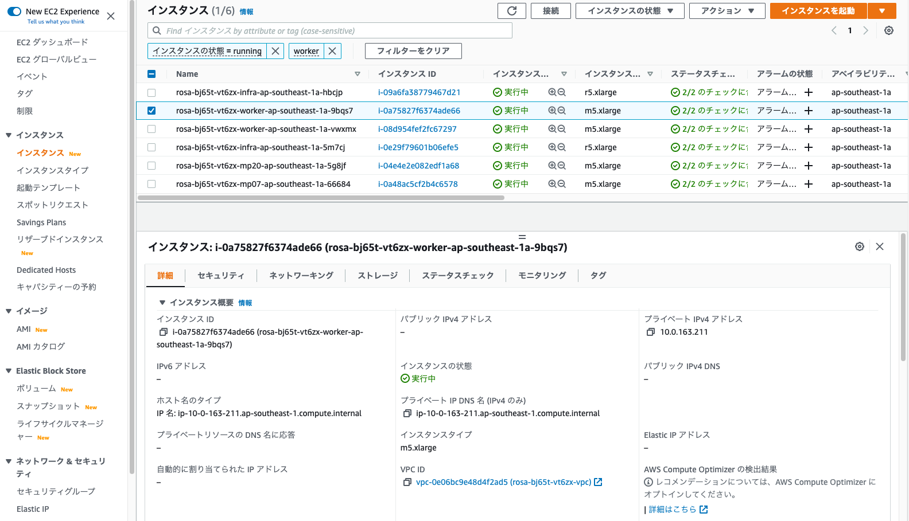
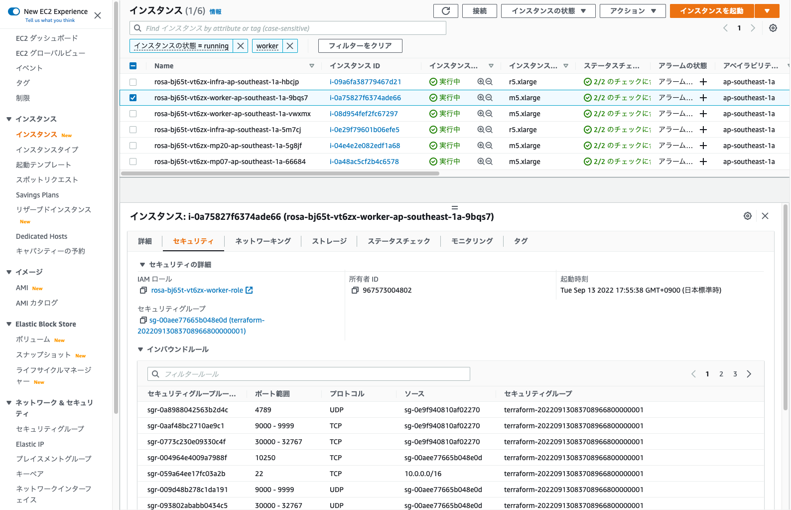
<div style="text-align: center;">VPC/Security GroupのID確認</div>　


ROSAクラスターからのEFSへのNFS接続のため、NFSトラフィックのアクセス許可ルールをセキュリティグループに追加します。セキュリティタブのセキュリティグループID(この例では、sg-00aee77665b048e0d)をクリックして、「インバウンドのルールを編集」をクリックします。


<div style="text-align: center;">インバウンドのルール確認</div>　


スクロールして、「ルールを追加」をクリックして、プライベートCIDRからNFSトラフィックを許可するルールを追加します。「タイプ」はNFS、ソース(アクセス元)は「カスタム」で「10.0.0.0/16」を入力します。この例では、この「10.0.0.0/16」が、ROSAの各コンピュートノードが、ROSAクラスター内で利用するプライベートのネットワークアドレスとなっています。ルールの一番下に追加されていることを確認した後に、「ルールを保存」をクリックして追加したルールを保存します。

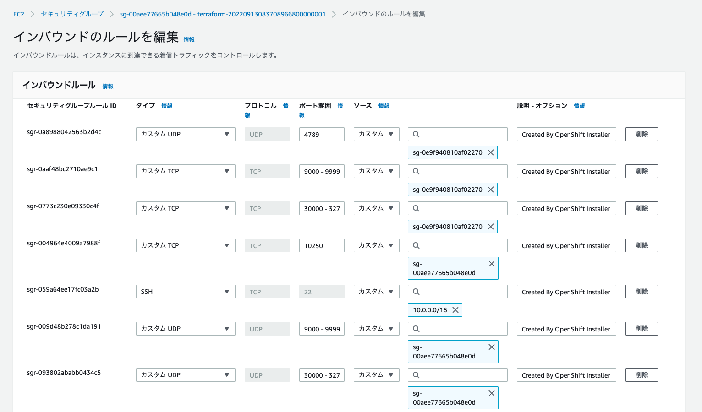
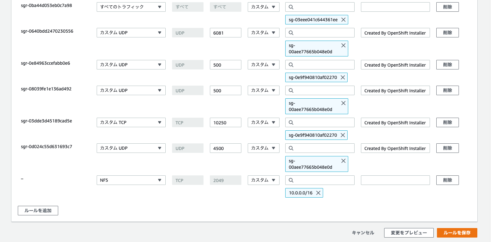
<div style="text-align: center;">インバウンドのルール追加と保存</div>　

NFSトラフィックを許可するルールを追加した後に、Amazon EFSのコンソールに移動して、ROSAクラスターがあるリージョンと同じリージョンを選択して、「ファイルシステムの作成」をクリックします。


<div style="text-align: center;">Amazon EFSのトップ画面</div>　


「ファイルシステムの作成」をクリックした後に表示される画面の「カスタマイズ」をクリックして、ステップ1の「ファイルシステムの設定」は全てデフォルト値のまま「次へ」をクリックし、ステップ2の「ネットワークアクセス」で、前述の手順でメモしておいたVPC ID(下記の例では、vpc-0e06bc9e48d4f2ad5)とセキュリティグループID(下記の例では、sg-00aee77665b048e0d)を、作成するファイルシステムに接続可能なVPCとセキュリティグループとして指定します。

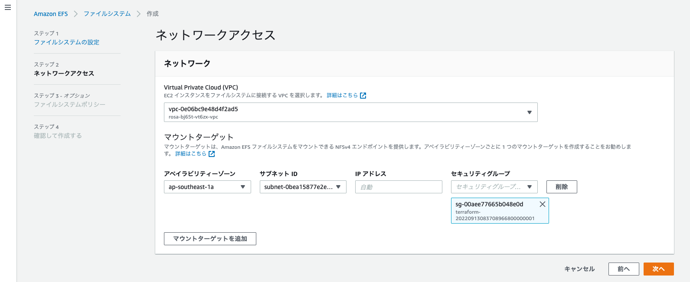
<div style="text-align: center;">ネットワークアクセスの設定</div>　

「次へ」をクリックして、ステップ3「ファイルシステムポリシー」はデフォルトのままで「次へ」をクリックして、最後にステップ4「確認して作成する」ではスクロールして、ページ下部にある「作成」ボタンをクリックしてファイルシステムを作成します。

作成したファイルシステムID(下記画像の例では、fs-0b6d438170cfe0a64)をクリックして、ファイルシステムに接続するためのアクセスポイントを作成します。「アクセスポイント」タブから「アクセスポイントを作成」をクリックします。

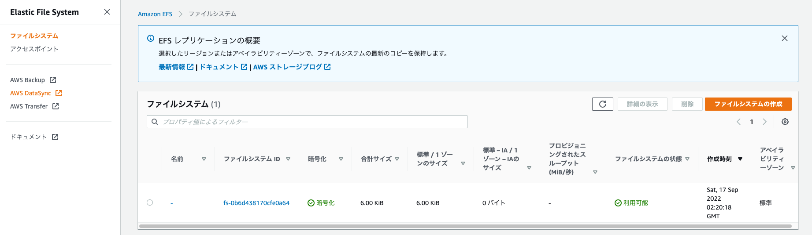
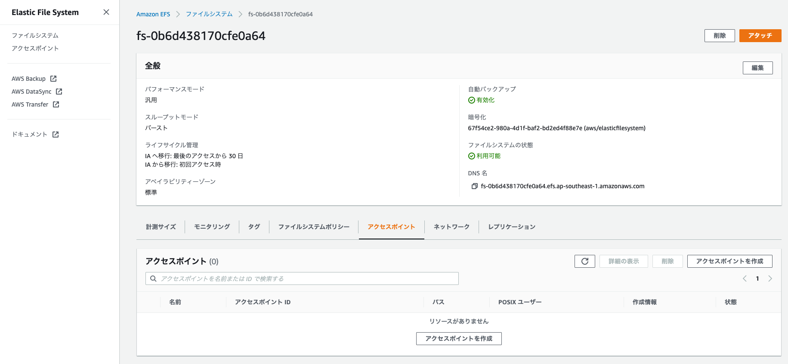
<div style="text-align: center;">アクセスポイントの作成 その1</div>　

「ルートディレクトリパス」に任意のPATH(この例では、/efs-mount)を入力し、「ルートディレクトリ作成のアクセス許可 - オプション」で、所有者ユーザーIDと所有者グループIDに「65534」、ルートディレクトリパスに適用する POSIX アクセス許可に「0777」を入力します。

ここでは、アクセス許可を「0777」として、どのユーザー権限でもファイルの読み書きを可能にする共有ファイルシステムとすることを想定します。そのため、ユーザー/グループIDについてはどの数値を指定してもいいのですが、nfsnobodyのIDとして「65534」を指定することにします。

他の値は空欄のままにしておいて、「アクセスポイントを作成」をクリックして、アクセスポイントを作成します。

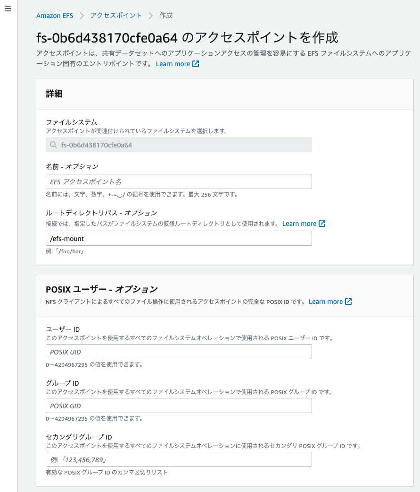
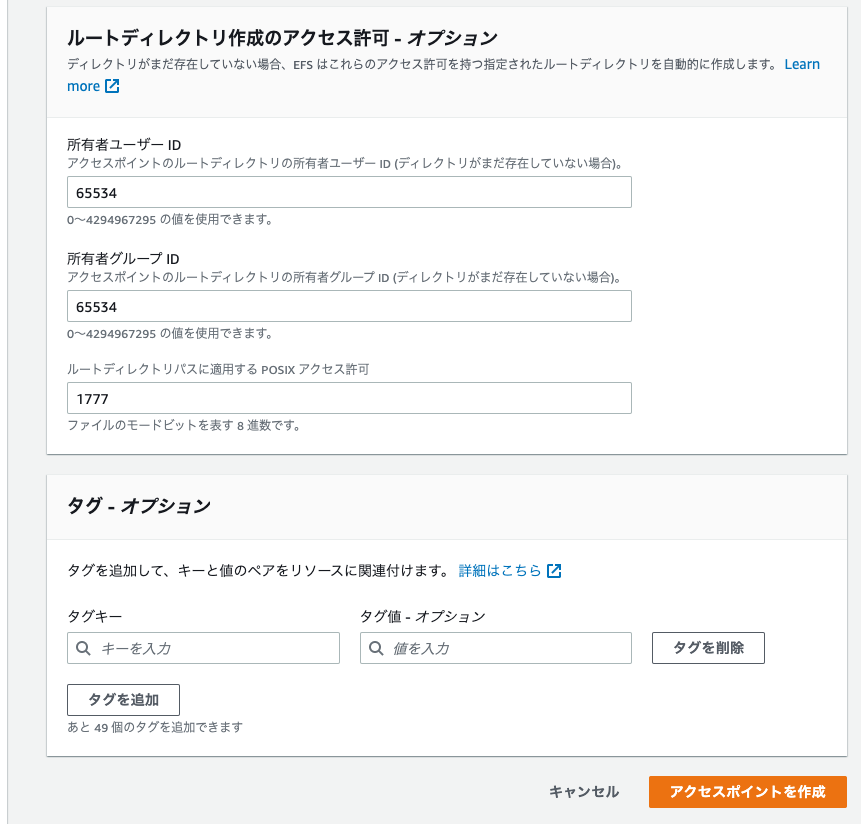
<div style="text-align: center;">アクセスポイントの作成 その2</div>　


Amazon EFSで利用可能なファイルシステムとアクセスポイントの作成が完了したら、それぞれのIDをメモしておきます。下記画像の例だと、ファイルシステムIDが「fs-0b6d438170cfe0a64」で、アクセスポイントIDが「fsap-014cb4e3f07260d15	」となります。

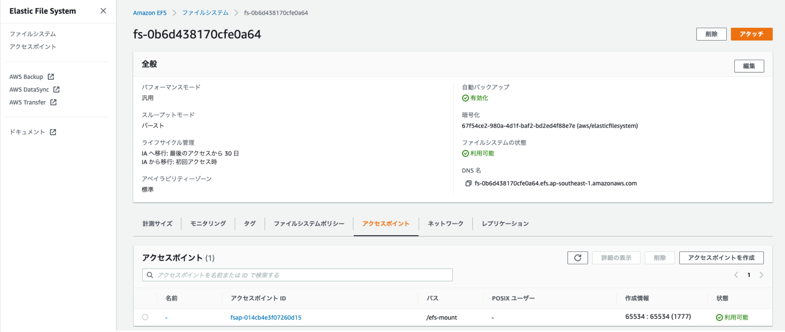
<div style="text-align: center;">作成したファイルシステムとアクセスポイントのID確認</div>　

ここからはROSAクラスターでの操作となります。ROSAクラスターに管理者権限を持つユーザーでログインして、左サイドメニューにある、AdministratorパースペクティブのOperatorHubから、Amazon EFSをPodから自動的に利用できるようにするための、「AWS EFS Operator」を選択します。なお、「EFS」でOperatorHubのカタログを検索すると、「AWS EFS CSI Driver Operator」も検索結果として表示されますが、このOperatorではなく、「AWS EFS Operator」の方となりますので、注意してください。

「AWS EFS Operator」を選択したあとは、全てデフォルトの値を利用してインストールを完了します。

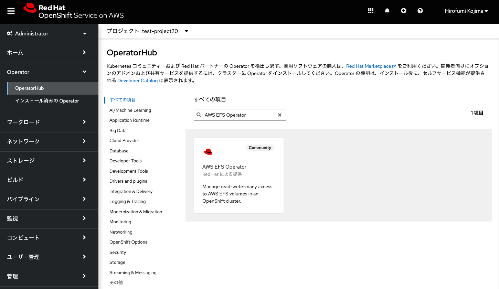
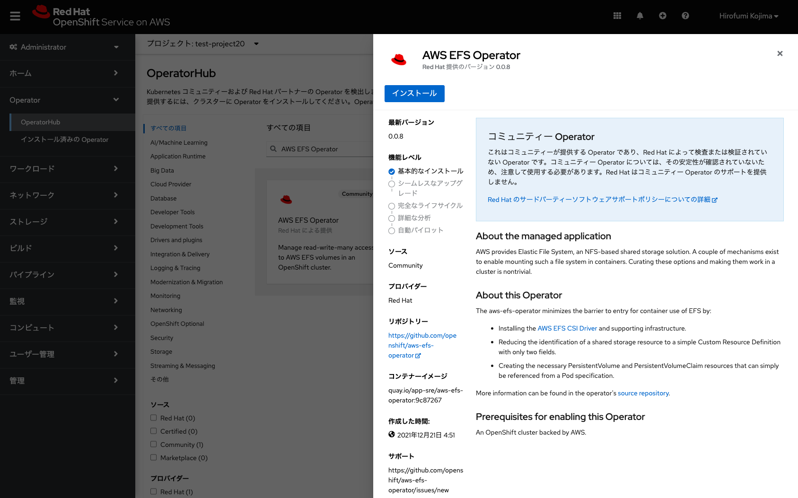
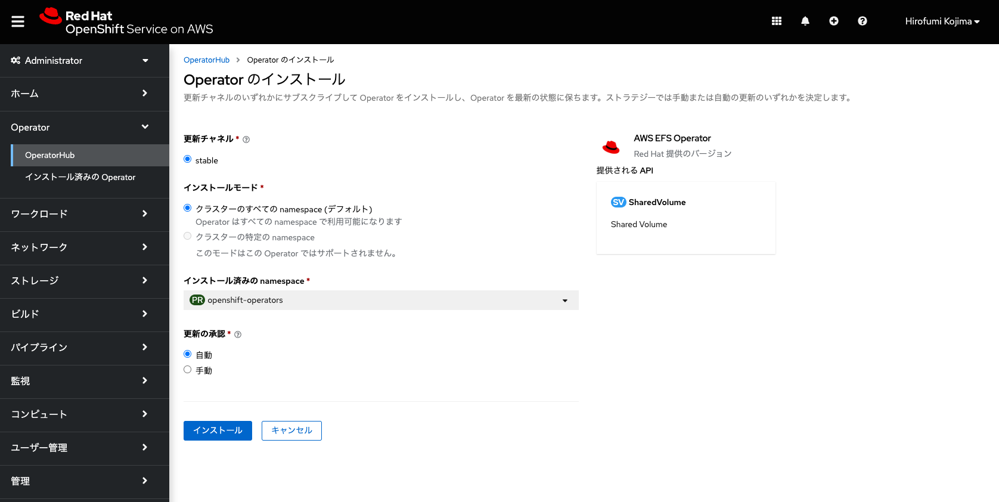
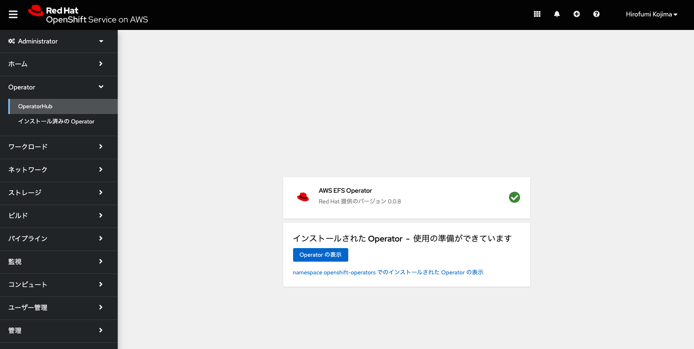
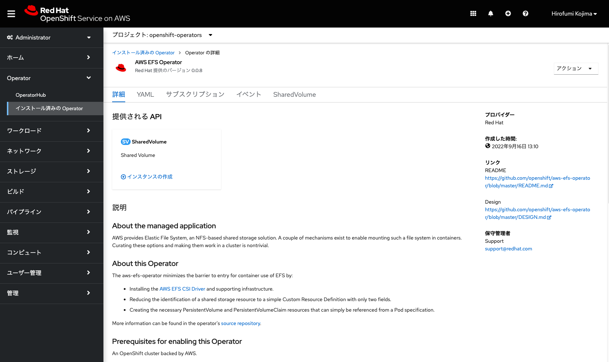
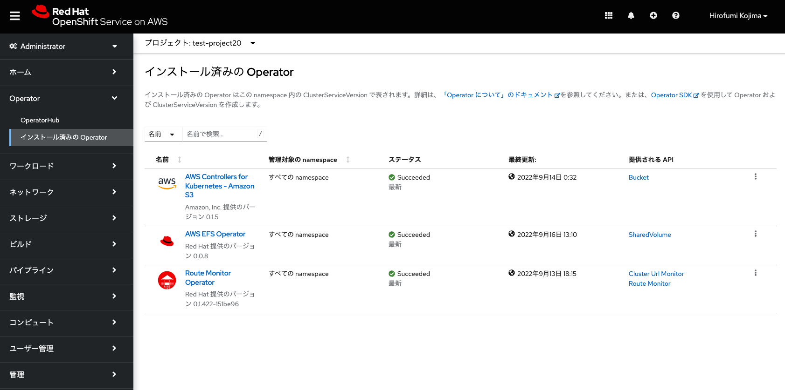
<div style="text-align: center;">AWS EFS Operatorのインストール</div>　

これで、ROSAクラスターで、永続ボリュームとしてAmazon EFSを利用する設定が完了しました。


### [ハンズオン]Amazon EFSの利用

ここまでの手順で用意したAmazon EFS上のファイルシステムを、Podが利用する永続ボリュームとして利用してみます。左サイドメニューのAdministratorパースペクティブにある「インストール済みのOperator」から「AWS EFS Operator」を選択して、「SharedVolume」タブから「SharedVolumeの作成」をクリックします。

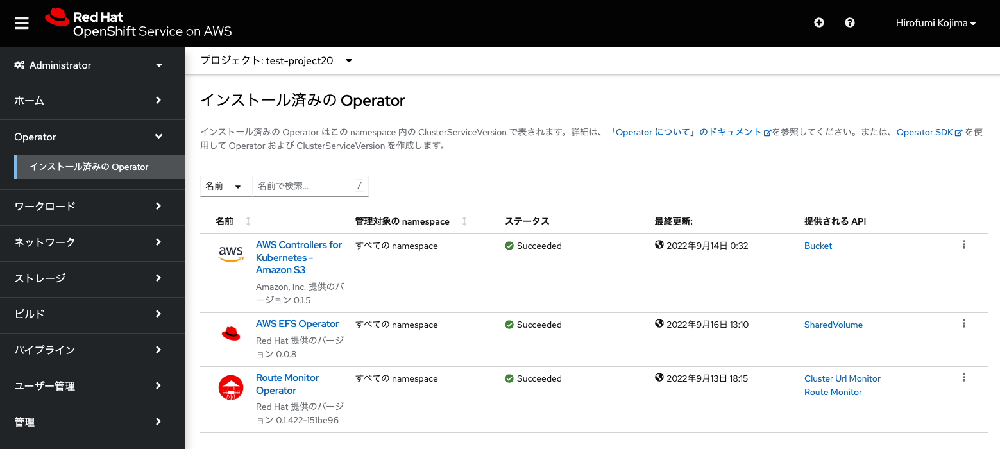
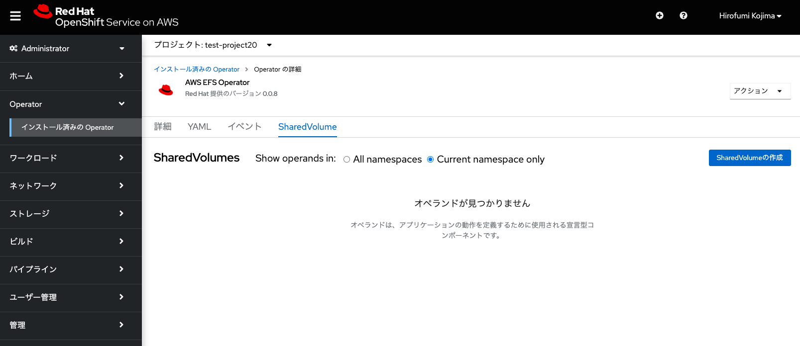
<div style="text-align: center;">EFS利用のためのSharedVolume作成 その1</div>　

「名前」には、任意の名前(この例では、sv20)を入力します。インストラクターによって案内される「Access Pointn ID」と「File System ID」を入力します。これらのIDは、本演習環境用に一時的に作成された、EFS上のファイルシステムを利用するためのIDです。下記画像で入力しているIDは例の1つとなり、この画像にあるIDは使えませんので注意してください。

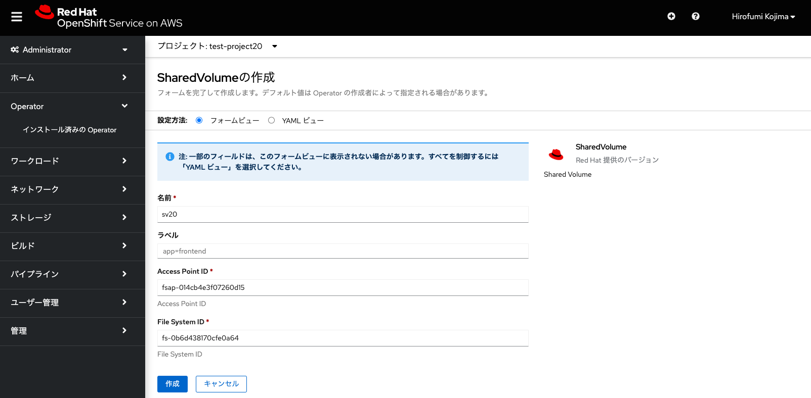
<div style="text-align: center;">EFS利用のためのSharedVolume作成 その2</div>　


最後に「作成」をクリックすると、SharedVolume(この例では、sv20)が作成され、それに対応した永続ボリューム要求であるPVC(この例では、pvc-sv20. pvc-<SharedVolumeの名前>が自動付与)が自動的に作成されます。なお、容量が1GiBと表示されていますが、実容量はこれより大きいものとなっています。

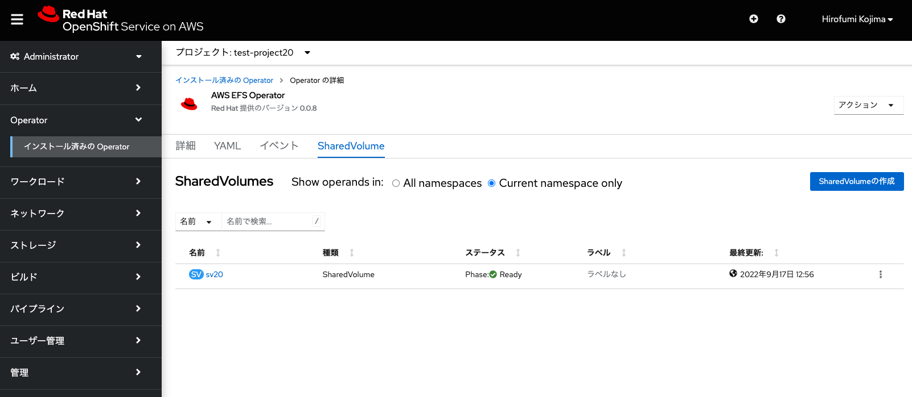
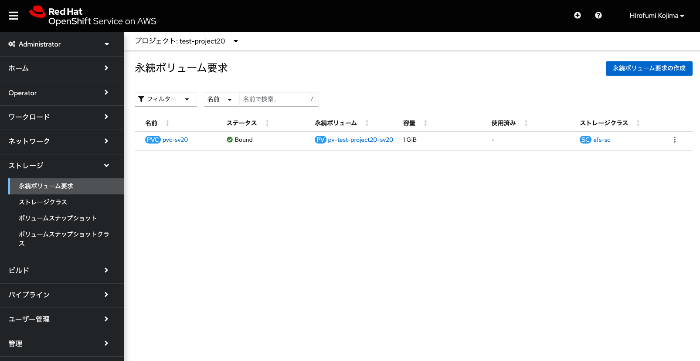
<div style="text-align: center;">作成したSharedVolumeとPVCの確認</div>　

作成したPVCをもとに、Amazon EBSをPodから利用する時と同様の手順で、Podを作成します。Podを作成するためのYAMLファイルは、次のものを利用してください。このとき、受講者が作成したPVCの名前に応じて、「pvc-sv20」となっている所を適宜修正してください。
```
apiVersion: v1
kind: Pod
metadata:
 name: test-efs1
spec:
 volumes:
   - name: efs-storage-vol
     persistentVolumeClaim:
       claimName: pvc-sv20
 containers:
   - name: test-efs
     image: centos:latest
     command: [ "/bin/bash", "-c", "--" ]
     args: [ "while true; do echo 'hello ebs' && sleep 30; done;" ]
     volumeMounts:
       - mountPath: "/mnt/efs-data"
         name: efs-storage-vol
```

Podの作成が完了したら、当該Podの「ターミナル」タブから、EFS上に作成したファイルシステムのマウント状況(NFS v4プロトコルを利用)と、マウントポイント先となるディレクトリに対してファイルが作成できることを確認します。下記画像では、2GiBのファイルを作成して、PVCの画面で確認した見せかけの容量(1GiB)より大きな容量を利用できることを確認しています。

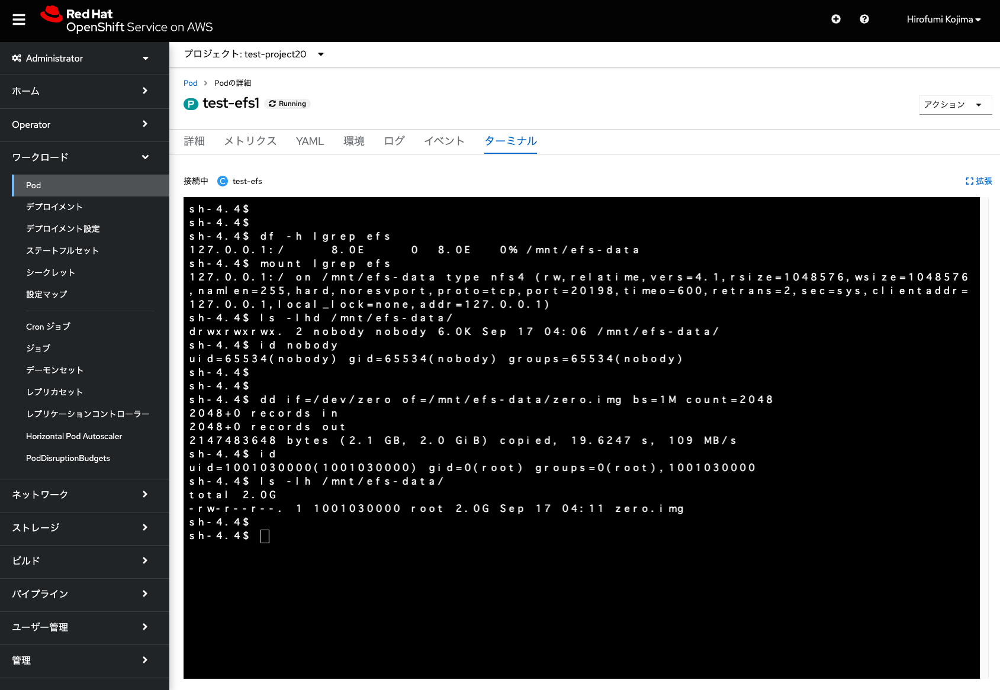
<div style="text-align: center;">PodでのEFS利用テスト</div>　


ここで作成したPodとは別のPodを新しく作成して、複数のPodから同じPVCを利用することで、1つのファイルシステムを共有できることを確認します。前述のPod作成に利用したYAMLファイルで、「name: test-efs1」を、「name: test-efs2」などに変更することで、変更したPod名で新規Podを実行してみます。「test-efs2」Podでもマウント先のディレクトリへのファイル作成/削除や、「test-efs1」Podで作成したファイルの修正ができることを、当該Podの「ターミナル」タブから確認してみてください。


なお、EFS Operatorによって作成された「pvc-sv20」は、アクセスモードが「ReadWriteMany(RWX. 複数台のコンピュートノードから利用可能)」となっています。

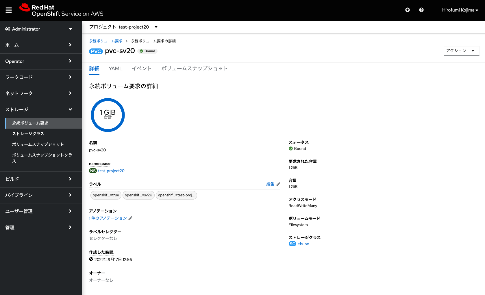
<div style="text-align: center;">EFSを利用するPVCの情報確認</div>　


デフォルトのストレージクラス(gp3タイプのEBS)を利用して作成したPVCは、アクセスモードが「ReadWriteOnce(RWO. 1台のコンピュートノードからのみ利用可能)」となります。EFSによって利用可能になる、RWXのアクセスモードに対応したPVCを利用することで、複数ノード上でレプリケーション構成を取るアプリケーション(Amazon EFSに保存したデータを共有)をROSAクラスター上で実行できるようになります。


ちなみに、Podを削除するなどによって、不要になったPVCを削除したい場合は、次の作業を実施します。

- EBSを利用していた場合: 該当するPVCを選択して、「永続ボリューム要求の削除」から削除します。

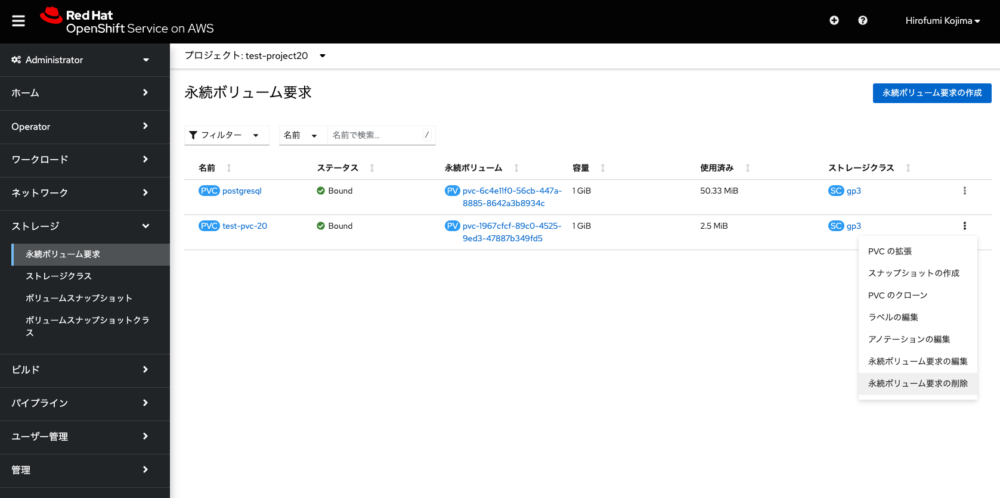
<div style="text-align: center;">PVCの削除</div>　

- EFSを利用していた場合: AWS EFS Operatorによって作成した、SharedVolumeを削除します。これによりSharedVolumeに対応したPVCが自動削除されます。

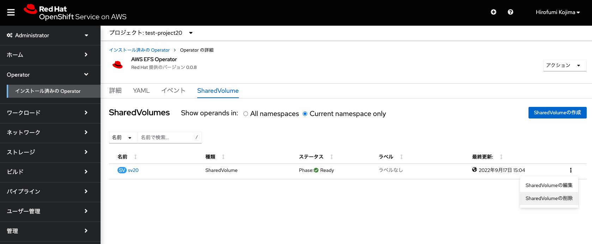
<div style="text-align: center;">SharedVolumeの削除</div>　


これでROSAクラスターでの、永続ボリュームとしてのAmazon EBS/EFS を利用する設定と確認が完了しました。次の演習の[AWS Controllers for Kubernetes (ACK) による Amazon S3の利用](../rosa-ack-s3)に進んでください。

[HOME](../../README.md)
