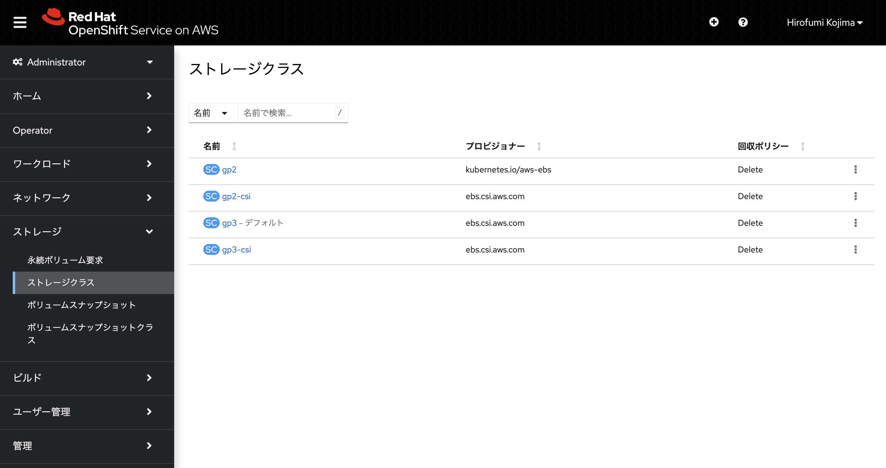
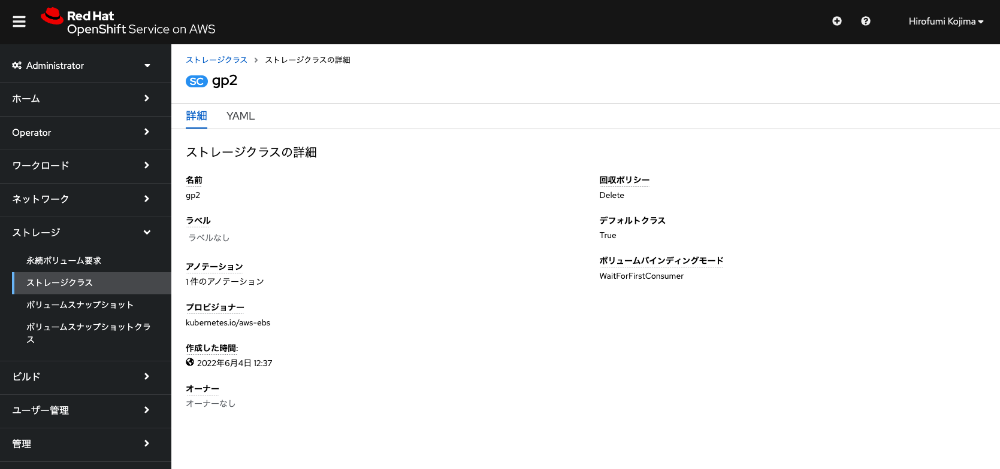
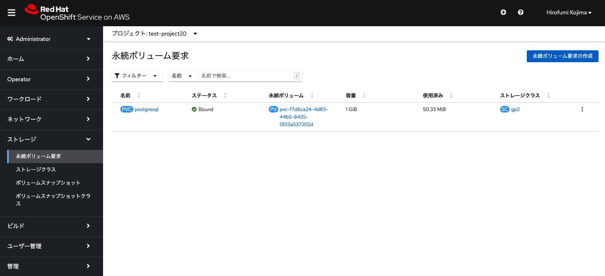
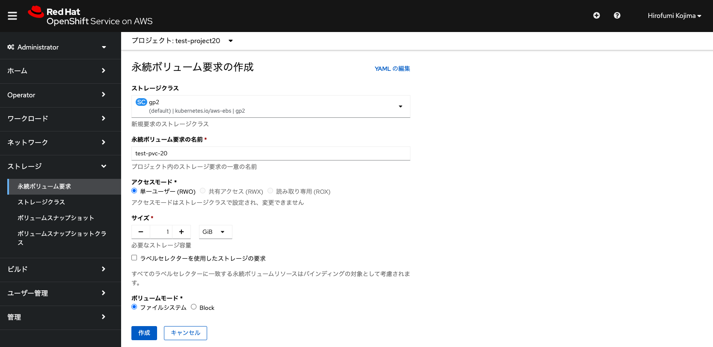
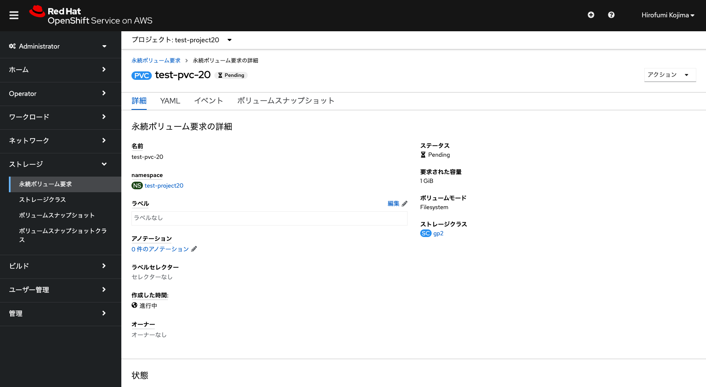
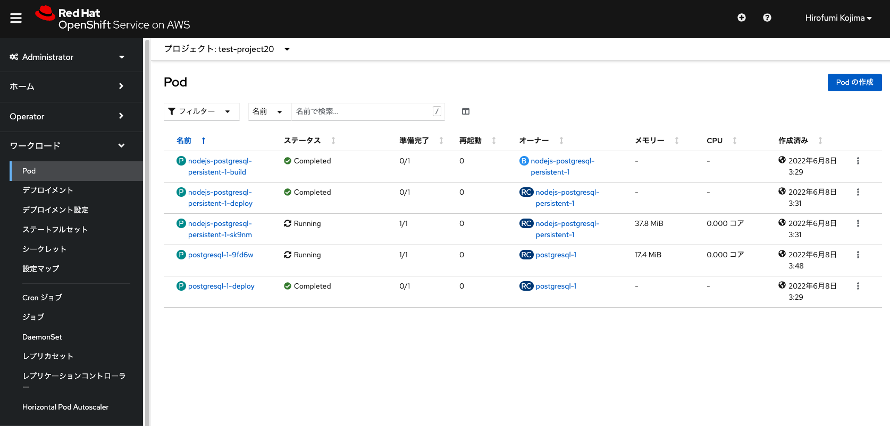
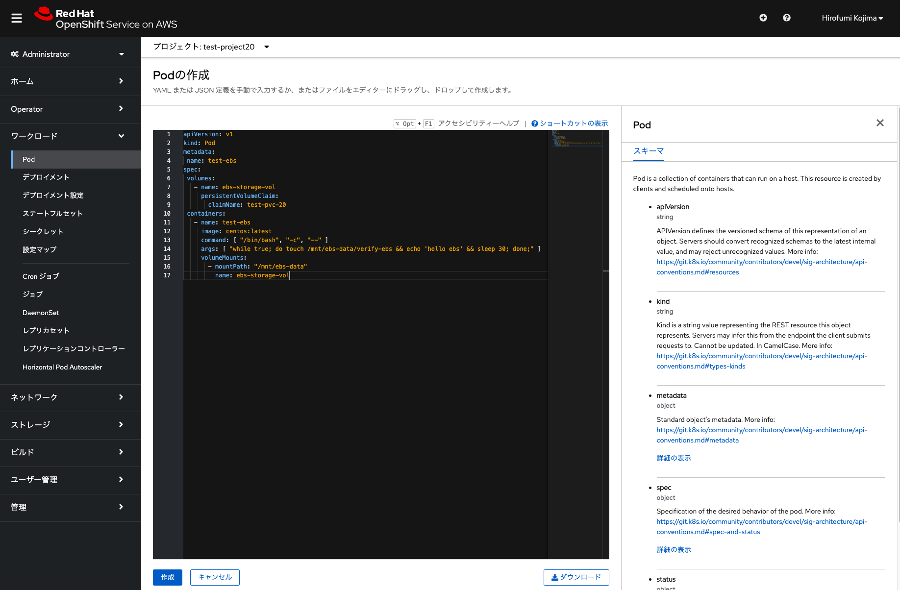
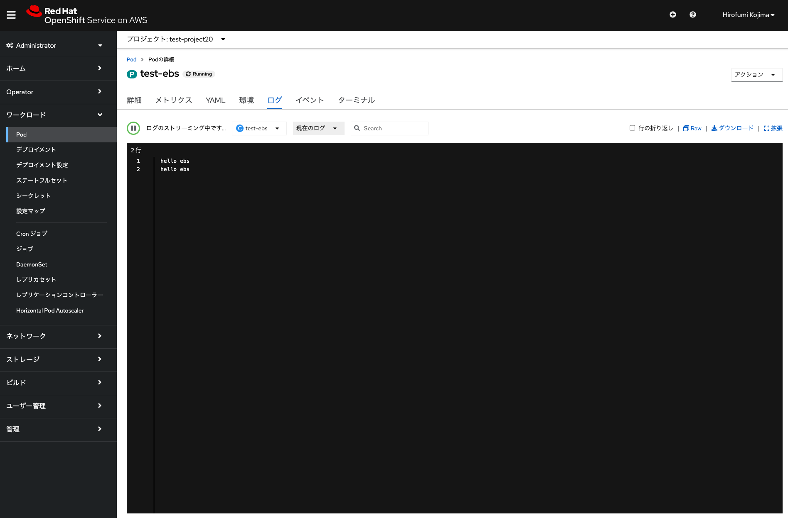
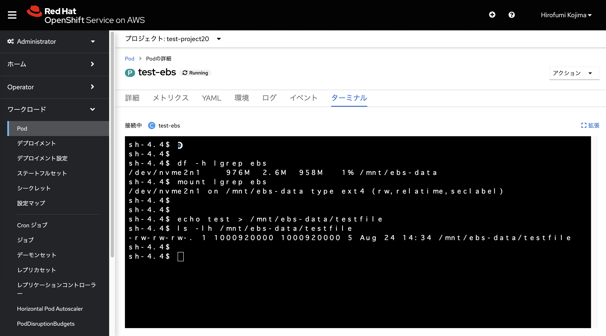

## 永続ボリュームとしてのAWS EBSの利用設定

ROSAには、AWS Elastic Block Store (EBS) ボリュームを使用するストレージクラスが事前に構築されています。これにより、[AWS EBSのgp2, gp3ボリュームタイプ](https://aws.amazon.com/jp/ebs/general-purpose/)がすぐに使えるように設定されています。


<div style="text-align: center;">ROSAですぐに利用可能なストレージクラス</div>　　

このうち、デフォルトのストレージクラスがgp2として設定されており、外部ストレージを永続ボリュームとして利用する際のデフォルトとして利用されます。


<div style="text-align: center;">gp2ストレージクラス</div>　　

また、前の演習で作成しました、PostgreSQLサンプルアプリでも、gp2ストレージクラスを利用して、gp2ボリュームタイプのAWS EBSにデータを保存するように設定されています。


<div style="text-align: center;">PostgreSQLが利用する永続ボリューム (Persistent Volume, PV)</div>　

ここでgp2ストレージクラスを利用するために、新しく永続ボリューム要求(Persistent Volume Claim, PVC)を作成します。永続ボリューム要求の名前は、任意の名前(ここではtest-pvc-20)を入力し、要求するサイズは1GiBと指定します。



<div style="text-align: center;">PVC　(test-pvc-20) の作成</div>　　

このgp2ストレージクラスは、ボリュームバインディングモードが「WaitForFirstConsumer」と指定されており、最初にPodから永続ボリューム要求が利用されるまで、永続ボリュームの割り当てが行われない(ステータスがPendingのまま)ようになっています。ボリュームバインディングモードが「Immediate」となっている場合、PVC作成後すぐに永続ボリュームの割り当てが行われます。

そして、Podを作成します。「Podの作成」から、次のYAMLファイルを入力してPodを作成します。下記の「claimName: test-pvc-20」となっているところは、作成したPVCの名前に応じて、適宜変更してください。

\[Tips\]: PodはKubernetes/OpenShift上でのコンテナアプリの実行単位です。下記のYAMLファイルにあるとおり、コンテナ(この例ではCentOSコンテナの最新版を利用)やコンテナが利用する永続ボリュームの設定などをまとめたものになります。Podにはコンテナを複数まとめることもできますが、基本的には1つのPodには1つのコンテナを含むことを推奨しています。
```
apiVersion: v1
kind: Pod
metadata:
 name: test-ebs
spec:
 volumes:
   - name: ebs-storage-vol
     persistentVolumeClaim:
       claimName: test-pvc-20
 containers:
   - name: test-ebs
     image: centos:latest
     command: [ "/bin/bash", "-c", "--" ]
     args: [ "while true; do touch /mnt/ebs-data/verify-ebs && echo 'hello ebs' && sleep 30; done;" ]
     volumeMounts:
       - mountPath: "/mnt/ebs-data"
         name: ebs-storage-vol
```




<div style="text-align: center;">Pod (test-ebs) の作成</div>　　

test-ebsという名前でPodが作成されて、Podにより「test-pvc-20」PVCが利用されて、永続ボリュームとして外部ストレージの利用が開始されます。


<div style="text-align: center;">Pod (test-ebs) の作成</div>　　

このPodのターミナルやログから、マウント状況や動作状況を確認できます。



<div style="text-align: center;">Podの情報確認</div>　

ここで上記画像にあるように、ターミナルから、echoコマンドなどで永続ボリュームのマウントポイントである「/mnt/ebs-data」ディレクトリに、適当なファイルを作成します。Podを削除(該当Podを選択して、「アクション」->「Podの削除」を選択)した後に、再度「test-pvc-20」PVCを指定してPodを作成すると、作成したテストファイルが残っていることを確認できます。
